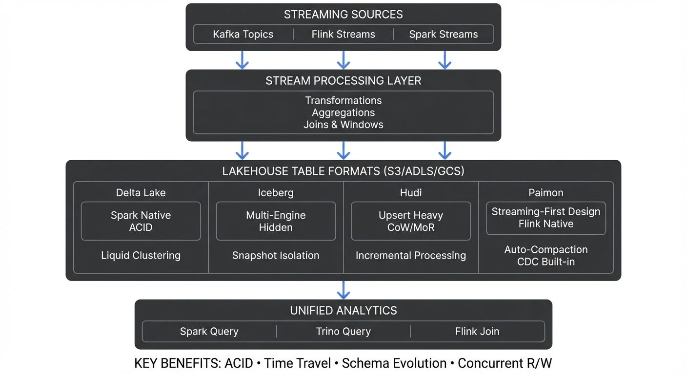

## Outline

1. **Introduction: The Streaming Lakehouse**
   - Evolution from batch to streaming lakehouses
   - Why table formats matter for real-time data

2. **Table Formats for Streaming Workloads**
   - ACID transactions in streaming contexts
   - Time travel and versioning capabilities
   - Concurrent reads and writes

3. **Delta Lake Streaming Patterns**
   - Spark Structured Streaming integration (3.5+)
   - Code examples: Append, merge, and upsert operations
   - Managing late-arriving data
   - Modern Delta Lake 3.x features

4. **Apache Iceberg for Stream Processing**
   - Flink 1.19+ and Spark streaming integration
   - Code examples: Watermarking and event-time processing
   - Hidden partitioning advantages

5. **Apache Hudi's Streaming Capabilities**
   - Copy-on-write vs. merge-on-read
   - Code examples: Near real-time data ingestion
   - Incremental processing patterns

6. **Apache Paimon: The Emerging Alternative**
   - Streaming-first design for Flink ecosystems
   - Code examples: Native Flink integration
   - When to choose Paimon

7. **Operational Considerations**
   - Schema evolution in streaming pipelines
   - Compaction strategies and file management
   - Partition management for time-series data
   - Exactly-once semantics

8. **Governance and Data Quality**
   - Quality gates before the lakehouse
   - Modern monitoring tools and metrics
   - Lineage and observability

9. **Choosing the Right Format: Comparison**
   - Comparison table and selection guide

---

## Introduction: The Streaming Lakehouse

The lakehouse architecture has fundamentally changed how organizations handle analytics at scale, combining the flexibility of data lakes with the reliability of data warehouses. While early lakehouses were primarily batch-oriented, modern table formats—Delta Lake, Apache Iceberg, Apache Hudi, and Apache Paimon—were built with streaming workloads in mind.



<!-- ORIGINAL_DIAGRAM
```
STREAMING TO LAKEHOUSE: DATA FLOW AND TABLE FORMATS

       STREAMING SOURCES
┌─────────────────────────────┐
│  Kafka  │  Flink  │  Spark  │
│ Topics  │ Streams │ Streams │
└────┬─────────┬────────┬─────┘
     │         │        │
     ▼         ▼        ▼
┌─────────────────────────────┐
│  STREAM PROCESSING LAYER    │
│  ┌──────────────────────┐   │
│  │ Transformations      │   │
│  │ Aggregations         │   │
│  │ Joins & Windows      │   │
│  └──────────────────────┘   │
└────┬─────────┬────────┬─────┘
     │         │        │
     ▼         ▼        ▼
┌─────────────────────────────────────────────────────────────┐
│             LAKEHOUSE TABLE FORMATS (S3/ADLS/GCS)           │
├─────────────┬─────────────┬─────────────┬──────────────────┤
│ Delta Lake  │   Iceberg   │     Hudi    │     Paimon       │
│ ┌─────────┐ │ ┌─────────┐ │ ┌─────────┐ │ ┌──────────────┐ │
│ │ Spark   │ │ │ Multi-  │ │ │ Upsert  │ │ │ Streaming-   │ │
│ │ Native  │ │ │ Engine  │ │ │ Heavy   │ │ │ First Design │ │
│ │ ACID    │ │ │ Hidden  │ │ │ CoW/MoR │ │ │ Flink Native │ │
│ └─────────┘ │ └─────────┘ │ └─────────┘ │ └──────────────┘ │
│ Liquid      │ Snapshot    │ Incremental │ Auto-Compaction  │
│ Clustering  │ Isolation   │ Processing  │ CDC Built-in     │
└─────────────┴─────────────┴─────────────┴──────────────────┘
                              │
                              ▼
                   ┌──────────────────────┐
                   │  UNIFIED ANALYTICS   │
                   │  Spark │ Trino │ Flink│
                   │  Query │ Query │ Join │
                   └──────────────────────┘

KEY BENEFITS: ACID • Time Travel • Schema Evolution • Concurrent R/W
```
-->

Streaming writes to lakehouse tables enable real-time analytics without sacrificing data quality or consistency. Unlike raw file writes to object storage, table formats provide ACID guarantees, schema enforcement, and time travel capabilities that make streaming data immediately queryable and trustworthy. For foundational concepts, see [What is Real-Time Data Streaming](https://conduktor.io/glossary/what-is-real-time-data-streaming).

The key innovation is treating streaming data as a continuous flow of incremental updates to versioned tables, rather than as separate batch snapshots. This approach bridges the gap between real-time processing and historical analytics, allowing organizations to query both fresh and historical data through the same interface. This pattern is particularly powerful for CDC use cases—see [What is Change Data Capture: CDC Fundamentals](https://conduktor.io/glossary/what-is-change-data-capture-cdc-fundamentals) for details on capturing database changes and streaming them to lakehouse tables.

## Table Formats for Streaming Workloads

Modern table formats share core capabilities that make them suitable for streaming:

**ACID Transactions**: Every streaming write is atomic and isolated. If a micro-batch fails mid-write, readers never see partial data. Delta Lake uses optimistic concurrency control with transaction logs, while Iceberg uses snapshot isolation with manifest files. This ensures data consistency even when multiple streaming jobs write to the same table concurrently.

**Time Travel and Versioning**: Each streaming write creates a new table version. You can query data as of any point in time, enabling powerful debugging ("What did this table look like when the anomaly occurred?") and regulatory compliance. This is particularly valuable for streaming workloads where understanding data lineage matters.

**Concurrent Operations**: Streaming writers append data while analysts query the table simultaneously. Table formats coordinate these operations without locking. Readers see consistent snapshots while writers continue processing events. This concurrent access pattern is essential for real-time analytics dashboards fed by streaming pipelines.

**Hidden Partitioning**: Particularly in Iceberg, partition values don't appear in query predicates—the engine handles partition pruning automatically. This decouples physical layout from logical queries, allowing partition schemes to evolve as data volumes grow without rewriting queries.

## Delta Lake Streaming Patterns

Delta Lake integrates natively with Spark Structured Streaming (Spark 3.5+), making it a natural choice for Spark-based streaming pipelines:

**Append Mode**: The simplest pattern. Each micro-batch appends new rows to the Delta table. Checkpoint locations track progress, ensuring exactly-once processing even after failures.

```python
from pyspark.sql import SparkSession
from pyspark.sql.functions import col, from_json

spark = SparkSession.builder \
    .appName("DeltaLakeStreaming") \
    .config("spark.sql.extensions", "io.delta.sql.DeltaSparkSessionExtension") \
    .config("spark.sql.catalog.spark_catalog", "org.apache.spark.sql.delta.catalog.DeltaCatalog") \
    .getOrCreate()

# Read from Kafka and write to Delta Lake
kafka_df = spark.readStream \
    .format("kafka") \
    .option("kafka.bootstrap.servers", "localhost:9092") \
    .option("subscribe", "events") \
    .load()

query = kafka_df \
    .selectExpr("CAST(value AS STRING) as json") \
    .writeStream \
    .format("delta") \
    .outputMode("append") \
    .option("checkpointLocation", "/tmp/delta-checkpoint") \
    .start("/tmp/delta-table")
```

**Merge Operations**: For CDC (change data capture) streams or deduplication, Delta Lake's MERGE operation handles late-arriving updates, inserting new records and updating existing ones based on a key. The transaction log ensures atomicity—either the entire micro-batch commits or none of it does.

```python
from delta.tables import DeltaTable

def upsert_to_delta(microBatchDF, batchId):
    deltaTable = DeltaTable.forPath(spark, "/tmp/delta-table")

    deltaTable.alias("target").merge(
        microBatchDF.alias("source"),
        "target.id = source.id"
    ).whenMatchedUpdateAll() \
     .whenNotMatchedInsertAll() \
     .execute()

# Stream with merge operations
query = kafka_df \
    .selectExpr("CAST(value AS STRING) as json") \
    .writeStream \
    .foreachBatch(upsert_to_delta) \
    .option("checkpointLocation", "/tmp/delta-checkpoint-merge") \
    .start()
```

**Managing Late Data**: Delta Lake's MERGE operation naturally handles out-of-order events. Combined with watermarking, you can control how long to wait for late arrivals. Events arriving beyond the watermark threshold are dropped, preventing indefinite state growth.

**Modern Delta Lake 3.x Features**: Delta Lake 3.0+ introduces Liquid Clustering, which replaces traditional static partitioning with adaptive data layout. For streaming workloads with evolving query patterns, Liquid Clustering automatically organizes data without requiring partition column selection upfront.

## Apache Iceberg for Stream Processing

Apache Iceberg's architecture (version 1.5+ in 2025) makes it particularly well-suited for streaming scenarios where data freshness and query performance must coexist:

**Flink Integration**: Iceberg has first-class Apache Flink support (Flink 1.19+), enabling sophisticated event-time processing with features like watermarking and equality-based upserts. For comprehensive coverage of Flink's capabilities, see [What is Apache Flink: Stateful Stream Processing](https://conduktor.io/glossary/what-is-apache-flink-stateful-stream-processing).

```java
// Flink 1.19+ streaming to Iceberg
StreamExecutionEnvironment env = StreamExecutionEnvironment.getExecutionEnvironment();
StreamTableEnvironment tableEnv = StreamTableEnvironment.create(env);

// Create Iceberg catalog
tableEnv.executeSql(
    "CREATE CATALOG iceberg_catalog WITH (" +
    "'type'='iceberg'," +
    "'catalog-type'='hadoop'," +
    "'warehouse'='s3://my-bucket/warehouse')"
);

// Create Iceberg table
tableEnv.executeSql(
    "CREATE TABLE iceberg_catalog.db.events (" +
    "  event_id STRING," +
    "  user_id STRING," +
    "  event_time TIMESTAMP(3)," +
    "  PRIMARY KEY (event_id) NOT ENFORCED" +
    ") PARTITIONED BY (DAYS(event_time)) " +
    "WITH ('format-version'='2', 'write.upsert.enabled'='true')"
);

// Stream from Kafka to Iceberg with upserts
tableEnv.executeSql(
    "INSERT INTO iceberg_catalog.db.events " +
    "SELECT event_id, user_id, event_time " +
    "FROM kafka_source"
);
```

**Watermarking and Event-Time Processing**: Iceberg preserves event-time semantics during writes. Flink's watermarks control when data becomes visible to readers, ensuring downstream consumers only see data that's sufficiently "complete" according to event time, not processing time. For detailed watermarking strategies, see [Watermarks and Triggers in Stream Processing](https://conduktor.io/glossary/watermarks-and-triggers-in-stream-processing).

**Hidden Partitioning Advantages**: Iceberg's hidden partitioning is particularly valuable for streaming workloads. You can partition by time (hours, days) without exposing this to queries. Streaming writers automatically route events to the correct partition, and queries prune partitions automatically based on time predicates.

**Snapshot Isolation**: Each Iceberg write creates a new snapshot. Streaming jobs can commit small, frequent snapshots (every few seconds), while readers see consistent point-in-time views. This isolation prevents "read-your-own-writes" anomalies in real-time dashboards. For more on Iceberg's architecture, see [Apache Iceberg](https://conduktor.io/glossary/apache-iceberg).

## Apache Hudi's Streaming Capabilities

Apache Hudi (Hadoop Upserts Deletes and Incrementals, version 0.15+ in 2025) was designed specifically for streaming ingestion with near real-time query capabilities:

**Copy-on-Write vs. Merge-on-Read**: Hudi offers two table types with different streaming trade-offs:

- **Copy-on-Write (CoW)**: Updates rewrite entire Parquet files. Streaming writes have higher latency but queries are fast. Suitable for read-heavy workloads with moderate update rates.

- **Merge-on-Read (MoR)**: Updates append to delta logs, merged during reads. Streaming writes are fast, but queries pay a merge cost. Ideal for write-heavy streaming with lower query frequency.

**Near Real-Time Ingestion**: Hudi's DeltaStreamer utility provides a complete streaming ingestion framework that continuously ingests from Kafka, applies transformations, and writes to Hudi with configurable commit intervals.

```python
# Spark Structured Streaming to Hudi (Spark 3.5+, Hudi 0.15+)
from pyspark.sql import SparkSession

spark = SparkSession.builder \
    .appName("HudiStreaming") \
    .config("spark.serializer", "org.apache.spark.serializer.KryoSerializer") \
    .config("spark.sql.extensions", "org.apache.spark.sql.hudi.HoodieSparkSessionExtension") \
    .getOrCreate()

hudi_options = {
    'hoodie.table.name': 'events_table',
    'hoodie.datasource.write.recordkey.field': 'event_id',
    'hoodie.datasource.write.partitionpath.field': 'event_date',
    'hoodie.datasource.write.table.name': 'events_table',
    'hoodie.datasource.write.operation': 'upsert',
    'hoodie.datasource.write.precombine.field': 'event_time',
    'hoodie.upsert.shuffle.parallelism': 2,
    'hoodie.insert.shuffle.parallelism': 2
}

kafka_df = spark.readStream \
    .format("kafka") \
    .option("kafka.bootstrap.servers", "localhost:9092") \
    .option("subscribe", "events") \
    .load()

query = kafka_df \
    .selectExpr("CAST(value AS STRING) as json") \
    .writeStream \
    .format("hudi") \
    .options(**hudi_options) \
    .option("checkpointLocation", "/tmp/hudi-checkpoint") \
    .start("/tmp/hudi-table")
```

**Incremental Processing Patterns**: Hudi excels at incremental processing—reading only changed data since a checkpoint. This enables streaming-to-streaming patterns where downstream jobs consume incremental changes from upstream Hudi tables.

## Apache Paimon: The Emerging Alternative

Apache Paimon (formerly Flink Table Store, reaching maturity in 2025) is a fourth lakehouse format designed specifically for streaming-first architectures with native Flink integration:

**Streaming-First Design**: Unlike Delta Lake, Iceberg, and Hudi which evolved from batch origins, Paimon was built from the ground up for streaming workloads. It provides automatic compaction, changelog retention, and streaming upserts without complex configuration.

**Unified Storage**: Paimon treats batch and streaming as unified—there's no distinction between "batch reads" and "streaming reads." All queries can optionally tail the table for new changes, making it ideal for streaming-to-streaming pipelines.

**Native Flink Integration**: Paimon is deeply integrated with Flink 1.17+ and supports features like lookup joins, CDC ingestion, and automatic small file compaction. For Flink-centric architectures, Paimon offers simpler operations than adapting other formats.

```sql
-- Flink SQL: Create streaming Paimon table
CREATE CATALOG paimon_catalog WITH (
    'type' = 'paimon',
    'warehouse' = 's3://bucket/warehouse'
);

CREATE TABLE paimon_catalog.default.events (
    event_id STRING,
    user_id STRING,
    event_time TIMESTAMP(3),
    PRIMARY KEY (event_id) NOT ENFORCED
) WITH (
    'changelog-producer' = 'input',  -- Preserve CDC events
    'compaction.optimization-interval' = '10m'  -- Auto-compact
);

-- Stream from Kafka to Paimon with automatic upserts
INSERT INTO paimon_catalog.default.events
SELECT event_id, user_id, event_time
FROM kafka_source;
```

**When to Choose Paimon**: Consider Paimon if you're building a Flink-native streaming architecture, need changelog retention for downstream streaming consumers, or want simpler streaming operations without complex compaction tuning. However, its ecosystem is less mature than Delta/Iceberg/Hudi, with fewer integrations outside Flink.

## Operational Considerations

**Schema Evolution**: Streaming pipelines must handle schema changes gracefully. All four table formats support adding columns, but streaming jobs need explicit configuration:

- **Delta Lake**: Set `mergeSchema` option to automatically merge new columns during streaming writes.
- **Iceberg**: Schema updates are versioned like data. Streaming writers can evolve schemas without downtime.
- **Hudi**: Configure `hoodie.schema.on.read.enable` to handle schema evolution during reads.
- **Paimon**: Supports automatic schema evolution without additional configuration.

For robust schema management, integrate with [Schema Registry and Schema Management](https://conduktor.io/glossary/schema-registry-and-schema-management) to validate schemas before writes.

**Compaction and File Management**: Streaming writes create many small files. Compaction merges them into optimal sizes:

- **Delta Lake**: Run `OPTIMIZE` commands periodically or use auto-compaction with `autoOptimize`. Delta Lake 3.x introduces automatic optimization features.
- **Iceberg**: Flink 1.19+ and Spark 3.5+ can trigger compaction after write commits with configurable target file sizes.
- **Hudi**: Inline or asynchronous compaction for MoR tables, with improved algorithms in 0.15+.
- **Paimon**: Automatic compaction is built-in and requires minimal tuning.

**Partition Management**: For time-series streaming data, partition by time (hour/day) to enable efficient pruning and retention. Old partitions can be dropped efficiently without scanning the entire table.

**Exactly-Once Semantics**: Achieving end-to-end exactly-once requires coordination between source, processing, and sink:

1. **Idempotent Writes**: Use primary keys and MERGE operations to handle duplicate deliveries.
2. **Checkpointing**: Spark/Flink checkpoints track Kafka offsets and output states atomically.
3. **Transactional Commits**: Table formats ensure atomic commits—no partial writes are visible.

The checkpoint location and table format's transaction log together guarantee exactly-once processing. For deeper understanding of exactly-once guarantees, see [Exactly-Once Semantics in Kafka](https://conduktor.io/glossary/exactly-once-semantics-in-kafka).

## Governance and Data Quality

**Quality Gates Before the Lakehouse**: Streaming pipelines should enforce data quality *before* writing to lakehouse tables. Modern approaches combine multiple validation layers:

- **Stream-Time Validation**: Tools like Conduktor provide data governance capabilities that validate schemas, check data quality rules, and enforce compliance policies in real-time as data flows through Kafka. Implement validations with [Data Quality Monitoring](https://docs.conduktor.io/guide/use-cases/observe-data-quality) and [Interceptors](https://docs.conduktor.io/guide/conduktor-concepts/interceptors).
- **Pre-Write Quality Checks**: Integrate tools like [Soda Core](https://www.soda.io/) or [Great Expectations](https://conduktor.io/glossary/great-expectations-data-testing-framework) into streaming jobs to validate data quality before committing to lakehouse tables.
- **Contract-Based Validation**: Define and enforce [Data Contracts](https://conduktor.io/glossary/data-contracts-for-reliable-pipelines) that specify expected schemas, data types, and business rules.

By validating data upstream in the streaming platform, you prevent bad data from polluting the lakehouse. This "shift-left" approach to governance means lakehouse tables remain clean and trustworthy, reducing the need for downstream data cleaning.

**Monitoring Streaming Table Health**: Key metrics to track using tools like Prometheus, Grafana, and OpenTelemetry:

- **Write Latency**: Time from event creation to table commit. Spikes indicate backpressure or resource constraints. See [Backpressure Handling in Streaming Systems](https://conduktor.io/glossary/backpressure-handling-in-streaming-systems).
- **File Count**: Too many small files degrades query performance. Monitor files-per-partition and trigger compaction accordingly.
- **Schema Drift**: Unexpected schema changes can break downstream consumers. Alert on schema evolution events using schema registry monitoring.
- **Data Freshness**: Time lag between event time and availability in the table. Essential for SLA monitoring. See [Data Freshness Monitoring & SLA Management](https://conduktor.io/glossary/data-freshness-monitoring-sla-management).

**Lineage and Observability**: Understanding data flow through streaming pipelines is critical. For comprehensive strategies, see [What is Data Observability: The Five Pillars](https://conduktor.io/glossary/what-is-data-observability-the-five-pillars):

- Track which source topics feed which tables through [Data Lineage Tracking](https://conduktor.io/glossary/data-lineage-tracking-data-from-source-to-consumption)
- Monitor transformation logic versions using Git integration and CI/CD practices
- Correlate data quality issues back to source systems with distributed tracing
- Audit who reads streaming tables and when using [Audit Logging for Streaming Platforms](https://conduktor.io/glossary/audit-logging-for-streaming-platforms)

Modern data catalogs like [What is a Data Catalog: Modern Data Discovery](https://conduktor.io/glossary/what-is-a-data-catalog-modern-data-discovery) integrate with table formats to provide automatic lineage tracking, showing how streaming data flows from sources through transformations into lakehouse tables and ultimately into analytics. Apache Iceberg's metadata tables expose detailed commit history and data lineage information.

## Choosing the Right Format: Comparison

| **Format** | **Best For** | **Streaming Strength** | **Ecosystem Maturity** | **2025 Status** |
|------------|--------------|------------------------|------------------------|-----------------|
| **Delta Lake** | Spark-native pipelines, straightforward append/merge patterns | Excellent Spark Structured Streaming integration | Very mature, wide adoption | Stable (3.x with Liquid Clustering) |
| **Apache Iceberg** | Multi-engine environments, hidden partitioning, complex queries | Strong Flink & Spark support, snapshot isolation | Mature, growing rapidly | Production-ready (1.5+) |
| **Apache Hudi** | Upsert-heavy workloads, incremental processing, CDC pipelines | Near real-time ingestion, incremental queries | Mature, strong in CDC use cases | Stable (0.15+ with perf improvements) |
| **Apache Paimon** | Flink-first architectures, streaming-to-streaming patterns | Built for streaming from the ground up | Emerging, Flink-focused | Growing (production-ready in Flink ecosystems) |

**Quick Selection Guide**:
- **Use Delta Lake** if you're already invested in Databricks or Spark ecosystems
- **Use Iceberg** if you need multi-engine support (Flink, Spark, Trino, Presto) or sophisticated partitioning
- **Use Hudi** if CDC and upserts are your primary pattern, especially for data lake ingestion
- **Use Paimon** if you're building a Flink-native streaming platform and want minimal operational overhead

## Conclusion

Streaming to lakehouse tables with Delta Lake, Apache Iceberg, Apache Hudi, and Apache Paimon represents a maturation of real-time data architecture. These table formats provide the ACID guarantees, schema evolution, and query performance necessary for production streaming workloads in 2025.

Delta Lake offers the tightest Spark integration with simple append and merge patterns, now enhanced with Liquid Clustering. Iceberg provides sophisticated hidden partitioning and multi-engine support, particularly strong with Flink. Hudi excels at upsert-heavy workloads with its incremental processing capabilities. Paimon brings streaming-first design with minimal operational complexity for Flink users.

Regardless of format choice, success requires attention to operational details: schema evolution strategies, compaction policies, partition management, and exactly-once semantics. Most critically, data quality must be enforced upstream—before data reaches the lakehouse—to ensure streaming tables remain reliable sources of truth.

The streaming lakehouse is no longer emerging technology—it's production-ready architecture powering real-time analytics at scale. For broader context on streaming architectures, see [What is Real-Time Data Streaming](https://conduktor.io/glossary/what-is-real-time-data-streaming) and [Streaming Data Pipeline](https://conduktor.io/glossary/streaming-data-pipeline).

## Related Concepts

- [Kafka Connect: Building Data Integration Pipelines](/kafka-connect-building-data-integration-pipelines)
- [Data Pipeline Orchestration with Streaming](/data-pipeline-orchestration-with-streaming)
- [Real-Time Analytics with Streaming Data](/real-time-analytics-with-streaming-data)

## Sources and References

- [Delta Lake Official Documentation](https://docs.delta.io/latest/index.html) - Transaction log protocol and streaming patterns (v3.x, 2025)
- [Apache Iceberg Specification](https://iceberg.apache.org/spec/) - Table format specification and design principles (v1.5+, 2025)
- [Apache Hudi Documentation](https://hudi.apache.org/docs/overview) - Streaming ingestion and incremental processing patterns (v0.15+, 2025)
- [Apache Paimon Documentation](https://paimon.apache.org/docs/master/) - Streaming-first table format for Flink (2025)
- [Apache Spark Structured Streaming](https://spark.apache.org/docs/latest/structured-streaming-programming-guide.html) - Streaming engine integration with table formats (v3.5+)
- [Apache Flink Documentation](https://nightlies.apache.org/flink/flink-docs-release-1.19/) - Stateful stream processing with lakehouse integration (v1.19+)
- [The Lakehouse Architecture](https://www.databricks.com/research/lakehouse-a-new-generation-of-open-platforms) - Research paper on unified data architecture
