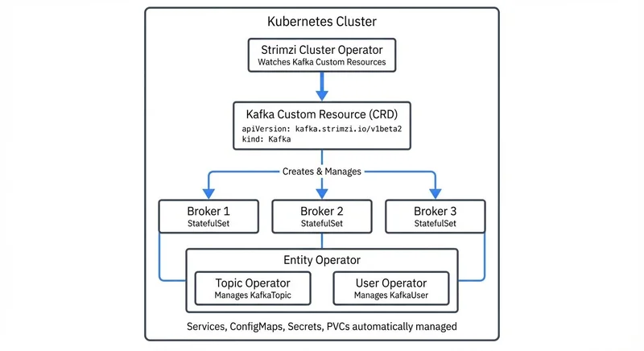

# Strimzi: Kafka Operator for Kubernetes

Running Apache Kafka on Kubernetes presents unique challenges. Kafka is a stateful, distributed system that requires careful configuration of brokers, storage, networking, and security. Traditional deployment methods involve manual setup and ongoing maintenance, which becomes increasingly complex as clusters scale. Strimzi addresses these challenges by providing a Kubernetes operator that automates deployment and management using cloud-native principles.

For context on how Kafka fits into modern architectures, see [Event-Driven Architecture](https://conduktor.io/glossary/event-driven-architecture).

## The Challenge of Running Kafka on Kubernetes

Kafka was designed before the widespread adoption of container orchestration platforms. Its architecture assumes long-lived servers with stable network identities and persistent storage. Kubernetes, by contrast, is built around the assumption that containers are ephemeral and can be replaced at any time.

This mismatch creates several operational hurdles. Kafka brokers need stable network identities to maintain cluster membership. They require persistent storage that survives pod restarts. Rolling upgrades must be carefully orchestrated to avoid data loss. Security configurations involving TLS certificates and authentication mechanisms add another layer of complexity.

Manual management of these concerns is error-prone and time-consuming. Organizations need a solution that bridges the gap between Kafka's operational requirements and Kubernetes' dynamic nature.

## Understanding Kubernetes Operators

The Kubernetes operator pattern extends the platform's capabilities by encoding domain-specific knowledge into custom controllers. An operator watches for changes to custom resources and takes action to reconcile the actual state of the system with the desired state.

Think of an operator like a thermostat for your application. A thermostat continuously monitors room temperature and adjusts heating or cooling to maintain your desired setting. Similarly, a Kubernetes operator continuously monitors your application's state and makes adjustments to match your declared configuration.

Operators follow a continuous control loop. When you declare that you want a Kafka cluster with three brokers, the operator creates the necessary StatefulSets, Services, ConfigMaps, and other Kubernetes resources. If a broker fails, the operator detects the failure and recreates it. If you update the cluster configuration, the operator performs a rolling update while maintaining cluster availability.

This pattern is particularly valuable for stateful applications like Kafka. The operator captures the expertise of experienced Kafka administrators and applies it automatically, reducing the operational burden on platform teams.

## Strimzi Architecture and Custom Resources

Strimzi is a Cloud Native Computing Foundation (CNCF) incubating project that implements the operator pattern for Apache Kafka. It extends Kubernetes with Custom Resource Definitions (CRDs) that represent Kafka clusters, topics, users, and related components.



<!-- ORIGINAL_DIAGRAM
```
┌───────────────────────────────────────────────────────────────┐
│                  Kubernetes Cluster                            │
│                                                                │
│  ┌─────────────────────────────────────────────────────────┐  │
│  │             Strimzi Cluster Operator                    │  │
│  │          Watches Kafka Custom Resources                 │  │
│  └──────────────────────┬──────────────────────────────────┘  │
│                         │                                     │
│                         ▼                                     │
│  ┌─────────────────────────────────────────────────────────┐  │
│  │          Kafka Custom Resource (CRD)                    │  │
│  │  apiVersion: kafka.strimzi.io/v1beta2                   │  │
│  │  kind: Kafka                                            │  │
│  └──────────────────────┬──────────────────────────────────┘  │
│                         │ Creates & Manages                   │
│          ┌──────────────┼──────────────┐                      │
│          ▼              ▼              ▼                      │
│  ┌──────────────┐ ┌──────────────┐ ┌──────────────┐          │
│  │   Broker 1   │ │   Broker 2   │ │   Broker 3   │          │
│  │ StatefulSet  │ │ StatefulSet  │ │ StatefulSet  │          │
│  └──────────────┘ └──────────────┘ └──────────────┘          │
│                                                                │
│  ┌─────────────────────────────────────────────────────────┐  │
│  │              Entity Operator                            │  │
│  │  ┌────────────────────┐  ┌──────────────────────────┐   │  │
│  │  │  Topic Operator    │  │    User Operator         │   │  │
│  │  │ Manages KafkaTopic │  │  Manages KafkaUser       │   │  │
│  │  └────────────────────┘  └──────────────────────────┘   │  │
│  └─────────────────────────────────────────────────────────┘  │
│                                                                │
│  Services, ConfigMaps, Secrets, PVCs automatically managed    │
└────────────────────────────────────────────────────────────────┘
```
-->

The core of Strimzi is the Cluster Operator, which must be deployed first. This operator watches for Kafka custom resources and manages the lifecycle of Kafka clusters, including brokers and supporting components like Kafka Connect, MirrorMaker 2, and Kafka Bridge.

**Note:** Modern Kafka deployments use KRaft mode, which eliminates the ZooKeeper dependency. ZooKeeper mode is deprecated as of Kafka 3.3 and should only be used for legacy systems. For detailed information on KRaft, see [Understanding KRaft Mode in Kafka](https://conduktor.io/glossary/understanding-kraft-mode-in-kafka).

The Entity Operator comprises two sub-operators: the Topic Operator manages KafkaTopic resources, and the User Operator manages KafkaUser resources. This design allows you to declare topics and users as Kubernetes resources, which can be version-controlled and managed using standard Kubernetes tools.

A typical Kafka custom resource defines the entire cluster configuration in YAML format with specifications for replicas, listeners, storage, and operators. This declarative approach aligns with Kubernetes best practices and makes cluster configuration transparent and reproducible.

## Deploying Kafka with Strimzi

Deploying a Kafka cluster with Strimzi begins with installing the Cluster Operator. This is typically done by applying the installation manifests:

```bash
# Install the Cluster Operator in the kafka namespace
kubectl create namespace kafka
kubectl apply -f 'https://strimzi.io/install/latest?namespace=kafka' -n kafka
```

Once the operator is running, you create a Kafka custom resource that describes your desired cluster. Here's a complete example of a KRaft-based Kafka cluster (recommended for all new deployments as of Kafka 3.3+):

```yaml
apiVersion: kafka.strimzi.io/v1beta2
kind: KafkaNodePool
metadata:
  name: broker-pool
  namespace: kafka
  labels:
    strimzi.io/cluster: my-cluster
spec:
  replicas: 3
  roles:
    - broker
  storage:
    type: jbod
    volumes:
      - id: 0
        type: persistent-claim
        size: 100Gi
        deleteClaim: false
---
apiVersion: kafka.strimzi.io/v1beta2
kind: KafkaNodePool
metadata:
  name: controller-pool
  namespace: kafka
  labels:
    strimzi.io/cluster: my-cluster
spec:
  replicas: 3
  roles:
    - controller
  storage:
    type: jbod
    volumes:
      - id: 0
        type: persistent-claim
        size: 20Gi
        deleteClaim: false
---
apiVersion: kafka.strimzi.io/v1beta2
kind: Kafka
metadata:
  name: my-cluster
  namespace: kafka
  annotations:
    strimzi.io/kraft: enabled
    strimzi.io/node-pools: enabled
spec:
  kafka:
    version: 3.9.0
    metadataVersion: 3.9-IV0
    listeners:
      - name: plain
        port: 9092
        type: internal
        tls: false
      - name: tls
        port: 9093
        type: internal
        tls: true
      - name: external
        port: 9094
        type: loadbalancer
        tls: true
    config:
      offsets.topic.replication.factor: 3
      transaction.state.log.replication.factor: 3
      transaction.state.log.min.isr: 2
      default.replication.factor: 3
      min.insync.replicas: 2
  entityOperator:
    topicOperator: {}
    userOperator: {}
```

**Understanding the Configuration:**

- **KafkaNodePool**: Introduced in Strimzi 0.36+, this resource allows you to manage separate pools of Kafka nodes. In KRaft mode, you typically create separate pools for controller nodes (which manage cluster metadata) and broker nodes (which handle data).
- **strimzi.io/kraft: enabled**: This annotation enables KRaft mode, eliminating ZooKeeper.
- **Listeners**: Define how clients connect to Kafka. The example shows internal plaintext, internal TLS, and external TLS listeners.
- **Storage**: Uses JBOD (Just a Bunch Of Disks) with persistent volume claims for durability.

You can also create topics and users declaratively:

```yaml
apiVersion: kafka.strimzi.io/v1beta2
kind: KafkaTopic
metadata:
  name: orders
  namespace: kafka
  labels:
    strimzi.io/cluster: my-cluster
spec:
  partitions: 12
  replicas: 3
  config:
    retention.ms: 604800000  # 7 days
    segment.bytes: 1073741824  # 1GB
    compression.type: producer
---
apiVersion: kafka.strimzi.io/v1beta2
kind: KafkaUser
metadata:
  name: order-processor
  namespace: kafka
  labels:
    strimzi.io/cluster: my-cluster
spec:
  authentication:
    type: tls
  authorization:
    type: simple
    acls:
      - resource:
          type: topic
          name: orders
          patternType: literal
        operations:
          - Read
          - Describe
      - resource:
          type: group
          name: order-processors
          patternType: literal
        operations:
          - Read
```

Strimzi handles several critical operational tasks automatically. It generates TLS certificates for secure communication between brokers and clients. It configures persistent volumes to ensure data durability. It sets up network policies and services to expose Kafka to applications inside and outside the Kubernetes cluster. For comprehensive security configuration, see [Encryption at Rest and in Transit for Kafka](https://conduktor.io/glossary/encryption-at-rest-and-in-transit-for-kafka).

Advanced configuration options include rack awareness to spread brokers across availability zones for high availability, resource limits and requests for CPU and memory optimization, and various authentication mechanisms like TLS client certificates, SCRAM-SHA-512, and OAuth 2.0 for enterprise integration. For access control patterns, see [Access Control for Streaming](https://conduktor.io/glossary/access-control-for-streaming).

## Strimzi in Data Streaming Architectures

Modern data streaming architectures rely on real-time event processing and integration across multiple systems. Kafka serves as the central nervous system for these architectures, handling high-throughput data ingestion, storage, and distribution. For a comprehensive overview of Kafka's role in streaming, see [Apache Kafka](https://conduktor.io/glossary/apache-kafka).

Strimzi enables cloud-native deployment of Kafka, which is essential for organizations adopting microservices and event-driven patterns. By running Kafka on Kubernetes, teams can deploy streaming applications alongside their processing workloads, such as Apache Flink jobs or custom stream processors. For details on Flink integration, see [What is Apache Flink: Stateful Stream Processing](https://conduktor.io/glossary/what-is-apache-flink-stateful-stream-processing).

This co-location simplifies infrastructure management and improves resource utilization. Kubernetes provides a unified platform for deploying, scaling, and monitoring both Kafka and the applications that depend on it. Strimzi integrates with Kubernetes-native monitoring tools like Prometheus, allowing teams to observe their entire streaming pipeline in one place.

For example, an e-commerce platform might use Strimzi to deploy Kafka clusters that handle order events, inventory updates, and customer notifications. These events feed into Flink jobs running in the same Kubernetes cluster, which perform real-time analytics and fraud detection. The entire system scales dynamically based on load, with Kubernetes managing resource allocation. For e-commerce streaming patterns, see [E-Commerce Streaming Architecture Patterns](https://conduktor.io/glossary/e-commerce-streaming-architecture-patterns).

## Monitoring and Managing Kafka at Scale

Operating Kafka in production requires continuous monitoring and management. Strimzi provides built-in integration with Prometheus for metrics collection and Grafana for visualization. The operator exposes metrics about cluster health, resource utilization, and performance through the JMX exporter and Kafka Exporter.

However, monitoring infrastructure metrics is only part of the story. Teams also need visibility into data flows, topic configurations, consumer lag, and schema management. For comprehensive Kafka management and observability, platforms like [Conduktor](https://www.conduktor.io/) offer unified interfaces for managing multiple Kafka clusters, including those deployed with Strimzi. Conduktor provides features like consumer lag monitoring, schema registry management, data governance policy enforcement, and self-service access controls for application developers. These tools complement Strimzi's infrastructure automation with application-level management and observability.

For consumer lag monitoring specifically, see [Consumer Lag Monitoring](https://conduktor.io/glossary/consumer-lag-monitoring) for detailed strategies and best practices.

Strimzi simplifies operational tasks like cluster upgrades and broker scaling. Rolling upgrades are performed automatically by the Cluster Operator, which updates one broker at a time while ensuring the cluster remains available. If you need to scale the cluster, you simply update the `replicas` field in the KafkaNodePool resource, and Strimzi handles the provisioning and rebalancing.

Recent versions of Strimzi (0.40+) have introduced significant improvements:

- **Unidirectional Topic Operator (UTO)**: Improved topic management with better performance and reliability
- **StrimziPodSet**: Enhanced pod management replacing StatefulSets for more flexible operations
- **Kafka 4.0 support**: Full compatibility with the latest Kafka features
- **Cruise Control integration**: Automated cluster rebalancing and self-healing capabilities
- **Improved KRaft mode support**: Enhanced stability and feature parity with ZooKeeper mode
- **Phased upgrades**: Managing large fleets of Kafka clusters with staged rollouts
- **kube-state-metrics integration**: Better observability of custom resource states

## Summary

Strimzi brings Kafka into the cloud-native era by providing a robust Kubernetes operator that automates deployment, configuration, and management. It leverages custom resources and the operator pattern to make Kafka a first-class citizen in Kubernetes environments.

The project eliminates much of the operational complexity associated with running Kafka, from generating TLS certificates to performing rolling upgrades. With full support for KRaft mode (the future of Kafka), Kafka 4.0 compatibility, and advanced features like KafkaNodePool for flexible broker management, Strimzi is production-ready for enterprise deployments.

Key capabilities in 2025 include:
- **Declarative cluster management** through Kubernetes CRDs
- **KRaft mode by default** for simplified architecture
- **Advanced pod management** with StrimziPodSet
- **Automated operations** including upgrades, scaling, and rebalancing
- **Enterprise security** with TLS, SCRAM, and OAuth support
- **Comprehensive monitoring** through Prometheus and Grafana integration

For organizations building data streaming platforms, Strimzi provides a solid foundation for running Kafka at scale. Combined with management platforms like Conduktor for application-level governance and observability, teams can build robust, production-grade streaming architectures. As a CNCF incubating project with broad community support, Strimzi continues to evolve and adapt to emerging Kafka and Kubernetes capabilities.

For schema management in your Strimzi deployment, see [Schema Registry and Schema Management](https://conduktor.io/glossary/schema-registry-and-schema-management). For disaster recovery strategies, see [Disaster Recovery Strategies for Kafka Clusters](https://conduktor.io/glossary/disaster-recovery-strategies-for-kafka-clusters).

## Related Concepts

- [Running Kafka on Kubernetes](https://conduktor.io/glossary/running-kafka-on-kubernetes) - Foundational concepts for deploying Kafka on Kubernetes, including storage, networking, and resource management considerations.
- [Infrastructure as Code for Kafka Deployments](https://conduktor.io/glossary/infrastructure-as-code-for-kafka-deployments) - Apply IaC and GitOps practices to manage Strimzi-deployed Kafka clusters declaratively.
- [CI/CD Best Practices for Streaming Applications](https://conduktor.io/glossary/cicd-best-practices-for-streaming-applications) - Integrate Strimzi deployments into CI/CD pipelines for automated testing and deployment.

## Sources and References

- [Strimzi Official Documentation](https://strimzi.io/)
- [GitHub - strimzi/strimzi-kafka-operator](https://github.com/strimzi/strimzi-kafka-operator)
- [CNCF Advances Strimzi Operator for Kafka on Kubernetes](https://www.cncf.io/news/2024/02/08/cloud-native-now-cncf-advances-strimzi-operator-for-kafka-on-kubernetes/)
- [Deploy Apache Kafka to GKE using Strimzi | Google Cloud](https://cloud.google.com/kubernetes-engine/docs/tutorials/apache-kafka-strimzi)
- [Kafka Operator: Deployment & Best Practices](https://www.automq.com/blog/kafka-operators-deployment-best-practices)
