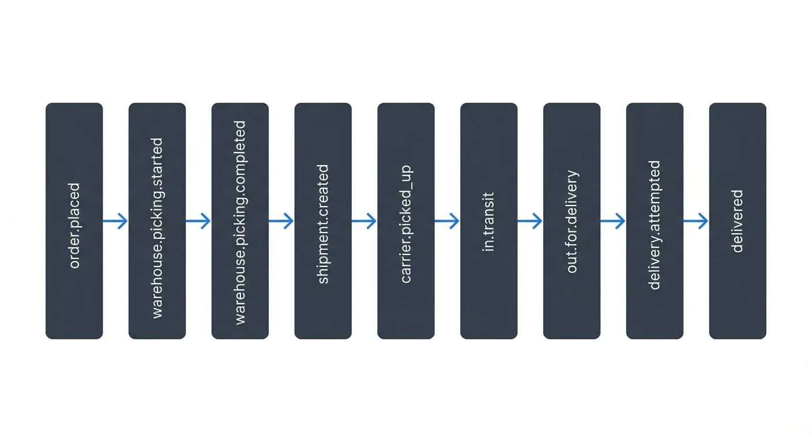

# Supply Chain Visibility with Real-Time Streaming

## The Problem: When Batch Processing Fails Supply Chains

A major electronics retailer discovers a critical problem at 9 AM: their bestselling laptop shows "in stock" on the website, but the Dallas warehouse is actually empty. By noon, 50 customers have ordered the product. The warehouse can't fulfill the orders, but the inventory system won't update until the nightly batch job runs at midnight. Customer service receives angry calls, the warehouse team scrambles to expedite shipments from other locations, and the company loses thousands in overnight shipping costs.

This scenario repeats daily across industries. A pharmaceutical distributor can't track temperature-sensitive vaccines in transit because carrier updates sync every 6 hours. A manufacturer discovers supplier delays only after weekly EDI (Electronic Data Interchange) batch exchanges, causing production line shutdowns. An auto parts company maintains 40% excess inventory because batch-based demand signals arrive too late for accurate forecasting.

The root cause is the same: traditional supply chain systems process data in batches—hourly, nightly, or weekly—creating visibility gaps that cost organizations millions in expedited shipping, excess inventory, stockouts, and lost customers.

## The Challenges of Traditional Supply Chain Systems

Traditional supply chain management systems face several fundamental limitations that impact visibility:

**Data Silos**: Different systems operate independently, creating isolated data pools that prevent a unified view of the supply chain:
- **ERP** (Enterprise Resource Planning) systems manage financials and planning
- **WMS** (Warehouse Management Systems) track inventory and fulfillment
- **TMS** (Transportation Management Systems) handle logistics and shipping
- **CRM** (Customer Relationship Management) systems store customer data

Information about an order might exist in the order management system, but the warehouse system has no real-time awareness of it until the next batch synchronization.

**Batch Processing Delays**: Legacy systems typically synchronize data through scheduled batch jobs—every hour, every night, or even less frequently. By the time data propagates through the system, it may already be outdated. A stockout detected in the morning might not be visible to the purchasing system until the evening batch run.

**Limited Event Granularity**: Traditional systems often capture only state changes at major checkpoints (order placed, order shipped, order delivered) rather than continuous event streams. This means losing visibility into intermediate steps and making it impossible to detect issues early.

**Scalability Constraints**: As supply chains grow in complexity, batch-based systems struggle to keep up with the volume of data. Processing millions of transactions in nightly batch windows becomes increasingly difficult and error-prone.

These limitations lead to increased costs, poor customer experiences, and inability to respond quickly to supply chain disruptions.

## Real-Time Streaming Architecture for Supply Chains

Streaming platforms address these challenges by treating supply chain activities as continuous streams of events rather than periodic snapshots. At the core of this approach are technologies like Apache Kafka and Apache Flink.

For foundational concepts, see [Apache Kafka](https://conduktor.io/glossary/apache-kafka) and [Event-Driven Architecture](https://conduktor.io/glossary/event-driven-architecture).

**Event-Driven Architecture**: Every meaningful action in the supply chain generates an event—a purchase order created, inventory received, shipment departed, delivery attempted. These events are published to Kafka topics, creating a real-time log of supply chain activity.

```json
{
  "eventType": "inventory.received",
  "timestamp": "2025-01-15T14:23:45Z",
  "warehouseId": "WH-Dallas-01",
  "sku": "LAPTOP-XPS-15",
  "quantity": 500,
  "supplierId": "SUPP-8472",
  "batchId": "BATCH-2025-0115"
}
```

Events flow through the system in a predictable sequence:



<!-- ORIGINAL_DIAGRAM
```
order.placed → warehouse.picking.started → warehouse.picking.completed
→ shipment.created → carrier.picked_up → in.transit → out.for.delivery
→ delivery.attempted → delivered
```
-->

**Stream Processing**: Apache Flink and Kafka Streams enable real-time processing of these events. Here's a Kafka Streams example that calculates real-time inventory levels. Kafka Streams uses two key abstractions: **KStream** (a stream of events) and **KTable** (a continuously updated table derived from a stream). This example aggregates inventory events (received/shipped) into a running total per warehouse and SKU:

```java
StreamsBuilder builder = new StreamsBuilder();

// Consume inventory events
KStream<String, InventoryEvent> inventoryStream =
    builder.stream("inventory-events");

// Calculate running inventory by warehouse and SKU
KTable<String, Long> inventoryLevels = inventoryStream
    .groupBy((key, event) -> event.getWarehouseId() + ":" + event.getSku())
    .aggregate(
        () -> 0L,
        (key, event, currentLevel) -> {
            if (event.getType().equals("RECEIVED")) {
                return currentLevel + event.getQuantity();
            } else if (event.getType().equals("SHIPPED")) {
                return currentLevel - event.getQuantity();
            }
            return currentLevel;
        },
        Materialized.as("inventory-levels-store")
    );

// Detect low inventory and publish alerts
inventoryLevels
    .toStream()
    .filter((key, level) -> level < 100)
    .mapValues(level -> new InventoryAlert(key, level, "LOW_STOCK"))
    .to("inventory-alerts");
```

This stream processor maintains an always-current inventory view without waiting for batch reconciliation. When inventory drops below 100 units, it immediately publishes an alert.

**Event Sourcing**: Rather than storing only current state, streaming systems maintain the complete history of events. This provides audit trails and enables reconstructing past states—critical for compliance and root cause analysis when supply chain issues occur.

**Decoupled Systems**: Kafka acts as a central nervous system for the supply chain. Different systems publish and consume events independently, eliminating point-to-point integrations and reducing coupling between components. The warehouse system publishes shipment events; multiple downstream systems (customer notifications, billing, analytics) can consume them without the warehouse system knowing or caring.

## Modern Streaming Stack (2025)

The streaming ecosystem has evolved significantly, with several key improvements that enhance supply chain implementations:

**Kafka 4.0 and KRaft Mode**: Apache Kafka 4.0 (released in 2024) eliminated the dependency on Apache ZooKeeper by introducing KRaft (Kafka Raft) mode for consensus. This simplifies cluster operations, reduces latency, and improves scalability—critical for supply chains managing millions of events per second across global deployments. KRaft mode also enables faster failover and simpler cluster management, reducing operational overhead.

For details on migrating existing clusters, see [Understanding KRaft Mode in Kafka](https://conduktor.io/glossary/understanding-kraft-mode-in-kafka).

**Flink 1.18+ Enhancements**: Apache Flink 1.18 and 1.19 introduced improved state management, adaptive query execution, and better integration with table stores like Apache Iceberg. These features enable more efficient stream processing for complex supply chain analytics, such as multi-dimensional inventory aggregations and real-time demand forecasting.

For Flink fundamentals, see [What is Apache Flink: Stateful Stream Processing](https://conduktor.io/glossary/what-is-apache-flink-stateful-stream-processing).

**Change Data Capture (CDC) Integration**: Modern supply chain architectures use CDC tools like Debezium with Kafka Connect to stream changes from legacy ERP, WMS, and TMS databases without modifying application code. This enables real-time visibility into systems that were designed for batch processing.

```yaml
# Debezium connector configuration for ERP system
name: erp-inventory-connector
connector.class: io.debezium.connector.postgresql.PostgresConnector
database.hostname: erp-db.company.com
database.port: 5432
database.user: debezium_user
database.dbname: erp_production
table.include.list: public.inventory,public.purchase_orders,public.shipments
transforms: unwrap,addPrefix
transforms.unwrap.type: io.debezium.transforms.ExtractNewRecordState
transforms.addPrefix.type: org.apache.kafka.connect.transforms.RegexRouter
transforms.addPrefix.regex: .*
transforms.addPrefix.replacement: erp.$0
```

For comprehensive CDC patterns, see [What is Change Data Capture (CDC) Fundamentals](https://conduktor.io/glossary/what-is-change-data-capture-cdc-fundamentals).

**Schema Management**: Modern deployments use schema registries (Karapace, AWS Glue Schema Registry) to enforce data contracts between supply chain systems. Schema evolution rules ensure that changes to event structures don't break downstream consumers.

For detailed schema strategies, see [Schema Registry and Schema Management](https://conduktor.io/glossary/schema-registry-and-schema-management).

**Exactly-Once Semantics**: Kafka transactions and Flink's checkpointing provide exactly-once processing guarantees—essential for financial operations like inventory valuation and order billing. Configure Kafka producers with `enable.idempotence=true` and Flink applications with checkpointing enabled to ensure no duplicate or lost events during failures.

```java
// Kafka Streams configuration for exactly-once semantics
Properties props = new Properties();
props.put(StreamsConfig.APPLICATION_ID_CONFIG, "supply-chain-inventory");
props.put(StreamsConfig.PROCESSING_GUARANTEE_CONFIG, StreamsConfig.EXACTLY_ONCE_V2);
props.put(StreamsConfig.REPLICATION_FACTOR_CONFIG, 3);
```

For implementation details, see [Exactly-Once Semantics in Kafka](https://conduktor.io/glossary/exactly-once-semantics-in-kafka).

## Key Use Cases and Patterns

Real-time streaming enables several transformative use cases in supply chain management:

**Inventory Optimization**: By processing sales, shipment, and receipt events in real-time, organizations maintain accurate inventory levels across all locations. Stream processing can detect when inventory falls below reorder points and automatically trigger replenishment orders, reducing stockouts and excess inventory.

**Shipment Tracking and Exception Management**: Carrier tracking events, IoT sensor data, and GPS coordinates flow into streaming platforms, providing real-time shipment visibility. Stream processing applications can detect exceptions—delayed shipments, temperature excursions for pharmaceuticals, route deviations—and alert stakeholders immediately rather than discovering issues after delivery failures.

This example uses Apache Flink's **KeyedProcessFunction**, which allows processing events grouped by a key (shipment ID) and managing timers for time-based logic:

```python
from pyflink.datastream import StreamExecutionEnvironment
from pyflink.datastream.functions import MapFunction, KeyedProcessFunction
from datetime import datetime, timedelta

class ShipmentMonitor(KeyedProcessFunction):
    """
    Monitors shipment events in real-time using Flink's KeyedProcessFunction.
    Detects delivery delays and temperature breaches for pharmaceutical shipments.
    """
    def process_element(self, event, ctx):
        # Track shipment status and detect delays
        shipment_id = event['shipmentId']
        expected_delivery = datetime.fromisoformat(event['expectedDelivery'])
        # Use event time from the context, not wall clock time
        current_time = datetime.fromtimestamp(ctx.timestamp() / 1000)

        if event['status'] == 'IN_TRANSIT':
            # Set timer to check for delays at expected delivery time
            delay_check_time = int(expected_delivery.timestamp() * 1000)
            ctx.timer_service().register_event_time_timer(delay_check_time)

        elif event['status'] == 'DELIVERED':
            # Cancel delay timer if delivered on time
            ctx.timer_service().delete_event_time_timer(
                int(expected_delivery.timestamp() * 1000)
            )

        # Check temperature for pharma shipments (cold chain monitoring)
        if event.get('temperature') and event['category'] == 'PHARMA':
            temp = event['temperature']
            if temp < 2 or temp > 8:  # Cold chain breach (2-8°C required)
                yield {
                    'alertType': 'TEMPERATURE_BREACH',
                    'shipmentId': shipment_id,
                    'temperature': temp,
                    'location': event['location'],
                    'timestamp': current_time.isoformat()
                }

    def on_timer(self, timestamp, ctx):
        # Timer fired - shipment has not been delivered by expected time
        yield {
            'alertType': 'DELIVERY_DELAYED',
            'shipmentId': ctx.get_current_key(),
            'expectedDelivery': datetime.fromtimestamp(timestamp / 1000).isoformat()
        }
```

**Demand Sensing**: Combining real-time point-of-sale data, web traffic, social media signals, and external events (weather, local events) allows organizations to sense demand shifts as they happen. Streaming analytics can detect unexpected demand spikes in specific regions and trigger dynamic inventory rebalancing.

**Supplier Performance Monitoring**: Events from supplier systems flow into the organization's Kafka cluster, enabling real-time monitoring of supplier on-time delivery rates, quality metrics, and lead times. Stream processing can maintain supplier scorecards that update continuously rather than monthly.

**End-to-End Order Tracking**: Customers increasingly expect Amazon-level visibility into their orders. Streaming architectures enable building real-time tracking experiences by combining events from order management, warehouse, and carrier systems into unified customer-facing views.

## Implementation Considerations

Building real-time supply chain visibility requires careful attention to several technical and organizational factors:

**Data Quality and Schema Management**: With events flowing from dozens of systems, maintaining data quality becomes paramount. Schema registries ensure that producers and consumers agree on event structures. Organizations need governance processes to manage schema evolution as systems change over time.

For comprehensive data quality strategies, see [Building a Data Quality Framework](https://conduktor.io/glossary/building-a-data-quality-framework) and [Automated Data Quality Testing](https://conduktor.io/glossary/automated-data-quality-testing). For testing stream processing applications, see [Testing Strategies for Streaming Applications](https://conduktor.io/glossary/testing-strategies-for-streaming-applications).

**Integration Complexity**: Connecting legacy ERP systems, modern cloud applications, IoT devices, and partner systems requires robust integration strategies. Change Data Capture (CDC) tools can stream changes from databases, while API gateways can convert REST API calls into events. When downstream systems can't keep up with event rates, backpressure mechanisms prevent data loss. Failed events should be routed to dead letter queues for investigation.

For error handling patterns, see [Dead Letter Queues for Error Handling](https://conduktor.io/glossary/dead-letter-queues-for-error-handling) and [Backpressure Handling in Streaming Systems](https://conduktor.io/glossary/backpressure-handling-in-streaming-systems).

**Data Security and Compliance**: Supply chain data often includes sensitive information—customer details, pricing, proprietary business processes. Streaming platforms must implement encryption, access controls, and audit logging. For global supply chains, data residency and cross-border data transfer regulations add additional complexity.

**Event Ordering and Exactly-Once Processing**: Supply chain events must often be processed in order—you can't deliver before shipping. Kafka's partitioning and Flink's checkpointing mechanisms provide ordering guarantees and exactly-once processing semantics, but applications must be designed carefully to leverage these features.

**Monitoring and Observability**: Real-time systems require real-time monitoring. Organizations need visibility into Kafka cluster health, topic throughput, consumer lag, and stream processing application performance. Without proper observability, detecting and diagnosing issues in production becomes nearly impossible.

For comprehensive observability strategies, see [What is Data Observability: The Five Pillars](https://conduktor.io/glossary/what-is-data-observability-the-five-pillars).

## Managing Streaming Supply Chain Infrastructure

Operating streaming platforms at scale requires specialized tooling for monitoring cluster health, managing schemas, testing streaming applications, and ensuring data governance.

**Monitoring and Observability**: Real-time supply chains require continuous monitoring of Kafka cluster health, topic throughput, consumer lag, and stream processing application performance. Key metrics to track include:

- **Consumer lag**: How far behind are downstream systems in processing supply chain events? High lag in the order processing consumer means delayed order fulfillment.
- **Topic throughput**: Are critical topics like `inventory-updates` or `shipment-tracking` experiencing traffic spikes that could cause bottlenecks?
- **Stream processing performance**: Are Flink jobs processing events within acceptable latency bounds?
- **Data quality**: Are events arriving with valid schemas and expected data ranges?

For comprehensive lag monitoring strategies, see [Consumer Lag Monitoring](https://conduktor.io/glossary/consumer-lag-monitoring).

**Platform Management with Conduktor**: Conduktor provides enterprise-grade management capabilities for Kafka-based supply chain platforms, including:

- **Schema registry management**: Enforce data contracts between supply chain systems, manage schema evolution, and prevent breaking changes
- **Access control and governance**: Implement role-based access control (RBAC) for sensitive supply chain data, ensuring warehouse teams can't access financial data and vice versa
- **Consumer lag monitoring**: Real-time dashboards showing which supply chain systems are falling behind in event processing ([Monitoring Guide](https://docs.conduktor.io/guide/monitor-brokers-apps/index))
- **Data quality monitoring**: Validate event schemas, detect anomalies in supply chain data, and alert on data quality issues ([Alerts](https://docs.conduktor.io/guide/monitor-brokers-apps/alerts))
- **Testing and chaos engineering**: Conduktor Gateway enables testing stream processing applications with synthetic supply chain events and simulating failure scenarios

**Security and Compliance**: Supply chain data includes sensitive information—customer addresses, pricing agreements, proprietary supplier relationships. Implement:

- **Encryption in transit and at rest**: Use TLS for Kafka client connections and encrypt data in Kafka storage
- **Audit logging**: Track who accessed which supply chain events and when, critical for compliance investigations
- **Data masking**: Redact PII from supply chain events when streaming to analytics environments

For security best practices, see [Access Control for Streaming](https://conduktor.io/glossary/access-control-for-streaming) and [Audit Logging for Streaming Platforms](https://conduktor.io/glossary/audit-logging-for-streaming-platforms).

## Summary

Real-time supply chain visibility powered by streaming platforms represents a fundamental shift from traditional batch-based supply chain management. By treating supply chain activities as continuous event streams, organizations gain the ability to monitor, analyze, and respond to supply chain dynamics in real-time rather than hours or days later.

Apache Kafka provides the foundation for these systems, acting as a central event backbone that connects disparate supply chain systems. The 2025 streaming ecosystem—featuring Kafka 4.0 with KRaft mode, Flink 1.18+, and mature CDC tools like Debezium—offers production-ready capabilities for enterprise supply chains. Kafka Streams and Apache Flink enable building sophisticated stream processing applications for inventory optimization, shipment tracking, demand sensing, and supplier monitoring with exactly-once processing guarantees.

Implementing streaming supply chain architectures requires addressing challenges in data quality, integration, security, and operational monitoring. Modern management platforms like Conduktor provide the tooling necessary to operate these systems at scale, with capabilities for schema governance, consumer lag monitoring, access control, and chaos testing. Organizations successful in this transformation gain significant competitive advantages through reduced costs, improved customer satisfaction, and increased agility in responding to supply chain disruptions.

As supply chains continue to grow in complexity and customer expectations for visibility increase, real-time streaming technologies have become essential infrastructure for modern supply chain operations.

## Sources and References

1. Apache Kafka Documentation - "Use Cases: Activity Tracking and Operational Metrics" (https://kafka.apache.org/documentation/)
2. Apache Kafka 4.0 Release Notes - "KRaft Mode General Availability" (https://kafka.apache.org/)
3. Apache Flink Documentation - "Stream Processing Patterns" (https://flink.apache.org/what-is-flink/)
4. Debezium Documentation - "CDC for Supply Chain Systems" (https://debezium.io/documentation/)
5. Gartner Research - "Market Guide for Real-Time Supply Chain Visibility Platforms" (2023-2025)
6. Council of Supply Chain Management Professionals (CSCMP) - "State of Logistics Report: Digital Transformation in Supply Chains"
7. Martin Kleppmann - "Designing Data-Intensive Applications" - Chapter on Stream Processing and Event Sourcing
