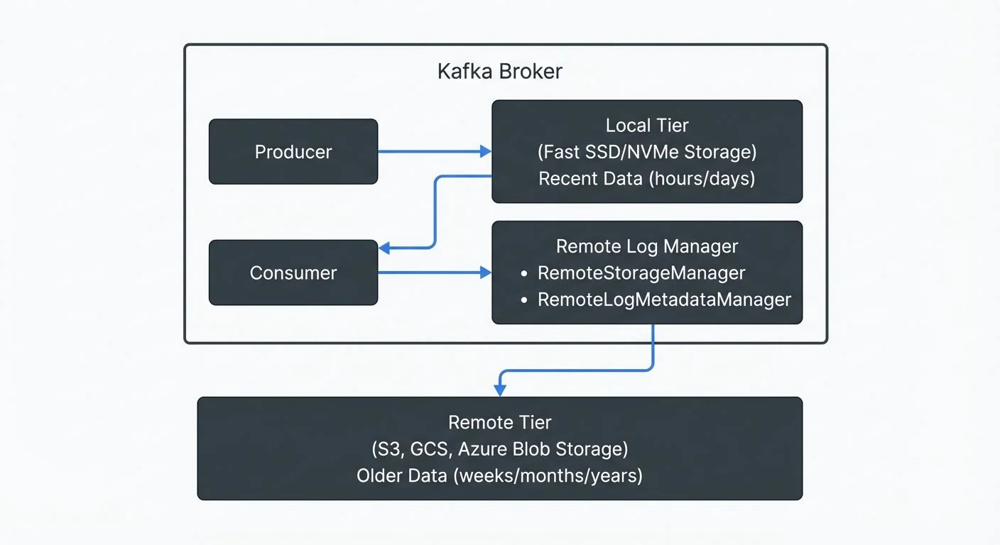

# Tiered Storage in Kafka

Apache Kafka has traditionally stored all topic data on local broker disks, tightly coupling compute and storage resources. As organizations retain data for longer periods to support compliance requirements, data analytics, and [event-driven architectures](https://conduktor.io/glossary/event-driven-architecture), this model has become increasingly expensive and operationally challenging. Tiered storage, introduced in KIP-405 and reaching general availability in Kafka 3.9, fundamentally changes this by separating hot and cold data across two storage tiers. The feature is fully compatible with [KRaft mode](https://conduktor.io/glossary/understanding-kraft-mode-in-kafka), which has become the standard deployment model in 2025, eliminating the need for ZooKeeper.

## Introduction to Tiered Storage

Tiered storage divides Kafka's data storage into two distinct layers: a local tier and a remote tier. The local tier uses the fast disks attached to Kafka brokers, serving recent data with low latency. The remote tier leverages external storage systems like Amazon S3, Google Cloud Storage, or Azure Blob Storage for older, infrequently accessed data.

This separation allows organizations to configure different retention periods for each tier. The local tier might retain data for hours or days, while the remote tier can store data for weeks, months, or even years. Importantly, this architecture remains completely transparent to Kafka clients. Consumers can read historical data from remote storage using the same APIs, with no code changes required.

The benefits extend beyond cost savings. By decoupling storage from compute, tiered storage enables faster cluster operations, better resource utilization, and virtually unlimited data retention without proportionally increasing infrastructure costs.

## The Architecture Behind Tiered Storage

Tiered storage introduces several new components to the Kafka broker architecture. The Remote Log Manager is the central component responsible for managing the lifecycle of log segments in remote storage. It coordinates when segments are copied to remote storage, how they're fetched for consumer requests, and when they're deleted based on retention policies.



<!-- ORIGINAL_DIAGRAM
```
┌─────────────────────────────────────────────────────────────────┐
│                        Kafka Broker                              │
│                                                                  │
│  ┌──────────────┐         ┌─────────────────────────────────┐  │
│  │   Producer   │────────▶│       Local Tier                │  │
│  └──────────────┘         │   (Fast SSD/NVMe Storage)       │  │
│                           │   Recent Data (hours/days)       │  │
│  ┌──────────────┐         └─────────────┬───────────────────┘  │
│  │   Consumer   │◀──────────────────────┘                      │
│  └──────┬───────┘                                               │
│         │                 ┌─────────────────────────────────┐  │
│         │                 │  Remote Log Manager             │  │
│         │                 │  • RemoteStorageManager         │  │
│         └─────────────────│  • RemoteLogMetadataManager     │  │
│                           └─────────────┬───────────────────┘  │
└─────────────────────────────────────────┼───────────────────────┘
                                          │
                                          ▼
                    ┌─────────────────────────────────────────┐
                    │         Remote Tier                     │
                    │  (S3, GCS, Azure Blob Storage)          │
                    │  Older Data (weeks/months/years)        │
                    └─────────────────────────────────────────┘
```
-->

Two key plugin interfaces enable flexibility in implementation:

**RemoteStorageManager**: Think of this as the "mover" - it handles the physical interaction with remote storage systems. Its responsibilities include uploading completed log segments to remote storage, fetching data when consumers request historical data, and deleting expired segments. Each uploaded segment receives a unique RemoteLogSegmentId (essentially a tracking number) that identifies it in the remote storage system.

**RemoteLogMetadataManager**: This acts as the "catalog" - it maintains metadata about which segments exist in remote storage, their offsets (position in the topic), and their locations. This metadata layer requires strong consistency guarantees to ensure consumers can reliably find and read historical data. Kafka provides a default implementation using an internal topic called `__remote_log_metadata`, but organizations can implement custom solutions using external systems like databases or metadata stores.

Critically, Apache Kafka does not ship with actual storage backend implementations. The community and vendors provide plugins for specific storage systems. For example, Aiven offers an open-source RemoteStorageManager supporting S3, GCS, and Azure Blob Storage. Organizations can also develop custom plugins to integrate with their existing storage infrastructure.

When a log segment on the local tier becomes complete and meets the criteria for offloading, the Remote Log Manager copies it to remote storage via the RemoteStorageManager. The metadata is then recorded through the RemoteLogMetadataManager. Consumer fetch requests for older data are automatically routed to remote storage, though with slightly higher latency than local disk reads.

## Cost and Performance Benefits

The financial impact of tiered storage can be substantial. Cloud object storage costs a fraction of fast SSD or NVMe disk pricing. Organizations report storage cost reductions of 3-9x after implementing tiered storage, as the majority of data resides in inexpensive object storage rather than on premium broker disks.

Beyond direct storage costs, tiered storage accelerates critical cluster operations. Partition reassignments, which previously required copying terabytes of data across brokers, now complete 15x faster since only recent local data needs redistribution. Cluster scaling operations that once took 13-14 hours now complete in about an hour. When adding new brokers for additional compute capacity, they only need to replicate the local tier data, not the entire historical dataset.

These operational improvements translate to reduced downtime and faster recovery from failures. In disaster recovery scenarios, tiered storage enables 13-115x faster recovery times. New broker nodes can rejoin the cluster and serve traffic much more quickly because remote storage is shared across all brokers.

The architecture also enables independent scaling of compute and storage. Traditional Kafka clusters often required adding brokers simply to accommodate storage growth, even when compute resources were sufficient. With tiered storage, organizations can expand storage capacity by configuring larger remote retention periods without adding broker nodes. Conversely, they can scale compute resources for higher throughput without being forced to provision additional storage they don't need.

Real-world example: A financial services company processing transaction events might configure 24-hour local retention and 7-year remote retention for compliance. Their 10-broker cluster stores only one day of data locally (perhaps 2TB per broker), while maintaining petabytes of historical data in S3. This configuration costs significantly less than running a 200-broker cluster to store seven years of data on local disks.

## Implementation and Configuration

Enabling tiered storage requires configuration at both the cluster and topic levels. At the cluster level, administrators must configure the RemoteStorageManager and RemoteLogMetadataManager implementations. This includes specifying the storage backend plugin class and providing necessary credentials for the remote storage system.

Here's an example broker configuration in `server.properties`:

```properties
# Enable tiered storage
remote.log.storage.system.enable=true

# Metadata manager (using internal topic)
remote.log.metadata.manager.class.name=org.apache.kafka.server.log.remote.metadata.storage.TopicBasedRemoteLogMetadataManager
remote.log.metadata.manager.listener.name=PLAINTEXT

# Storage manager (example using Aiven's S3 plugin)
remote.log.storage.manager.class.name=io.aiven.kafka.tieredstorage.RemoteStorageManager
remote.log.storage.manager.class.path=/path/to/tiered-storage-plugin.jar

# S3 configuration
rsm.config.chunk.size=4194304
rsm.config.storage.backend.class=io.aiven.kafka.tieredstorage.storage.s3.S3Storage
rsm.config.storage.s3.bucket.name=my-kafka-tiered-storage
rsm.config.storage.s3.region=us-east-1
rsm.config.storage.aws.access.key.id=${AWS_ACCESS_KEY_ID}
rsm.config.storage.aws.secret.access.key=${AWS_SECRET_ACCESS_KEY}
```

At the topic level, administrators can enable tiered storage for individual topics and configure retention policies. You can set these during topic creation:

```bash
kafka-topics.sh --create \
  --bootstrap-server localhost:9092 \
  --topic transactions \
  --partitions 6 \
  --replication-factor 3 \
  --config remote.storage.enable=true \
  --config local.retention.ms=86400000 \
  --config retention.ms=2592000000
```

Or update an existing topic:

```bash
kafka-configs.sh --bootstrap-server localhost:9092 \
  --entity-type topics \
  --entity-name transactions \
  --alter \
  --add-config remote.storage.enable=true,local.retention.ms=86400000,retention.ms=2592000000
```

Key configuration parameters:

- `remote.storage.enable=true` enables tiered storage for the topic
- `local.retention.ms` or `local.retention.bytes` controls how long data remains on local disks
- Standard `retention.ms` or `retention.bytes` applies to the remote tier

In the example above, `local.retention.ms=86400000` (24 hours) and `retention.ms=2592000000` (30 days) means data stays on local disks for one day before moving to remote storage, where it remains for 30 days total.

Storage backend selection depends on requirements and existing infrastructure. Cloud object stores like S3 offer virtually unlimited capacity and high durability but introduce network latency. On-premises options might include shared NFS volumes or HDFS, trading some cost benefits for lower latency and data locality.

Important considerations: Topics must be created with tiered storage enabled from the start, or you can enable it on existing topics using the configuration update command shown above. However, once enabled, tiered storage cannot be disabled without deleting and recreating the topic. Plan retention policies carefully, as deleting a topic removes data from both local and remote storage.

## Tiered Storage in Data Streaming Ecosystems

Tiered storage transforms Kafka's role in data streaming architectures. Traditionally, organizations built separate systems for real-time streaming (Kafka) and historical data storage (data lakes or warehouses). Consumers would read recent events from Kafka, while analytics on older data required querying a different system entirely. This dual-system approach created complexity in maintaining data consistency and developing applications that span historical and real-time data.

With tiered storage, Kafka can serve as a unified event store for both real-time and historical use cases. Stream processing frameworks like [Apache Flink](https://conduktor.io/glossary/what-is-apache-flink-stateful-stream-processing) or [Kafka Streams](https://conduktor.io/glossary/introduction-to-kafka-streams) can process data spanning days, weeks, or months without architectural changes. A fraud detection system might analyze patterns over the past 90 days, all accessible through standard Kafka consumer APIs.

This capability enables several new streaming patterns:

**Reprocessing and Backfilling**: When deploying new stream processing logic, teams can reprocess historical data in its original order without maintaining separate historical datasets. If a bug is discovered in a stream processor, teams can reprocess weeks of data to regenerate corrected output.

**Long-Term Event Sourcing**: [Event-sourced systems](https://conduktor.io/glossary/event-sourcing-patterns-with-kafka) can maintain complete event histories in Kafka itself, rather than periodically snapshotting to external databases. This simplifies architecture and ensures all event data remains queryable through consistent Kafka interfaces.

**Disaster Recovery and Compliance**: Regulated industries can retain complete event histories for audit and compliance without expensive dedicated storage infrastructure. For detailed strategies on protecting Kafka clusters, see [Disaster Recovery Strategies for Kafka Clusters](https://conduktor.io/glossary/disaster-recovery-strategies-for-kafka-clusters). In disaster scenarios, systems can rebuild state from retained events rather than complex backup/restore processes.

Real-world example: A ride-sharing platform uses tiered storage to retain trip events for 180 days. Their real-time pricing algorithm consumes recent trip data from the local tier for low-latency decisions. Meanwhile, their analytics team runs weekly batch jobs in Flink that read 30-60 day windows of historical trip data from remote storage to optimize driver allocation models. Both workloads use the same Kafka topics with no architectural duplication.

Tools like Conduktor can enhance operational visibility in these complex streaming environments. Conduktor's monitoring dashboards can show which partitions are being read from remote versus local storage, helping teams understand access patterns and optimize retention policies. The platform can also validate tiered storage configurations across multiple clusters and alert on misconfigurations that might lead to unexpected costs or data loss.

## Current Limitations and Future Directions

While tiered storage is production-ready, several limitations exist in the current implementation. Most notably, tiered storage does not support log compaction. Log compaction is a cleanup policy that keeps only the latest value for each key, making it useful for maintaining stateful tables (like user profiles) where you only need the current state. Topics configured with `cleanup.policy=compact` cannot enable remote storage. This restriction affects use cases like maintaining user profile tables or other key-based state stores that rely on compaction to retain only the latest value per key.

The Just a Bunch of Disks (JBOD) feature is also incompatible with tiered storage. JBOD allows Kafka brokers to use multiple independent disk volumes (rather than RAID) to distribute partitions across disks for better performance and capacity. Brokers configured with JBOD cannot leverage tiered storage, requiring administrators to choose between these features.

Performance characteristics differ from local storage. When tiered storage is enabled, each consumer fetch request can only handle a single remote storage partition, meaning consumers reading from multiple partitions must issue separate requests for each. This can impact consumer throughput when reading primarily from remote storage.

Future development is addressing some of these constraints and extending tiered storage capabilities. KIP-1176 proposes fast-tiering for active log segments, allowing brokers to offload data to remote storage even before segments are fully sealed (completed and marked as read-only when they reach their size limit or time threshold). This would reduce cross-availability-zone replication traffic and enable more cost-efficient storage of write-ahead logs.

KIP-1150 explores fully diskless topics, where brokers maintain minimal local state and rely primarily on remote storage. This radical shift would further separate compute and storage but requires deeper architectural changes to maintain performance and consistency guarantees.

These future enhancements aim to make tiered storage the default deployment model, with organizations choosing from a spectrum of options: traditional local storage for ultra-low latency, current tiered storage for balanced performance and cost, or fully cloud-native storage for maximum cost efficiency and elasticity.

## Summary

Tiered storage represents a fundamental evolution in Kafka's architecture, decoupling compute and storage to enable more flexible and cost-effective deployments. By automatically moving older log segments to remote object storage while keeping recent data on fast local disks, organizations can achieve 3-9x storage cost reductions and dramatically faster cluster operations.

The two-tier model uses a local tier on broker disks for low-latency access to recent data and a remote tier in systems like S3 for cost-effective long-term retention. This separation remains transparent to clients, requiring no application code changes while enabling virtually unlimited data retention.

Key benefits include independent scaling of compute and storage resources, 15x faster partition reassignments, 13x faster cluster scaling operations, and the ability to use Kafka as a long-term event store without external systems. Organizations can configure topic-level retention policies that keep hours or days of data locally while retaining weeks, months, or years remotely.

Implementation requires configuring storage backend plugins and setting appropriate retention policies for both local and remote tiers. While current limitations exist around log compaction and JBOD support, ongoing development through KIPs like 1176 and 1150 will expand tiered storage capabilities.

For organizations building event-driven architectures, tiered storage enables Kafka to serve as a unified platform for both real-time streaming and historical data access. This simplifies architecture, reduces costs, and enables new use cases spanning real-time and batch processing within a single streaming platform.

## Related Concepts

- [Kafka Capacity Planning](https://conduktor.io/glossary/kafka-capacity-planning) - Optimize storage costs and cluster sizing by factoring tiered storage into capacity calculations.
- [Disaster Recovery Strategies for Kafka Clusters](https://conduktor.io/glossary/disaster-recovery-strategies-for-kafka-clusters) - Leverage tiered storage for cost-effective long-term backups and compliance retention.
- [Streaming Total Cost of Ownership](https://conduktor.io/glossary/streaming-total-cost-of-ownership) - Quantify tiered storage's impact on total streaming infrastructure costs.

## Sources and References

- [KIP-405: Kafka Tiered Storage - Apache Kafka](https://cwiki.apache.org/confluence/display/KAFKA/KIP-405:+Kafka+Tiered+Storage)
- [Kafka tiered storage deep dive - Red Hat Developer](https://developers.redhat.com/articles/2024/03/13/kafka-tiered-storage-deep-dive)
- [Why Tiered Storage for Apache Kafka is a BIG THING - Kai Waehner](https://www.kai-waehner.de/blog/2023/12/05/why-tiered-storage-for-apache-kafka-is-a-big-thing/)
- [16 Ways Tiered Storage Improves Apache Kafka - Aiven](https://aiven.io/blog/16-ways-tiered-storage-makes-kafka-better)
- [Tiered Storage for Apache Kafka - Confluent Developer](https://developer.confluent.io/courses/architecture/tiered-storage/)
