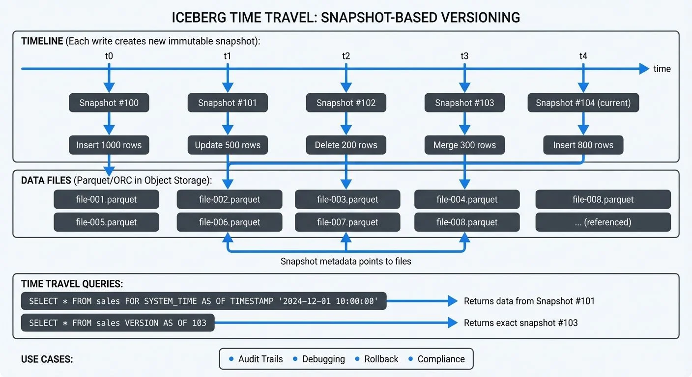

Apache Iceberg's time travel feature allows you to query your data as it appeared at any point in the past. This capability transforms how data teams approach debugging, auditing, and compliance by providing a complete historical view of table evolution without maintaining separate backup copies. For a comprehensive overview of Iceberg's architecture and capabilities, see [Apache Iceberg](https://conduktor.io/glossary/apache-iceberg).

<!-- ORIGINAL_DIAGRAM
```
ICEBERG TIME TRAVEL: SNAPSHOT-BASED VERSIONING

TIMELINE (Each write creates new immutable snapshot):
─────────────────────────────────────────────────────────────▶
   t0         t1         t2         t3         t4      time
   │          │          │          │          │
   ▼          ▼          ▼          ▼          ▼
Snapshot  Snapshot  Snapshot  Snapshot  Snapshot
  #100      #101      #102      #103      #104  (current)
   │          │          │          │          │
Insert    Update    Delete    Merge     Insert
1000 rows 500 rows 200 rows  300 rows  800 rows

DATA FILES (Parquet/ORC in Object Storage):
┌──────────────────────────────────────────────────────────┐
│  file-001.parquet  file-002.parquet  file-003.parquet   │
│  file-004.parquet  file-005.parquet  file-006.parquet   │
│  file-007.parquet  file-008.parquet  ... (referenced)   │
└──────────────────────────────────────────────────────────┘
       ▲                    ▲                    ▲
       │ Snapshot metadata points to files      │
       └────────────────────┴────────────────────┘

TIME TRAVEL QUERIES:
┌──────────────────────────────────────────────────────────┐
│ SELECT * FROM sales                                      │
│ FOR SYSTEM_TIME AS OF TIMESTAMP '2024-12-01 10:00:00'   │
│ ──▶ Returns data from Snapshot #101                     │
│                                                          │
│ SELECT * FROM sales VERSION AS OF 103                   │
│ ──▶ Returns exact snapshot #103                         │
└──────────────────────────────────────────────────────────┘

USE CASES: Audit Trails • Debugging • Rollback • Compliance
```
-->

## Understanding Iceberg Snapshots

At the core of Iceberg's time travel functionality is its snapshot-based architecture. Every write operation, whether insert, update, delete, or merge, creates a new immutable snapshot of the table. Each snapshot represents a complete, consistent view of the table at that moment in time. This is conceptually similar to version control systems like Git, where each commit creates an immutable reference to the repository state.

Unlike traditional data lakes where historical data requires manual versioning or external backup systems, Iceberg maintains this history automatically through its metadata layer. Each snapshot contains:

- A unique snapshot ID
- Timestamp of creation
- Schema at that point in time
- Complete list of data files
- Summary statistics and metadata

This metadata-driven approach means time travel queries don't duplicate data files. Instead, they reference the same underlying Parquet or ORC files that were valid at the queried point in time, making historical queries storage-efficient.

## Time Travel Query Syntax

Iceberg supports time travel through multiple query patterns, giving you flexibility in how you specify which historical version to access.

### Query by Timestamp

The most intuitive approach is querying data as it existed at a specific timestamp:

```sql
-- View data as of a specific date and time
SELECT * FROM sales_data
FOR SYSTEM_TIME AS OF TIMESTAMP '2024-12-01 10:30:00';

-- Alternative syntax (engine-specific, check documentation)
SELECT * FROM sales_data
TIMESTAMP AS OF '2024-12-01 10:30:00';
```

Both syntaxes are functionally equivalent when supported. The `FOR SYSTEM_TIME AS OF` syntax follows the SQL standard and has broader engine support, while some engines like Spark also support the shorter `TIMESTAMP AS OF` variant for convenience.

This syntax works across multiple query engines including Apache Spark 3.5+, Trino 440+, and Dremio 24+. The query returns results using the snapshot that was current at the specified timestamp. Note that exact syntax support may vary slightly between engines; always consult your query engine's Iceberg documentation for the most current compatibility details.

### Query by Snapshot ID

For precise control, you can query a specific snapshot directly:

```sql
-- Query using explicit snapshot ID
SELECT * FROM sales_data
FOR SYSTEM_VERSION AS OF 8234567890123456789;

-- Useful for reproducing exact results
SELECT * FROM sales_data
VERSION AS OF 8234567890123456789;
```

This approach is particularly valuable when you need to reproduce exact query results for compliance or debugging, as snapshot IDs never change.

### Inspecting Available Snapshots

Before time traveling, you often want to see what snapshots are available:

```sql
-- View all snapshots for a table
SELECT * FROM prod_db.sales_data.snapshots
ORDER BY committed_at DESC;

-- See snapshot details including operation type
SELECT
  snapshot_id,
  committed_at,
  operation,
  summary
FROM prod_db.sales_data.snapshots;
```

## Practical Use Cases for Time Travel

Time travel capabilities unlock several critical data engineering workflows that would otherwise require complex custom solutions.

### Audit and Compliance

Financial services and healthcare organizations face strict requirements to explain exactly what data was visible at any point in time. With Iceberg time travel, compliance queries become straightforward. This complements Change Data Capture (CDC) strategies by providing queryable history without maintaining separate audit tables. For CDC implementation patterns, see [What is Change Data Capture (CDC) Fundamentals](https://conduktor.io/glossary/what-is-change-data-capture-cdc-fundamentals).

```sql
-- Reproduce quarterly report exactly as generated
SELECT
  region,
  SUM(revenue) as total_revenue
FROM financial_transactions
FOR SYSTEM_TIME AS OF TIMESTAMP '2024-09-30 23:59:59'
GROUP BY region;
```

This eliminates the need to maintain separate archive databases or backup tables, reducing storage costs and operational complexity.

### Debugging and Root Cause Analysis

When data quality issues arise, time travel lets you pinpoint exactly when incorrect data entered the system. This complements modern data quality frameworks by providing historical context for validation failures. For comprehensive testing strategies, see [Great Expectations Data Testing Framework](https://conduktor.io/glossary/great-expectations-data-testing-framework).

```sql
-- Compare current data with yesterday's snapshot
WITH current AS (
  SELECT customer_id, balance FROM accounts
),
yesterday AS (
  SELECT customer_id, balance FROM accounts
  FOR SYSTEM_TIME AS OF CURRENT_TIMESTAMP - INTERVAL '1' DAY
)
SELECT
  c.customer_id,
  c.balance as current_balance,
  y.balance as yesterday_balance,
  c.balance - y.balance as change
FROM current c
JOIN yesterday y ON c.customer_id = y.customer_id
WHERE ABS(c.balance - y.balance) > 10000;
```

This query identifies accounts with significant balance changes in the last 24 hours, helping quickly isolate data pipeline issues. For systematic approaches to incident response, see [Data Incident Management and Root Cause Analysis](https://conduktor.io/glossary/data-incident-management-and-root-cause-analysis).

### Data Recovery and Rollback

Accidental deletes or incorrect updates can be recovered without restoring from backups:

```sql
-- Restore table to previous snapshot
CALL prod_db.system.rollback_to_snapshot('sales_data', 8234567890123456789);

-- Or restore to a timestamp
CALL prod_db.system.rollback_to_timestamp('sales_data', TIMESTAMP '2024-12-01 10:00:00');
```

This rollback capability provides a safety net for production data pipelines, allowing quick recovery from mistakes.

## Streaming Ecosystem Integration

Iceberg's time travel works seamlessly with streaming platforms, enabling powerful patterns for real-time analytics with historical context. For foundational understanding of streaming architectures, see [Apache Kafka](https://conduktor.io/glossary/apache-kafka).

### Apache Kafka and Flink Integration

When ingesting data from Kafka into Iceberg tables via Apache Flink (1.18+), each checkpoint or commit interval creates a new snapshot. This allows you to correlate streaming data with specific Kafka offsets and timestamps:

```sql
-- Query data as it arrived from Kafka stream
SELECT * FROM events_table
FOR SYSTEM_TIME AS OF TIMESTAMP '2024-12-07 14:30:00'
WHERE event_type = 'purchase';
```

As of 2025, the Flink Iceberg connector supports several advanced features that enhance time travel capabilities:

- **Automatic snapshot creation**: Configure snapshot commit frequency via `write.target-file-size-bytes` and `write.distribution-mode` to balance snapshot granularity with metadata overhead
- **Kafka offset tracking**: The connector stores Kafka offsets and timestamps in Iceberg commit metadata, enabling precise correlation between stream position and table snapshots
- **Incremental reads**: Use time travel to implement incremental processing patterns, reading only data written since the last checkpoint

For Kafka Connect users, the Iceberg sink connector provides similar snapshot-per-commit behavior, making time travel equally powerful for no-code ingestion pipelines.

This capability is crucial for debugging streaming pipelines, as you can examine exactly what data was written during a specific time window and trace issues back to their source Kafka messages. For detailed implementation guidance, see [What is Apache Flink: Stateful Stream Processing](https://conduktor.io/glossary/what-is-apache-flink-stateful-stream-processing).

### Streaming Governance Integration

For organizations running complex streaming infrastructures, governance platforms provide critical visibility into data lineage and schema evolution. When combined with Iceberg's time travel, these tools enable powerful operational and compliance capabilities:

- **Topic-to-snapshot tracking**: Correlate which Kafka topics and offset ranges feed into specific Iceberg snapshots
- **Schema evolution monitoring**: Track schema changes across snapshots and correlate with streaming pipeline deployments
- **Compliance auditing**: Record access patterns to historical data for regulatory requirements
- **Data freshness visualization**: Monitor snapshot creation frequency and identify pipeline delays

Platforms like Conduktor offer comprehensive governance for Kafka ecosystems, including lineage tracking, schema registry management, and audit logging. When integrated with Iceberg's time travel capabilities, this creates a complete audit trail from source events through analytical queries. For audit requirements, see [Audit Logging for Streaming Platforms](https://conduktor.io/glossary/audit-logging-for-streaming-platforms).

## Snapshot Retention and Management

While time travel is powerful, unbounded snapshot retention can lead to metadata bloat and storage costs. Iceberg provides configurable retention policies to balance history preservation with resource efficiency.

### Configuring Retention

```sql
-- Set retention to 7 days of snapshot history
ALTER TABLE sales_data SET TBLPROPERTIES (
  'history.expire.max-snapshot-age-ms' = '604800000'
);

-- Manually expire old snapshots
CALL prod_db.system.expire_snapshots(
  table => 'sales_data',
  older_than => TIMESTAMP '2024-11-01 00:00:00',
  retain_last => 100
);
```

The `retain_last` parameter ensures you always keep a minimum number of recent snapshots, even if they fall outside the time window.

### Best Practices

- **Development tables**: Short retention (1-3 days) to minimize metadata overhead
- **Production analytics**: Medium retention (30-90 days) for debugging and auditing
- **Compliance-critical tables**: Extended retention (1+ years) or permanent archival of specific snapshots
- **High-frequency updates**: Consider longer intervals between snapshots to reduce metadata volume

## Advanced Time Travel Features in 2025

Recent Iceberg releases (1.5+) have introduced several enhancements that make time travel more efficient and powerful:

### Deletion Vectors for Faster Historical Queries

Iceberg 1.5 introduced deletion vectors as an alternative to traditional copy-on-write for delete operations. When querying historical snapshots, the query engine can efficiently skip deleted rows without rewriting entire data files:

```sql
-- Configure deletion vectors for faster deletes
ALTER TABLE events_table SET TBLPROPERTIES (
  'write.delete.mode' = 'merge-on-read',
  'write.update.mode' = 'merge-on-read'
);
```

This significantly improves performance for tables with frequent deletes, as time travel queries can read historical snapshots without processing unnecessary data file copies.

### Metadata Column Optimization

Iceberg now exposes metadata columns that make time travel queries more efficient:

```sql
-- Find all snapshots that modified specific partitions
SELECT DISTINCT _iceberg_snapshot_id, _iceberg_file_path
FROM events_table
WHERE event_date = '2024-12-01'
  AND _iceberg_snapshot_id > 8234567890123456789;
```

These metadata columns (`_iceberg_snapshot_id`, `_iceberg_file_path`, `_iceberg_committed_at`) enable precise snapshot-aware queries without scanning table metadata.

### REST Catalog and Multi-Version Access

Modern Iceberg deployments increasingly use REST catalogs (supported by AWS Glue, Tabular, Nessie, and others) which provide enhanced snapshot management capabilities:

- **Atomic multi-table time travel**: Query consistent snapshots across multiple related tables
- **Branching and tagging**: Create named references to specific snapshots for reproducible analytics
- **Distributed snapshot expiration**: Coordinate retention policies across data lake zones

For teams building lakehouse architectures with multiple Iceberg tables, REST catalogs ensure time travel queries maintain referential integrity across table relationships. For broader lakehouse context, see [Introduction to Lakehouse Architecture](https://conduktor.io/glossary/introduction-to-lakehouse-architecture).

## Related Concepts

- [What is Change Data Capture: CDC Fundamentals](/what-is-change-data-capture-cdc-fundamentals)
- [Data Lineage: Tracking Data from Source to Consumption](/data-lineage-tracking-data-from-source-to-consumption)
- [Real-Time Analytics with Streaming Data](/real-time-analytics-with-streaming-data)

## Summary

Apache Iceberg's time travel feature provides a robust foundation for querying historical data without the complexity of manual versioning systems. By leveraging immutable snapshots, Iceberg enables:

- Effortless compliance and audit reporting with point-in-time queries
- Rapid debugging through historical data comparison
- Safe data recovery via snapshot rollback
- Seamless integration with streaming platforms like Kafka and Flink
- Storage-efficient historical access through metadata-driven architecture
- Advanced 2025 features including deletion vectors, metadata column optimization, and REST catalog support

The combination of flexible query syntax (timestamp and snapshot-based), automatic snapshot management, and configurable retention policies makes Iceberg's time travel suitable for diverse use cases from development experimentation to regulatory compliance.

As data volumes and regulatory requirements continue to grow, the ability to access and reason about historical data states becomes increasingly critical. Iceberg's approach, treating time travel as a first-class feature rather than an afterthought, positions it as a cornerstone technology for modern data platforms. For related data versioning patterns, see [Data Versioning in Streaming](https://conduktor.io/glossary/data-versioning-in-streaming).

## Sources and References

- [Apache Iceberg Documentation: Time Travel and Snapshots](https://iceberg.apache.org/docs/latest/spark-queries/#time-travel)
- [Apache Iceberg Specification: Snapshots](https://iceberg.apache.org/spec/#snapshots)
- [Iceberg Metadata Tables](https://iceberg.apache.org/docs/latest/spark-queries/#querying-with-sql)
- [Apache Flink Iceberg Connector](https://nightlies.apache.org/flink/flink-docs-master/docs/connectors/table/iceberg/)
- [Iceberg REST Catalog Specification](https://iceberg.apache.org/docs/latest/rest/)
- [Conduktor Platform for Kafka Governance](https://www.conduktor.io/)
