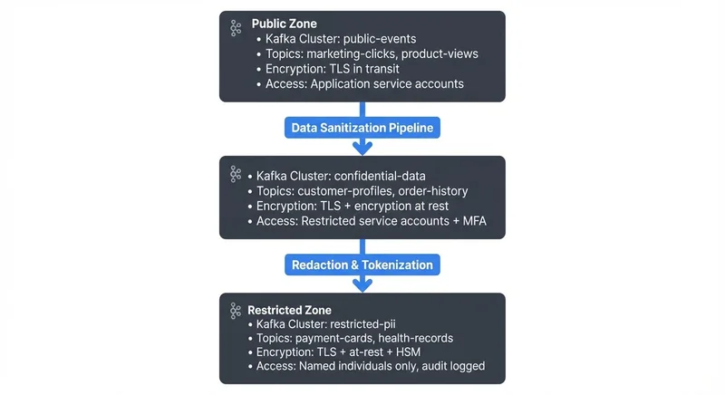
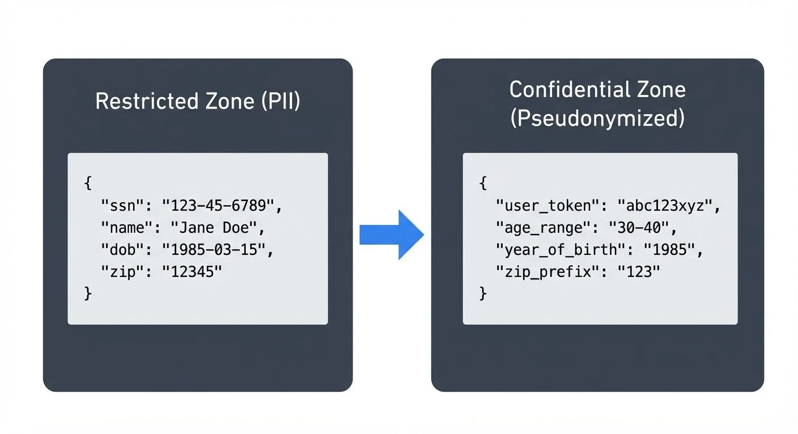

# Trust Zones: Isolating Sensitive Data in Streaming Architectures

## Outline

1. **Introduction: The Security Perimeter Challenge**
   - Data streaming across security boundaries
   - Need for isolation in multi-tenant environments

2. **Understanding Trust Zones**
   - Definition and core principles
   - Security perimeter concept
   - Defense in depth strategy

3. **Why Trust Zones for Streaming Data**
   - Data classification requirements
   - Regulatory compliance drivers
   - Risk mitigation through isolation

4. **Trust Zone Architecture Patterns**
   - Network segmentation approaches
   - Dedicated cluster architectures
   - Zone hierarchy and data flow

5. **Implementing Zone Controls**
   - Access control mechanisms
   - Encryption requirements
   - Ingress and egress controls
   - Monitoring and auditing

6. **Cross-Zone Data Movement**
   - Transformation pipelines
   - Data redaction techniques
   - Sanitization processes

7. **Operational Considerations**
   - Management overhead
   - Performance implications
   - Compliance mapping

---

## Introduction: The Security Perimeter Challenge

Streaming platforms handle data with vastly different security requirements. Customer payment information, personal health records, and public marketing metrics often flow through the same infrastructure. Without proper isolation, a breach in one area can compromise sensitive data across the entire system.

**Real-World Example**: An e-commerce company streams customer behavior data (clicks, page views) to a public analytics cluster accessible to marketing teams. The same infrastructure also processes payment card transactions requiring PCI DSS compliance. Without trust zones, a misconfigured analytics query or compromised marketing account could expose payment card data. Trust zones prevent this by physically or logically separating these workloads—even if marketing systems are compromised, attackers cannot reach payment data in the restricted zone.

Trust zones provide a security architecture pattern that creates isolated environments for processing data based on its sensitivity level. By establishing clear security perimeters and controlling data movement between zones, organizations can protect high-value data while maintaining the flexibility and performance of their streaming platforms.

## Understanding Trust Zones

A **trust zone** is an isolated security perimeter designed to protect data based on its classification level. Think of it as a secure room within a building—only authorized personnel can enter, and everything that comes in or goes out is carefully controlled and logged.

For a comprehensive overview of modern security approaches beyond traditional perimeter-based models, see [Zero Trust for Streaming](https://conduktor.io/glossary/zero-trust-for-streaming).

In streaming architectures, trust zones implement a **defense in depth** strategy—a security approach using multiple, layered security controls so that if one layer fails, others provide backup protection:

- **Physical or logical isolation** separates sensitive workloads from general-purpose processing
- **Network segmentation** restricts communication paths between zones (like building walls between rooms)
- **Access controls** enforce the principle of least privilege (users get only the minimum access they need)
- **Data transformation boundaries** ensure sensitive data is sanitized before leaving high-security zones

The core principle is simple: data classified as highly sensitive should only be processed in environments with equivalent security controls. This prevents accidental exposure and limits the **blast radius** (the scope of damage) of potential security incidents—like containing a fire to one room instead of letting it spread through an entire building.

## Why Trust Zones for Streaming Data

### Data Classification Requirements

Not all data deserves the same level of protection. A well-designed trust zone architecture starts with **data classification** (for detailed strategies, see [Data Classification and Tagging Strategies](https://conduktor.io/glossary/data-classification-and-tagging-strategies)):

- **Public**: Marketing metrics, product catalogs, public APIs
- **Internal**: Employee directories, operational metrics, business KPIs
- **Confidential**: Customer lists, pricing strategies, financial forecasts
- **Restricted**: Payment card data, health records, authentication credentials

Each classification level maps to a specific trust zone with appropriate security controls. For example, restricted data might require dedicated hardware, hardware security modules (HSMs), and complete network isolation, while internal data might only need encrypted transmission and role-based access control.

### Regulatory Compliance Drivers

Compliance frameworks like **PCI DSS**, **HIPAA**, and **GDPR** mandate specific security controls for sensitive data. Trust zones simplify compliance by creating clear boundaries:

- **PCI DSS zones** isolate cardholder data environments with strict network segmentation and access logging
- **HIPAA zones** protect electronic protected health information (ePHI) with encryption at rest and in transit
- **GDPR zones** implement data minimization and purpose limitation for personal data processing

By mapping compliance requirements to specific zones, audit teams can verify controls without examining the entire streaming infrastructure. For comprehensive audit trail implementation, see [Audit Logging for Streaming Platforms](https://conduktor.io/glossary/audit-logging-for-streaming-platforms).

### Risk Mitigation Through Isolation

Trust zones reduce risk by limiting exposure:

- **Lateral movement prevention**: Attackers who compromise a low-security zone cannot easily "move sideways" to access high-security zones (like having locked doors between rooms)
- **Blast radius containment**: A misconfiguration in one zone doesn't affect data in other zones—damage is contained
- **Simplified incident response**: Security teams can quickly identify which data classifications were potentially exposed

## Trust Zone Architecture Patterns

### Network Segmentation Approaches

The foundation of trust zones is **network segmentation**. Common patterns include:

**VPC-Based Isolation**: Each trust zone runs in a dedicated Virtual Private Cloud (VPC)—an isolated virtual network in the cloud—with strict ingress (incoming) and egress (outgoing) rules. Only specific ports and protocols are allowed between zones, and all cross-zone traffic is logged and monitored.

**Subnet Segregation**: Within a single VPC, different subnets host different trust zones. Security groups and network ACLs enforce zone boundaries. This approach reduces complexity but provides less isolation than dedicated VPCs.

**On-Premises Segmentation**: Physical network separation using VLANs and firewalls. Each zone connects to different network segments with dedicated switches and routing policies.

### Dedicated Cluster Architectures

For streaming platforms like Apache Kafka, trust zones often translate to **dedicated clusters**:



<!-- ORIGINAL_DIAGRAM
```
┌─────────────────────────────────────────────────────┐
│                 Public Zone                         │
│  • Kafka Cluster: public-events                     │
│  • Topics: marketing-clicks, product-views          │
│  • Encryption: TLS in transit                       │
│  • Access: Application service accounts             │
└─────────────────────────────────────────────────────┘
                         ↓
              Data Sanitization Pipeline
                         ↓
┌─────────────────────────────────────────────────────┐
│              Confidential Zone                      │
│  • Kafka Cluster: confidential-data                 │
│  • Topics: customer-profiles, order-history         │
│  • Encryption: TLS + encryption at rest             │
│  • Access: Restricted service accounts + MFA        │
└─────────────────────────────────────────────────────┘
                         ↓
              Redaction & Tokenization
                         ↓
┌─────────────────────────────────────────────────────┐
│               Restricted Zone                       │
│  • Kafka Cluster: restricted-pii                    │
│  • Topics: payment-cards, health-records            │
│  • Encryption: TLS + at-rest + HSM                  │
│  • Access: Named individuals only, audit logged     │
└─────────────────────────────────────────────────────┘
```
-->

Each cluster operates in a separate network zone with distinct security controls. Data flows from high-security to low-security zones only after sanitization.

### Kubernetes Namespace Isolation

For cloud-native deployments, **Kubernetes namespaces** provide lightweight trust zones:

- **Network policies** restrict pod-to-pod communication between namespaces
- **Resource quotas** prevent noisy neighbor problems
- **Pod security standards** enforce container security requirements
- **Service mesh authorization** (Istio, Linkerd) controls service-to-service authentication

While not as isolated as dedicated clusters, namespace-based zones offer flexibility for organizations running multiple workloads on shared infrastructure.

#### Service Mesh for Fine-Grained Zone Control (2025)

Modern service mesh solutions provide advanced trust zone isolation at Layer 7:

**Istio (1.20+)**: Industry-leading service mesh with comprehensive security features:

- **Authorization Policies**: Declarative L7 policies enforce zone boundaries based on service identity, HTTP methods, and paths
- **Peer Authentication**: Automatic mutual TLS (mTLS) between services with certificate rotation
- **Request Authentication**: JWT validation for user-to-service authentication
- **Telemetry**: Detailed metrics and traces for all cross-zone traffic

**Example Istio Policy**:
```yaml
apiVersion: security.istio.io/v1beta1
kind: AuthorizationPolicy
metadata:
  name: restricted-zone-ingress
  namespace: restricted-zone
spec:
  action: DENY
  rules:
  - from:
    - source:
        notNamespaces: ["confidential-zone", "restricted-zone"]
    to:
    - operation:
        methods: ["*"]
```

**Linkerd (2.14+)**: Lightweight, high-performance service mesh:

- Ultra-fast sidecar with minimal resource overhead
- Automatic mTLS with SPIFFE/SPIRE identity framework
- Policy enforcement with external authorization (OPA integration)
- Per-route metrics and golden signal monitoring

**eBPF-Based Solutions** (Cilium, Calico): Next-generation network security:

- Kernel-level enforcement with zero-overhead performance
- Identity-aware network policies without sidecars
- API-aware security (HTTP, gRPC, Kafka protocol)
- Transparent encryption between zones

## Implementing Zone Controls

### Access Control Mechanisms

Trust zones enforce **role-based access control (RBAC)** with different requirements per zone:

**Public Zone**:
- Service account authentication
- Read-only access for analytics teams
- Automated monitoring without human approval

**Confidential Zone**:
- Individual user accounts (no shared credentials)
- Multi-factor authentication required
- Time-limited access grants
- Manager approval for new access

**Restricted Zone**:
- Named individual access only
- Hardware token authentication
- Just-in-time access provisioning
- Executive approval required
- All actions logged with video audit trails

#### Modern Authentication (2025)

**OAuth 2.0 / OIDC Integration**: Modern Kafka deployments (Kafka 3.1+) support OAuth 2.0 for user authentication, replacing certificate-based authentication with token-based flows:

- Integration with corporate identity providers (Okta, Auth0, Azure AD, Google Workspace)
- Fine-grained scope-based authorization
- Automatic token refresh and rotation
- Centralized user management and audit trails

**Cloud-Native IAM**: Cloud deployments should leverage native identity services:

- **AWS IAM Roles for Service Accounts**: Kafka clients authenticate using temporary credentials from IAM roles
- **GCP Workload Identity**: Kubernetes pods inherit GCP service account permissions
- **Azure Managed Identity**: Eliminate stored credentials with Azure AD integration

**KRaft Mode Security** (Kafka 4.0+): With the removal of ZooKeeper, KRaft introduces new security considerations:

- Metadata ACLs control access to cluster controller operations
- Simplified security configuration without ZooKeeper ACLs
- Reduced attack surface with fewer components to secure

### Encryption Requirements

Each zone defines minimum encryption standards (2025 recommendations). For detailed implementation guidance, see [Encryption at Rest and in Transit for Kafka](https://conduktor.io/glossary/encryption-at-rest-and-in-transit-for-kafka):


| Zone       | In Transit      | At Rest           | Key Management     |
|------------|-----------------|-------------------|--------------------|
| Public     | TLS 1.3         | AES-256           | Cloud KMS          |
| Internal   | TLS 1.3         | AES-256           | Cloud KMS          |
| Confidential | TLS 1.3 + mTLS | AES-256           | Dedicated KMS      |
| Restricted | TLS 1.3 + mTLS  | AES-256 + HSM     | HSM-backed keys    |

**Key Terms**:
- **TLS (Transport Layer Security)**: Encryption protocol for secure network communication. TLS 1.3 is the latest version with better security and performance. TLS 1.2 is deprecated for new deployments as of 2025.
- **mTLS (Mutual TLS)**: Both client and server authenticate each other with certificates, providing two-way trust
- **HSM (Hardware Security Module)**: Physical device providing tamper-resistant key storage—even physical attacks cannot extract keys
- **KMS (Key Management Service)**: Cloud service for managing encryption keys with automated rotation and access controls

Encryption keys for higher zones must never be accessible from lower zones.

### Ingress and Egress Controls

**Ingress controls** define what data can enter a zone (like security screening at an airport):

- **Schema validation** ensures only expected data formats are accepted (like checking passport format)
- **Data lineage tracking** records source systems and transformations (maintaining a "chain of custody")
- **Rate limiting** prevents resource exhaustion attacks (like limiting visitors per hour)
- **Content inspection** blocks malicious payloads (like scanning luggage)

**Egress controls** protect data leaving a zone (like customs when leaving a country):

- **Data Loss Prevention (DLP)** scans outbound streams for sensitive patterns like credit cards and SSNs
- **Transformation pipelines** automatically redact or tokenize sensitive fields before data crosses boundaries
- **Approval workflows** require human review before cross-zone transfers (like export licenses)
- **Watermarking** embeds invisible tracking identifiers for leak detection (like serial numbers on documents)

### Monitoring and Auditing

Each zone implements progressively stricter monitoring:

**Public Zone**:
- Aggregate metrics (throughput, latency, error rates)
- Automated alerting on anomalies
- Monthly access reviews

**Confidential Zone**:
- Per-topic metrics and access logs
- Real-time anomaly detection
- Weekly access reviews
- Quarterly security assessments

**Restricted Zone**:
- Per-message audit logging
- Real-time security monitoring with SOC integration
- Daily access reviews
- Continuous compliance monitoring
- Annual penetration testing

All audit logs are stored in a separate, write-only zone to prevent tampering.

## Cross-Zone Data Movement

Moving data between trust zones requires careful handling to prevent sensitive data leakage.

### Transformation Pipelines

**Streaming ETL jobs** act as zone boundaries:



<!-- ORIGINAL_DIAGRAM
```
Restricted Zone (PII)          Confidential Zone (Pseudonymized)
──────────────────────         ──────────────────────────────────
{                              {
  "ssn": "123-45-6789",    →     "user_token": "abc123xyz",
  "name": "Jane Doe",            "age_range": "30-40",
  "dob": "1985-03-15",           "year_of_birth": "1985",
  "zip": "12345"                 "zip_prefix": "123"
}                              }
```
-->

Transformation pipelines run in the **source zone** (higher security) and write sanitized data to the **destination zone** (lower security). This ensures sensitive data never leaves the protected environment.

### Data Redaction Techniques

Common redaction patterns for cross-zone movement. For comprehensive coverage of data protection techniques, see [Data Masking and Anonymization for Streaming](https://conduktor.io/glossary/data-masking-and-anonymization-for-streaming):

- **Masking**: Replace sensitive characters with asterisks (e.g., 123-45-6789 becomes ***-**-6789)
- **Hashing**: One-way cryptographic transformation—same input always produces same output, but cannot be reversed
- **Tokenization**: Replace sensitive values with random tokens (like "abc123xyz"), store the real-to-token mapping in a secure vault
- **Generalization**: Reduce precision to protect privacy (exact age 34 → age range "30-40", zip code 12345 → zip prefix "123")
- **Suppression**: Remove fields entirely when not needed downstream (the simplest and most secure option)

### Sanitization Processes

Automated sanitization ensures no sensitive data accidentally crosses zone boundaries:

1. **Schema enforcement**: Reject messages containing restricted field names
2. **Pattern detection**: Block known sensitive patterns (SSNs, credit cards) using regex
3. **Statistical disclosure control**: Aggregate data to prevent re-identification
4. **Differential privacy**: Add calibrated noise to protect individual records

#### Policy-as-Code with Open Policy Agent (OPA)

**Open Policy Agent** enables declarative policy enforcement at zone boundaries:

```rego
# Example OPA policy: Block messages with PII from leaving restricted zone
package zone.boundary.restricted_to_confidential

default allow = false

# Allow only if message has been sanitized
allow {
    not contains_pii(input.message)
    valid_transformation(input.message)
}

contains_pii(msg) {
    regex.match(`\b\d{3}-\d{2}-\d{4}\b`, msg.ssn)
}

contains_pii(msg) {
    regex.match(`\b\d{16}\b`, msg.credit_card)
}

valid_transformation(msg) {
    msg.user_token != null
    not msg.ssn
    not msg.credit_card
}
```

OPA integrates with service meshes (Istio, Linkerd), API gateways, and Kafka proxies to enforce policies consistently across all zone boundaries.

#### Data Governance Platforms (2025)

**Conduktor Platform**: Enterprise-grade Kafka governance for trust zones:

- **[Data Masking](https://docs.conduktor.io/guide/conduktor-in-production/admin/data-mask)**: Automatically redact sensitive fields based on policies at the platform level
- **Zone Monitoring**: Real-time visibility into cross-zone data flows and access patterns
- **Schema Governance**: Field-level security tags and validation rules
- **[Audit Trails](https://docs.conduktor.io/guide/conduktor-in-production/admin/audit-logs)**: Comprehensive compliance reporting for regulatory requirements
- **[Access Control](https://docs.conduktor.io/guide/conduktor-in-production/admin/set-up-rbac)**: Centralized RBAC management across multiple Kafka clusters

**Conduktor Gateway**: Acts as an intelligent proxy at zone boundaries:

- **Policy Enforcement**: Intercept and validate messages against data contracts before crossing zones
- **Automatic Sanitization**: Apply transformation rules (redaction, tokenization, encryption) transparently
- **Rate Limiting**: Protect zones from resource exhaustion with per-client quotas
- **Chaos Engineering**: Test zone isolation resilience by injecting failures
- **Protocol Translation**: Enable secure communication between zones with different security requirements

Example: Conduktor Gateway can automatically strip PII fields from messages leaving a restricted zone, ensuring compliance without modifying application code.

Automated governance platforms like Conduktor enforce data contracts and policies at zone boundaries, automatically blocking messages that violate sanitization rules.

## Operational Considerations

### Management Overhead

Trust zones add operational complexity:

- **Multiple clusters** require separate monitoring, upgrades, and capacity planning
- **Network policies** need careful design to avoid blocking legitimate traffic
- **Access management** becomes more complex with zone-specific permissions
- **Data pipelines** require additional transformation stages

Organizations should start with coarse-grained zones (public, internal, restricted) and refine based on actual compliance and security needs.

### Performance Implications

Zone boundaries introduce latency:

- **Cross-zone network hops** add milliseconds to end-to-end processing
- **Transformation pipelines** consume CPU and memory for sanitization
- **Encryption overhead** increases with stronger algorithms (HSMs, AES-256)

Optimize by:
- Batching cross-zone transfers to amortize overhead
- Using dedicated network paths for high-throughput zone connections
- Caching transformed data to avoid repeated sanitization

### Compliance Mapping

Map trust zones to compliance requirements:

**PCI DSS**:
- **Cardholder Data Environment (CDE)**: Restricted zone with network isolation, encryption, and access logging
- **Non-CDE**: Lower zones for sanitized payment metadata

**HIPAA**:
- **ePHI Zone**: Restricted zone with BAA-covered infrastructure, encryption, and audit controls
- **De-identified Data**: Public zone after safe harbor or expert determination

**GDPR**:
- **Personal Data Zone**: Confidential zone with data minimization and purpose limitation
- **Anonymized Data**: Public zone after irreversible anonymization

Regular audits verify zone controls match compliance obligations. For detailed GDPR implementation guidance, see [GDPR Compliance for Data Teams](https://conduktor.io/glossary/gdpr-compliance-for-data-teams).

## Implementation Examples

### Kafka ACL Configuration for Trust Zones

Configure Kafka Access Control Lists to enforce zone boundaries. For comprehensive ACL patterns and best practices, see [Kafka ACLs and Authorization Patterns](https://conduktor.io/glossary/kafka-acls-and-authorization-patterns):

```bash
# Restricted zone - only specific service account can produce
kafka-acls --bootstrap-server restricted-kafka:9093 \
  --add --allow-principal User:payment-processor \
  --operation Write --topic payment-cards

# Confidential zone - analytics can only consume sanitized data
kafka-acls --bootstrap-server confidential-kafka:9093 \
  --add --allow-principal User:analytics-service \
  --operation Read --topic customer-profiles-sanitized \
  --group analytics-consumers
```

### Network Policy for Kubernetes Zone Isolation

Implement namespace-based trust zones with network policies:

```yaml
apiVersion: networking.k8s.io/v1
kind: NetworkPolicy
metadata:
  name: restricted-zone-isolation
  namespace: restricted-zone
spec:
  podSelector: {}
  policyTypes:
  - Ingress
  - Egress
  ingress:
  # Only allow ingress from transformation pipeline
  - from:
    - namespaceSelector:
        matchLabels:
          zone: confidential
    - podSelector:
        matchLabels:
          app: data-sanitizer
  egress:
  # Only allow egress to Kafka and monitoring
  - to:
    - podSelector:
        matchLabels:
          app: kafka
    ports:
    - protocol: TCP
      port: 9093
```

### Data Sanitization Pipeline Example

Implement cross-zone data transformation with Apache Kafka Streams:

```java
public class TrustZoneSanitizer {

    public static void main(String[] args) {
        StreamsBuilder builder = new StreamsBuilder();

        // Read from restricted zone
        KStream<String, UserProfile> restrictedStream = builder
            .stream("restricted.user-pii",
                Consumed.with(Serdes.String(), userProfileSerde()));

        // Sanitize sensitive fields
        KStream<String, SanitizedProfile> sanitized = restrictedStream
            .mapValues(profile -> {
                return SanitizedProfile.builder()
                    .userToken(hashUserId(profile.getSsn()))
                    .ageRange(calculateAgeRange(profile.getDateOfBirth()))
                    .zipPrefix(profile.getZipCode().substring(0, 3))
                    .yearOfBirth(profile.getDateOfBirth().getYear())
                    .build();
            });

        // Write to confidential zone
        sanitized.to("confidential.user-profiles",
            Produced.with(Serdes.String(), sanitizedProfileSerde()));

        KafkaStreams streams = new KafkaStreams(builder.build(), getConfig());
        streams.start();
    }

    private static String hashUserId(String ssn) {
        try {
            MessageDigest digest = MessageDigest.getInstance("SHA-256");
            byte[] hash = digest.digest(ssn.getBytes(StandardCharsets.UTF_8));
            return Base64.getEncoder().encodeToString(hash);
        } catch (NoSuchAlgorithmException e) {
            throw new RuntimeException("SHA-256 algorithm not available", e);
        }
    }

    private static String calculateAgeRange(LocalDate dob) {
        int age = Period.between(dob, LocalDate.now()).getYears();
        int lowerBound = (age / 10) * 10;
        return lowerBound + "-" + (lowerBound + 9);
    }
}
```

### Terraform Configuration for VPC Zone Isolation

Create isolated network zones with infrastructure as code:

```hcl
# Restricted zone VPC
resource "aws_vpc" "restricted_zone" {
  cidr_block           = "10.1.0.0/16"
  enable_dns_hostnames = true

  tags = {
    Name = "restricted-zone-vpc"
    TrustZone = "restricted"
  }
}

# Confidential zone VPC
resource "aws_vpc" "confidential_zone" {
  cidr_block           = "10.2.0.0/16"
  enable_dns_hostnames = true

  tags = {
    Name = "confidential-zone-vpc"
    TrustZone = "confidential"
  }
}

# VPC peering for controlled cross-zone communication
resource "aws_vpc_peering_connection" "restricted_to_confidential" {
  vpc_id        = aws_vpc.restricted_zone.id
  peer_vpc_id   = aws_vpc.confidential_zone.id
  auto_accept   = true

  tags = {
    Name = "restricted-to-confidential-peering"
  }
}

# Security group - only allow sanitization pipeline traffic
# Note: AWS security groups use implicit deny - only explicitly allowed traffic is permitted
resource "aws_security_group" "zone_boundary" {
  name        = "trust-zone-boundary"
  description = "Controls traffic between trust zones"
  vpc_id      = aws_vpc.restricted_zone.id

  # Allow outbound only to sanitization pipeline in confidential zone
  egress {
    from_port   = 9092
    to_port     = 9092
    protocol    = "tcp"
    cidr_blocks = ["10.2.1.0/24"]  # Sanitization pipeline subnet
    description = "Kafka cross-zone replication"
  }

  # No other egress rules = implicit deny for all other traffic
  tags = {
    Name      = "zone-boundary-sg"
    TrustZone = "boundary"
  }
}
```

### Data Loss Prevention Scanning

Implement DLP scanning at zone egress points:

```python
import re
import json
from datetime import datetime
from kafka import KafkaConsumer, KafkaProducer

class ZoneBoundaryDLP:
    # Sensitive data patterns
    SSN_PATTERN = re.compile(r'\b\d{3}-\d{2}-\d{4}\b')
    CREDIT_CARD_PATTERN = re.compile(r'\b\d{4}[\s-]?\d{4}[\s-]?\d{4}[\s-]?\d{4}\b')

    def __init__(self, source_zone, dest_zone):
        self.consumer = KafkaConsumer(
            f'{source_zone}.sanitized',
            bootstrap_servers=['zone-boundary:9092'],
            value_deserializer=lambda m: json.loads(m.decode('utf-8'))
        )
        self.producer = KafkaProducer(
            bootstrap_servers=[f'{dest_zone}-kafka:9092'],
            value_serializer=lambda v: json.dumps(v).encode('utf-8')
        )
        self.blocked_messages = 0

    def scan_and_forward(self):
        for message in self.consumer:
            data_str = json.dumps(message.value)

            # Scan for sensitive patterns
            if self.contains_sensitive_data(data_str):
                self.log_violation(message)
                self.blocked_messages += 1
                continue

            # Forward to destination zone
            self.producer.send(
                message.topic.replace(source_zone, dest_zone),
                value=message.value
            )

    def contains_sensitive_data(self, data_str):
        return (
            self.SSN_PATTERN.search(data_str) or
            self.CREDIT_CARD_PATTERN.search(data_str)
        )

    def log_violation(self, message):
        # Log to security monitoring system
        security_event = {
            'timestamp': datetime.now().isoformat(),
            'event_type': 'zone_boundary_violation',
            'source_topic': message.topic,
            'offset': message.offset,
            'violation_type': 'sensitive_data_detected'
        }
        self.producer.send('security.violations', value=security_event)
```

## Sources and References

1. **PCI Security Standards Council** - "Information Supplement: PCI DSS Tokenization Guidelines" (2023)
   Comprehensive guidance on implementing network segmentation and zone isolation for cardholder data environments, including architectural patterns and compliance validation.

2. **National Institute of Standards and Technology (NIST)** - "NIST Special Publication 800-53: Security and Privacy Controls for Information Systems and Organizations" (2020)
   Authoritative framework for implementing security controls including system and communications protection (SC) and access control (AC) families that underpin trust zone architectures.

3. **Apache Kafka Documentation** - "Security Overview: Authentication, Authorization, and Encryption"
   Official documentation covering ACL configuration, SSL/TLS encryption, and SASL authentication mechanisms essential for implementing zone-level security controls in Kafka deployments.

4. **Cloud Security Alliance** - "Security Guidance for Critical Areas of Focus in Cloud Computing v4.0" (2017)
   Industry best practices for implementing network segmentation, data classification, and defense-in-depth strategies in cloud-based streaming architectures.

5. **U.S. Department of Health and Human Services** - "HIPAA Security Rule Technical Safeguards"
   Regulatory requirements for implementing technical safeguards including access controls, audit controls, and transmission security relevant to healthcare data streaming zones.

## Getting Started: Minimal Trust Zone Implementation

For organizations new to trust zones, start simple and expand:

**Phase 1: Two-Zone Architecture** (Minimal Viable Security)
- **Public Zone**: Non-sensitive data, standard access controls, TLS encryption
- **Restricted Zone**: Sensitive data (PII, payment cards), strict access controls, mTLS encryption, all access logged

**Phase 2: Add Transformation Pipeline**
- Deploy a sanitization service at the zone boundary
- Implement schema validation and DLP scanning
- Create monitoring dashboards for cross-zone data flows

**Phase 3: Expand and Refine**
- Add intermediate zones (Internal, Confidential) as needed
- Implement policy-as-code with OPA
- Deploy governance platforms like Conduktor for centralized management

**Common Pitfalls to Avoid**:
- **Over-segmentation**: Don't create zones for every data type—start with 2-3 broad classifications
- **Forgotten documentation**: Maintain clear zone definitions and data flow diagrams
- **Neglecting monitoring**: Zone boundaries are only effective if violations are detected and acted upon
- **Hardcoded credentials**: Use cloud-native IAM and service accounts instead of storing secrets

## Conclusion

Trust zones provide a structured approach to protecting sensitive data in streaming architectures. By creating isolated environments with appropriate security controls, organizations can:

- Meet regulatory compliance requirements with clear zone-to-compliance mappings
- Reduce risk through defense in depth and blast radius containment
- Enable safe data sharing by sanitizing data at zone boundaries
- Simplify audits with well-defined security perimeters

Start by classifying your streaming data, define zones matching those classifications, and implement progressively stronger controls for higher-sensitivity zones. The upfront investment in zone design pays dividends in reduced breach risk and streamlined compliance.
