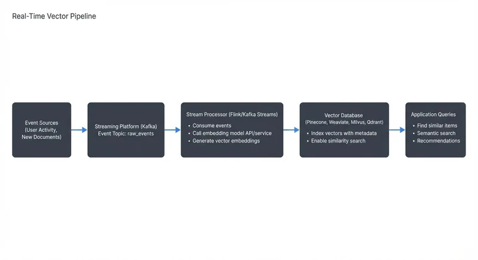

# Vector Databases and Streaming Architectures

Vector databases have emerged as a critical infrastructure component for modern AI applications, particularly those requiring semantic search, recommendations, and similarity matching. When combined with streaming architectures, they enable real-time intelligent processing at scale. This article explores how these technologies work together and the patterns that make this integration effective.

## Understanding Vector Databases

Vector databases are specialized storage systems designed to efficiently store, index, and query high-dimensional vectors. Unlike traditional databases that store structured data in rows and columns, vector databases store numerical representations of unstructured data such as text, images, audio, or any content that can be transformed into embeddings.

The fundamental difference lies in the query pattern. Traditional databases use exact matches or range queries (e.g., "find all users where age > 25"). Vector databases perform similarity searches, answering questions like "find the 10 most similar items to this product" or "retrieve documents semantically related to this query."

Popular vector database systems include dedicated solutions like Pinecone, Weaviate, Milvus, Qdrant, and Chroma, as well as vector extensions for traditional databases such as pgvector for PostgreSQL, Redis with vector search capabilities, and OpenSearch's vector engine. These systems use specialized indexing algorithms such as HNSW (Hierarchical Navigable Small World, offering the best accuracy-speed balance), IVF (Inverted File Index, optimized for large-scale datasets), or LSH (Locality-Sensitive Hashing, fastest but less precise) to perform approximate nearest neighbor searches efficiently, even with millions or billions of vectors.

## Vector Embeddings and Similarity Search

Vector embeddings are dense numerical representations of data, typically generated by machine learning models. A sentence might be converted into a 768-dimensional vector, an image into a 512-dimensional vector. These embeddings capture semantic meaning in a way that similar items have similar vector representations.

For example, the sentences "The cat sat on the mat" and "A feline rested on the rug" would have embeddings that are close together in vector space, even though they share few words. This is because embedding models learn to encode meaning rather than just syntax.

Similarity is measured using distance metrics such as cosine similarity, Euclidean distance, or dot product. When a query arrives, the database computes its embedding and searches for vectors with the smallest distance to find the most relevant results. This enables semantic search that understands intent rather than just matching keywords.

The challenge is performance. Computing distances across millions of vectors for every query would be prohibitively slow. This is why vector databases use approximate nearest neighbor (ANN) algorithms that trade perfect accuracy for speed, typically achieving 95%+ recall while being orders of magnitude faster than brute-force search. In practical terms, if you search for the 10 most similar products and the perfect answer would return items A through J, an ANN algorithm might return A through I plus item K instead of J. The result is still highly relevant, but the query completes in milliseconds instead of seconds.

## Streaming Architectures Fundamentals

Streaming architectures process data continuously as it arrives, rather than in batch jobs. Systems like Apache Kafka 4.0+ (now running on KRaft consensus instead of ZooKeeper), Apache Flink 2.0+, and Apache Pulsar 3.x+ form the backbone of modern data streaming platforms, enabling organizations to react to events in real-time. For detailed coverage of Kafka fundamentals and architecture, see [Apache Kafka](https://conduktor.io/glossary/apache-kafka).

In a streaming architecture, data flows through pipelines as events. Producers write events to topics, consumers read and process them, and stream processors transform, aggregate, or enrich the data. This creates a continuous flow of information that can power real-time applications, dashboards, and machine learning models.

The key characteristics of streaming systems are low latency, high throughput, and fault tolerance. Events are processed within milliseconds to seconds of their creation, and the system can handle thousands to millions of events per second while ensuring data is not lost even during failures.

## Integrating Vector Databases with Streaming Pipelines

The integration of vector databases with streaming architectures creates powerful real-time AI capabilities. The typical pattern involves a streaming pipeline that processes events, generates embeddings, and writes them to a vector database for immediate querying.



<!-- ORIGINAL_DIAGRAM
```
Real-Time Vector Pipeline:
┌─────────────────┐
│  Event Sources  │
│ (User Activity, │
│  New Documents) │
└────────┬────────┘
         │
         ▼
┌─────────────────────────────────────────────┐
│        Streaming Platform (Kafka)            │
│         Event Topic: raw_events              │
└────────┬────────────────────────────────────┘
         │
         ▼
┌─────────────────────────────────────────────┐
│   Stream Processor (Flink/Kafka Streams)    │
│   • Consume events                          │
│   • Call embedding model API/service        │
│   • Generate vector embeddings              │
└────────┬────────────────────────────────────┘
         │
         ▼
┌─────────────────────────────────────────────┐
│         Vector Database                      │
│  (Pinecone, Weaviate, Milvus, Qdrant)      │
│  • Index vectors with metadata              │
│  • Enable similarity search                 │
└────────┬────────────────────────────────────┘
         │
         ▼
┌─────────────────────────────────────────────┐
│      Application Queries                     │
│  • Find similar items                       │
│  • Semantic search                          │
│  • Recommendations                          │
└─────────────────────────────────────────────┘
```
-->

For instance, an e-commerce platform might stream new product descriptions through this pipeline. As soon as a merchant adds a product, its embedding is generated and indexed, making it immediately searchable and enabling real-time "similar products" recommendations.

Tools like Conduktor, a comprehensive Kafka management and governance platform, can be valuable in this architecture for managing Kafka topics, monitoring data quality of the events feeding the pipeline, and ensuring governance around potentially sensitive data being embedded. Conduktor Gateway can also be used for testing chaos scenarios such as network latency or partition failures that are common in ML pipelines. Data quality issues upstream can lead to poor embeddings, so visibility into the streaming pipeline is essential.

## Implementation Example

Here's a practical example using Python with Kafka, Sentence Transformers for embeddings, and Pinecone as the vector database:

```python
from kafka import KafkaConsumer
from sentence_transformers import SentenceTransformer
import pinecone
import json

# Initialize embedding model (runs locally)
model = SentenceTransformer('all-MiniLM-L6-v2')  # 384-dimensional embeddings

# Initialize Pinecone vector database
pinecone.init(api_key='your-api-key', environment='us-west1-gcp')
index = pinecone.Index('product-embeddings')

# Kafka consumer configuration
consumer = KafkaConsumer(
    'product-events',
    bootstrap_servers=['localhost:9092'],
    value_deserializer=lambda m: json.loads(m.decode('utf-8')),
    group_id='vector-indexer',
    auto_offset_reset='earliest'
)

# Process stream and generate embeddings
for message in consumer:
    product = message.value

    try:
        # Generate embedding from product description
        text = f"{product['name']} {product['description']}"
        embedding = model.encode(text).tolist()

        # Upsert to vector database with metadata
        index.upsert(vectors=[(
            product['id'],           # unique ID
            embedding,               # vector embedding
            {                        # metadata for filtering
                'name': product['name'],
                'category': product['category'],
                'price': product['price']
            }
        )])

        print(f"Indexed product: {product['id']}")

    except Exception as e:
        print(f"Error processing product {product.get('id')}: {e}")
        # In production, send to dead letter queue

# Querying for similar products
def find_similar_products(query_text, top_k=10):
    query_embedding = model.encode(query_text).tolist()

    results = index.query(
        vector=query_embedding,
        top_k=top_k,
        include_metadata=True
    )

    return [(match['id'], match['score'], match['metadata'])
            for match in results['matches']]

# Example query
similar = find_similar_products("wireless bluetooth headphones", top_k=5)
for product_id, score, metadata in similar:
    print(f"{metadata['name']} (similarity: {score:.2f})")
```

For production deployments with Flink, you can use PyFlink or the Flink Java API to handle more sophisticated windowing, state management, and exactly-once semantics. Here's a conceptual Flink example:

```java
// Flink streaming job with vector database sink
StreamExecutionEnvironment env = StreamExecutionEnvironment.getExecutionEnvironment();
env.enableCheckpointing(10000); // checkpoint every 10 seconds

DataStream<Product> products = env
    .addSource(new FlinkKafkaConsumer<>("product-events",
        new ProductDeserializer(), kafkaProps))
    .uid("kafka-source");

// Process and generate embeddings
DataStream<VectorRecord> embeddings = products
    .map(new EmbeddingGeneratorFunction())  // calls embedding service
    .uid("embedding-generator");

// Sink to vector database
embeddings.addSink(new PineconeSinkFunction())
    .uid("vector-db-sink");

env.execute("Vector Embedding Pipeline");
```

This pipeline provides exactly-once processing guarantees through Flink's checkpointing mechanism, ensuring embeddings aren't duplicated even during failures.

## Native Streaming Integrations

Some vector databases provide built-in connectors for streaming platforms, simplifying the architecture by eliminating custom integration code:

**Weaviate Kafka Connector**: Weaviate offers a native Kafka connector that can directly consume events from Kafka topics and automatically generate embeddings using configured models. This reduces the need for custom stream processing code and provides automatic retry logic and error handling.

**Pinecone Spark Connector**: While not streaming-native, Pinecone's Spark connector can be used with Spark Structured Streaming to process micro-batches from Kafka and write to Pinecone with optimized batching.

**Qdrant with Change Data Capture**: Qdrant can integrate with CDC tools like Debezium (see [Implementing CDC with Debezium](https://conduktor.io/glossary/implementing-cdc-with-debezium)) to automatically sync embeddings when source database records change, useful for scenarios where vector embeddings represent database entities.

These native integrations can significantly reduce development time and operational complexity, though they may offer less flexibility than custom stream processing pipelines. Evaluate whether the connector supports your required throughput, error handling, and monitoring needs before choosing this approach.

## Real-World Use Cases

**Personalized Recommendations**: Streaming user behavior (clicks, views, purchases) generates real-time user embeddings that are matched against product embeddings to deliver instant personalized recommendations. Netflix and Spotify use variations of this pattern.

**Semantic Search**: As documents, support tickets, or knowledge base articles are created, they are immediately embedded and indexed, enabling users to search by meaning rather than keywords. GitHub's code search uses semantic understanding to find relevant code snippets.

**Fraud Detection**: Financial transactions stream through embedding models that capture transaction patterns. New transactions are compared against known fraud patterns in vector space, enabling real-time anomaly detection with lower false positive rates than rule-based systems.

**Content Moderation**: Social media posts are embedded and compared against known problematic content in real-time, enabling faster moderation while understanding context and variations of harmful content.

## Implementation Challenges and Best Practices

**Latency Considerations**: Generating embeddings adds latency to the pipeline. For real-time applications, this might mean using smaller, faster models or batching requests to embedding services. Some organizations deploy embedding models on GPUs within their stream processors to minimize network overhead. Model serving infrastructure like NVIDIA Triton Inference Server, TorchServe, or ONNX Runtime can be deployed alongside stream processors (Flink or Kafka Streams) to provide low-latency inference. These platforms support batching, model versioning, and GPU acceleration, making them ideal for high-throughput streaming scenarios where embedding generation is the bottleneck.

**Consistency and Ordering**: Streaming systems must handle out-of-order events and ensure embeddings are updated correctly when source data changes. Implementing proper deduplication and update strategies is critical, especially when the same entity might be updated multiple times in quick succession.

**Scalability**: As data volume grows, both the streaming infrastructure and vector database must scale. This often means partitioning data, using multiple vector database instances, or implementing tiered storage where recent embeddings are hot and older ones are archived.

**Data Quality**: Poor quality input data leads to poor embeddings. Common issues include missing fields, malformed text, encoding problems, or data that violates business rules. Implementing validation, schema enforcement, and monitoring throughout the pipeline is essential. For comprehensive data quality strategies, see [Building a Data Quality Framework](https://conduktor.io/glossary/building-a-data-quality-framework) and [Automated Data Quality Testing](https://conduktor.io/glossary/automated-data-quality-testing). Dead letter queues for failed embedding generation and alerting on embedding quality metrics help maintain system health. For error handling patterns, refer to [Dead Letter Queues for Error Handling](https://conduktor.io/glossary/dead-letter-queues-for-error-handling).

**Cost Management**: Generating embeddings at scale can be expensive, especially when using third-party APIs. Caching frequently embedded content, using batch processing where real-time isn't required, and considering self-hosted embedding models can reduce costs significantly.

**Observability and Monitoring**: Production vector pipelines require comprehensive monitoring across multiple dimensions:

- **Pipeline Throughput**: Track events/second through each stage (Kafka consumption rate, embedding generation rate, vector DB insertion rate)
- **Latency Metrics**: Measure end-to-end latency from event arrival to vector indexing, with percentile breakdowns (p50, p95, p99)
- **Embedding Quality**: Monitor embedding distribution (detect drift), average vector magnitude, and cosine similarity distributions
- **Vector Database Health**: Query latency, index size, memory usage, and recall metrics if ground truth is available
- **Error Rates**: Failed embeddings, vector DB timeouts, deserialization errors with alerting thresholds
- **Consumer Lag**: Critical for Kafka-based systems to detect processing bottlenecks

Tools like Prometheus and Grafana are commonly used for metrics collection and visualization. For Kafka-specific monitoring, Conduktor provides built-in observability for consumer lag, throughput, and data quality issues. Setting up alerts for consumer lag spikes or embedding latency degradation helps catch issues before they impact end users.

## Summary

Vector databases and streaming architectures represent a powerful combination for building real-time AI applications. Vector databases provide efficient similarity search over high-dimensional embeddings, while streaming platforms enable continuous processing and updating of these embeddings as new data arrives.

The integration enables use cases from personalized recommendations to fraud detection, all operating in real-time. Success requires careful attention to latency, data quality, scalability, and cost management. As embedding models become more efficient and vector databases more scalable, this architectural pattern will continue to expand across industries.

Organizations building these systems should focus on incremental implementation, starting with a single use case and expanding as they develop expertise in managing both the streaming pipeline and vector database operations.

## Related Topics

For deeper understanding of the technologies and patterns discussed in this article:

- **Streaming Fundamentals**: [Apache Kafka](https://conduktor.io/glossary/apache-kafka) provides the foundational architecture for event streaming
- **Stream Processing**: [Introduction to Kafka Streams](https://conduktor.io/glossary/introduction-to-kafka-streams) and [Flink DataStream API](https://conduktor.io/glossary/flink-datastream-api-building-streaming-applications) for building processing pipelines
- **ML Integration**: [Feature Stores for Machine Learning](https://conduktor.io/glossary/feature-stores-for-machine-learning) for managing embeddings and features at scale
- **Monitoring**: [Consumer Lag Monitoring](https://conduktor.io/glossary/consumer-lag-monitoring) and [Kafka Cluster Monitoring and Metrics](https://conduktor.io/glossary/kafka-cluster-monitoring-and-metrics) for operational visibility
- **Data Governance**: [Schema Registry and Schema Management](https://conduktor.io/glossary/schema-registry-and-schema-management) for managing event schemas and [Data Contracts for Reliable Pipelines](https://conduktor.io/glossary/data-contracts-for-reliable-pipelines)
- **Testing**: [Chaos Engineering for Streaming Systems](https://conduktor.io/glossary/chaos-engineering-for-streaming-systems) for resilience testing
- **Recommendations Use Case**: [Building Recommendation Systems with Streaming Data](https://conduktor.io/glossary/building-recommendation-systems-with-streaming-data) provides additional context on this use case

## Sources and References

1. **Pinecone Documentation** - "What is a Vector Database?" - Comprehensive overview of vector database concepts and use cases (https://www.pinecone.io/learn/vector-database/)

2. **Weaviate Blog** - "Vector Databases and Streaming Data" - Technical deep dive on integrating vector databases with streaming architectures (https://weaviate.io/blog)

3. **Apache Kafka Documentation** - "Stream Processing" - Official documentation on stream processing patterns and best practices (https://kafka.apache.org/documentation/streams/)

4. **Meta AI Research** - "FAISS: A Library for Efficient Similarity Search" - Research paper on approximate nearest neighbor search algorithms (https://arxiv.org/abs/1702.08734)

5. **Apache Flink Documentation** - "Machine Learning with Flink" - Patterns for integrating ML models in streaming applications (https://flink.apache.org/)
