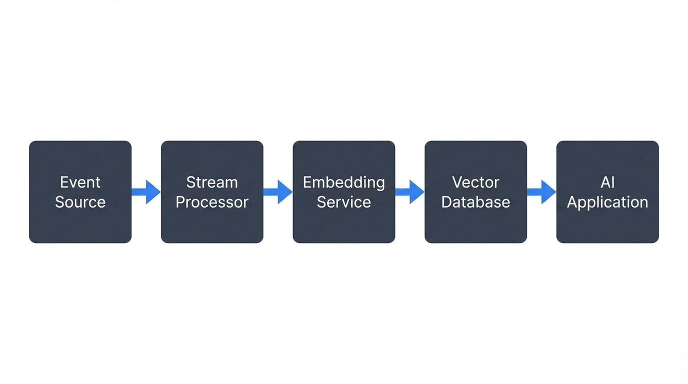

## Introduction

Vector embeddings have become the foundation of modern AI applications, transforming unstructured data like text, images, and audio into dense numerical representations that machines can understand and compare. While batch processing of embeddings has been the norm, streaming architectures are increasingly critical for applications that require real-time intelligence: conversational AI with up-to-date knowledge, live recommendation systems, and fraud detection that adapts to emerging patterns.

Streaming vector embeddings means generating these numerical representations in real-time as data flows through your system, immediately making them available for similarity search, retrieval-augmented generation (RAG), and AI agents. This article explores how to build robust streaming pipelines that generate, manage, and govern vector embeddings at scale.

## What Are Vector Embeddings?

Vector embeddings are dense numerical arrays that capture the semantic meaning of data. Unlike traditional keyword-based approaches, embeddings place similar concepts close together in high-dimensional space. The sentence "database migration" might produce a 1,536-dimensional vector like `[0.023, -0.891, 0.445, ...]`, which would be mathematically close to vectors for "schema evolution" or "data migration."

These representations are created by machine learning models trained on vast datasets. The models learn to encode context, relationships, and nuances that simple word counting cannot capture. For example, "bank" in "river bank" produces a different embedding than "bank" in "savings bank" because the surrounding context influences the representation.

Embeddings enable:
- **Semantic search**: Finding documents by meaning, not just keywords
- **Similarity detection**: Identifying related content, duplicate detection, clustering
- **Classification**: Categorizing content based on learned patterns
- **Recommendations**: Suggesting items based on user preferences encoded as vectors

## Why Stream Vector Embeddings?

Traditional batch processing generates embeddings periodically—perhaps nightly or weekly. This approach creates a fundamental problem: your AI systems operate on stale data. A customer support chatbot trained on yesterday's documentation cannot answer questions about features released today. A recommendation engine working from last week's embeddings cannot adapt to trending content.

Streaming embedding generation solves this by processing data as it arrives:

**Real-time RAG pipelines**: When new documentation, support tickets, or knowledge base articles are published, they're immediately embedded and searchable. LLMs can retrieve the freshest context for their responses.

**Live personalization**: User interactions stream into the system, generating embeddings that update recommendation models in real-time. The system learns from clicks, purchases, and feedback as they happen. For comprehensive coverage of recommendation architectures, see [Building Recommendation Systems with Streaming Data](https://conduktor.io/glossary/building-recommendation-systems-with-streaming-data).

**Anomaly detection**: Transaction streams are embedded and compared against historical patterns. Unusual patterns trigger alerts within seconds, not hours later during batch processing.

**Dynamic AI agents**: Agentic systems that need to reason over constantly updating information—market data, social media, sensor readings—require fresh embeddings to make informed decisions.

The tradeoff is complexity: streaming systems must handle fluctuating load, ensure ordering guarantees, manage failures gracefully, and coordinate between multiple processing stages.

## Streaming Architecture for Embeddings

A typical streaming embedding pipeline follows this pattern:



<!-- ORIGINAL_DIAGRAM
```
Event Source → Stream Processor → Embedding Service → Vector Database → AI Application
```
-->

**Event ingestion**: Data flows into a streaming platform like Apache Kafka (4.0+ with KRaft for simplified operations), Amazon Kinesis, or Apache Pulsar. Events might be new documents, chat messages, product descriptions, or image uploads. For foundational Kafka concepts, see [Apache Kafka](https://conduktor.io/glossary/apache-kafka).

**Stream processing**: A processing layer (Apache Flink, Kafka Streams, or custom microservices) consumes events, performs preprocessing, and routes them to embedding services. This layer handles:
- Chunking long documents into manageable segments
- Deduplication to avoid processing the same content twice
- Enrichment with metadata that should accompany embeddings
- Rate limiting to respect embedding API quotas

**Embedding generation**: Specialized services transform data into vectors. Options include:
- **OpenAI APIs**: `text-embedding-3-small` (1,536 dimensions) or `text-embedding-3-large` (3,072 dimensions) offer excellent quality with managed infrastructure
- **Cohere Embed v3**: Multilingual models optimized for semantic search with compression options and improved retrieval quality
- **Voyage AI**: Specialized models for code, documents, and multilingual content with state-of-the-art retrieval performance
- **Mistral Embed**: European alternative with strong multilingual capabilities and competitive pricing
- **Open-source models**: Sentence-transformers, Nomic Embed, BGE-M3, E5 models, or domain-specific models you can host and fine-tune

**Vector storage**: Generated embeddings flow into vector databases designed for similarity search:
- **Pinecone**: Managed vector database with millisecond queries at scale
- **Weaviate**: Open-source with rich filtering and hybrid search capabilities
- **Qdrant**: Rust-based open-source vector database with excellent performance and filtering
- **Milvus**: High-performance, cloud-native vector database with GPU acceleration support
- **pgvector**: PostgreSQL extension for teams wanting vectors alongside relational data
- **Chroma**: Embedded vector database ideal for local development and smaller deployments
- **LanceDB**: Serverless vector database built on Lance format, optimized for multi-modal data

**AI consumption**: Applications query the vector store using similarity search (k-NN for k-Nearest Neighbors, ANN for Approximate Nearest Neighbors), retrieve relevant embeddings, and feed them to LLMs, recommendation engines, or classification models.

## Processing Patterns and Implementation

**Apache Flink** excels at stateful stream processing with exactly-once semantics. A Flink pipeline can consume from Kafka, maintain state about which documents have been processed, call embedding APIs with parallelism, and write results to vector stores while guaranteeing each event is processed exactly once even during failures. For exactly-once guarantees in Kafka specifically, see [Exactly-Once Semantics in Kafka](https://conduktor.io/glossary/exactly-once-semantics-in-kafka). For comprehensive coverage of Flink's capabilities, see [What is Apache Flink: Stateful Stream Processing](https://conduktor.io/glossary/what-is-apache-flink-stateful-stream-processing).

**Kafka Streams** provides a simpler programming model for teams already invested in Kafka. Stream processing logic embeds directly in your application, and Kafka manages state and fault tolerance. You can implement embedding generation as a stateful transformation that tracks request quotas and retries. For getting started with Kafka Streams, see [Introduction to Kafka Streams](https://conduktor.io/glossary/introduction-to-kafka-streams).

**Dedicated embedding services** abstract the complexity. Services like Jina AI, txtai, or custom microservices expose REST or gRPC endpoints that stream processors invoke. This separation allows independent scaling: you can run many embedding service instances during high load without reconfiguring stream processors.

**Batch vs streaming hybrid approaches** are common in production. Backfill historical data using batch processes with high parallelism, then switch to streaming for new data. This pattern balances the need for complete embeddings with real-time updates.

## Challenges in Streaming Embeddings

**Latency vs throughput**: Embedding generation adds milliseconds to seconds per event, depending on model size and API location. High-quality models like `text-embedding-3-large` are slower than smaller alternatives. Teams must balance embedding quality against acceptable latency.

**Cost management**: Commercial embedding APIs charge per token processed. A streaming pipeline processing millions of documents daily can generate substantial costs. Strategies include:
- Caching embeddings for unchanged content using Redis or other caching layers
- Using smaller models for less critical data
- Rate limiting to smooth cost spikes and prevent API quota exhaustion
- Self-hosting open-source models for high-volume scenarios
- Implementing content-based hashing to detect and skip duplicate content before embedding

**Model updates**: Embedding models improve over time. When you switch from `text-embedding-ada-002` to `text-embedding-3-small`, old and new embeddings aren't directly comparable. You face a choice: regenerate all historical embeddings (expensive), maintain separate vector stores (complex), or accept degraded search quality during transition.

**Embedding drift**: Like ML models, embedding quality can degrade over time as language evolves or your domain shifts. Monitoring cosine similarity distributions, search result relevance, and user satisfaction helps detect drift before it impacts users.

**Versioning and lineage**: A vector database might contain embeddings from multiple models, processed at different times, from different source versions. Without proper metadata tracking, debugging quality issues becomes impossible. Every embedding needs lineage: which model generated it, from what source data, at what timestamp. For comprehensive lineage tracking strategies, see [Data Lineage: Tracking Data from Source to Consumption](https://conduktor.io/glossary/data-lineage-tracking-data-from-source-to-consumption).

## Governance and Quality Monitoring

Production streaming embedding systems require robust governance:

**Model lineage tracking**: Record which embedding model version generated each vector. When investigating quality issues, you need to identify whether problems stem from the source data, the embedding model, or the vector search algorithm.

**Quality metrics**: Monitor:
- **Generation latency**: Time from event arrival to embedding storage
- **Similarity score distributions**: Unusually high or low similarities indicate problems
- **Search recall**: Are queries returning relevant results?
- **Model drift indicators**: Statistical tests comparing new embeddings against historical baselines
For monitoring strategies, see [Consumer Lag Monitoring](https://conduktor.io/glossary/consumer-lag-monitoring) for tracking processing delays.

**Schema evolution**: As your embedding model changes (dimension size, normalization), ensure vector stores can handle multiple schemas simultaneously or manage migrations without downtime. For broader schema management strategies, see [Avro vs Protobuf vs JSON Schema](https://conduktor.io/glossary/avro-vs-protobuf-vs-json-schema) and [Data Contracts for Reliable Pipelines](https://conduktor.io/glossary/data-contracts-for-reliable-pipelines).

**Data governance integration**: Vector embeddings inherit sensitivity from source data. If a document contains PII, its embedding might encode that information. Governance platforms like **Conduktor** extend to streaming embedding pipelines, enforcing policies about what data can be embedded, who can access vector stores, and retention periods for vectors derived from sensitive sources. Conduktor provides comprehensive data governance capabilities including [schema registry management](https://docs.conduktor.io/guide/manage-kafka/kafka-resources/schema-registry), [data quality testing](https://docs.conduktor.io/guide/use-cases/observe-data-quality), and access control enforcement across streaming pipelines. For broader governance frameworks, see [Data Governance Framework: Roles and Responsibilities](https://conduktor.io/glossary/data-governance-framework-roles-and-responsibilities).

**Reprocessing and backfill**: When you discover a bug in preprocessing or want to upgrade embedding models, you need infrastructure to reprocess data without disrupting live traffic. Dual-pipeline patterns run old and new systems in parallel, comparing outputs before cutover.

## Integration with LLMs and Agentic AI

Modern AI applications combine embeddings with large language models. For comprehensive coverage of LLM integration patterns, see [Integrating LLMs with Streaming Platforms](https://conduktor.io/glossary/integrating-llms-with-streaming-platforms).

**RAG (Retrieval-Augmented Generation)**: When a user asks a question, the system:
1. Embeds the question using the same model as the document corpus
2. Queries the vector database for similar document embeddings
3. Retrieves the top-k most relevant documents
4. Includes these documents in the LLM prompt as context
5. The LLM generates an answer grounded in retrieved facts

Streaming ensures the vector store contains the latest information. A RAG system with streaming embeddings answers questions about events that happened minutes ago, not just historical data.

**Agentic AI systems**: Autonomous agents that plan, execute, and reflect need access to constantly updating knowledge. An agent helping with software development queries a vector database of recent code changes, documentation updates, and resolved issues—all embedded in real-time as they occur. For detailed coverage of building agentic systems with streaming data, see [Agentic AI Pipelines](https://conduktor.io/glossary/agentic-ai-pipelines).

**Hybrid search**: Combining vector similarity with traditional filters (date ranges, categories, metadata) requires coordination between vector databases and operational data stores. Streaming architectures can dual-write to both, maintaining consistency.

**Modern integration patterns**: Production RAG systems increasingly use orchestration frameworks like LangChain, LlamaIndex, or Semantic Kernel to manage the complexity of retrieval, re-ranking, and prompt construction. These frameworks integrate naturally with streaming vector stores, providing abstractions for caching, fallback strategies, and multi-modal retrieval.

## Practical Considerations

**Chunking strategies**: Long documents exceed embedding model token limits (typically 512-8192 tokens). Chunking strategies include:
- Fixed-size windows with overlap (e.g., 500 tokens with 50-token overlap to preserve context at boundaries)
- Semantic chunking at paragraph or section boundaries
- Recursive splitting that respects document structure (headers, paragraphs, sentences)
- Tools like LangChain's text splitters or Semantic Kernel provide production-ready implementations

Each chunk is embedded separately, but metadata links chunks to parent documents.

**Deduplication**: Identical documents should not be embedded multiple times. Content-based hashing identifies duplicates before embedding, saving cost and storage.

**Multi-modal embeddings**: Modern models generate embeddings for text, images, and audio in the same vector space. Streaming pipelines can handle heterogeneous data types, routing each to appropriate embedding services.

**Feature store integration**: Vector embeddings can be managed alongside traditional ML features in feature stores, providing unified versioning and serving infrastructure. For details on feature store patterns, see [Feature Stores for Machine Learning](https://conduktor.io/glossary/feature-stores-for-machine-learning).

**Testing and validation**: Embedding quality is hard to measure objectively. Build test sets with known similar/dissimilar pairs. Track metrics like Mean Reciprocal Rank (MRR) or Normalized Discounted Cumulative Gain (NDCG) to detect regressions when changing models or processing logic. For comprehensive testing strategies, see [Building a Data Quality Framework](https://conduktor.io/glossary/building-a-data-quality-framework) and [Automated Data Quality Testing](https://conduktor.io/glossary/automated-data-quality-testing).

## Conclusion

Streaming vector embeddings unlock real-time AI capabilities that batch processing cannot match. As applications increasingly rely on RAG, semantic search, and agentic AI, the ability to embed and index information as it arrives becomes a competitive advantage.

Building these systems requires careful architecture: choosing embedding models that balance quality and latency, stream processors that handle backpressure and failures, vector databases optimized for your query patterns, and governance frameworks that ensure quality and compliance. For managing backpressure in streaming systems, see [Backpressure Handling in Streaming Systems](https://conduktor.io/glossary/backpressure-handling-in-streaming-systems).

The investment pays off in AI systems that respond to the world as it changes, not as it was when batch jobs last ran. Whether you're building customer support chatbots, recommendation engines, or autonomous agents, streaming embeddings provide the fresh context that separates reactive systems from truly intelligent ones.

## Related Concepts

- [Streaming Data Pipeline](/streaming-data-pipeline) - Build robust embedding generation pipelines
- [Kafka Connect: Building Data Integration Pipelines](/kafka-connect-building-data-integration-pipelines) - Integrate embedding services with data sources
- [Data Governance Framework: Roles and Responsibilities](/data-governance-framework-roles-and-responsibilities) - Govern embedding models and vector stores

## Sources and References

1. **OpenAI Embeddings API Documentation**. OpenAI. https://platform.openai.com/docs/guides/embeddings - Official documentation for text-embedding-3-small and text-embedding-3-large models, including usage patterns and best practices.

2. **Pinecone Documentation - Real-Time Vector Search**. Pinecone Systems. https://docs.pinecone.io/docs/overview - Comprehensive guide to streaming vector embeddings into production vector databases with real-time indexing.

3. **Apache Flink Documentation - Stateful Stream Processing**. Apache Software Foundation. https://nightlies.apache.org/flink/flink-docs-stable/ - Technical reference for building exactly-once streaming pipelines suitable for embedding generation workflows.

4. **Lewis, Patrick et al. "Retrieval-Augmented Generation for Knowledge-Intensive NLP Tasks."** NeurIPS 2020. https://arxiv.org/abs/2005.11401 - Foundational research paper on RAG architectures that rely on real-time vector embeddings.

5. **Weaviate Documentation - Streaming Data Integration**. Weaviate. https://weaviate.io/developers/weaviate - Guide to integrating vector databases with streaming platforms for real-time AI applications.
