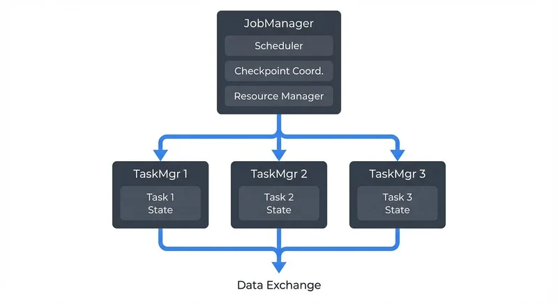
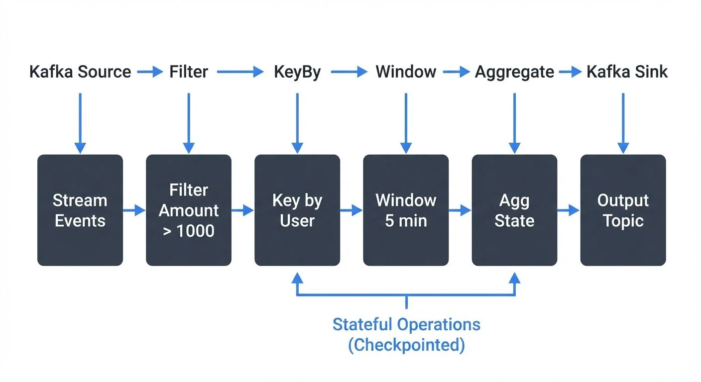
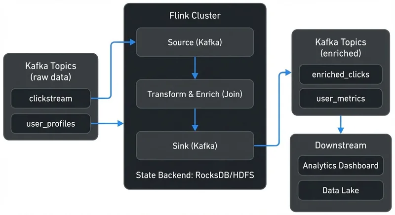

# What is Apache Flink? Stateful Stream Processing

Apache Flink (currently version 1.18 as of 2024, with 1.19 in development) is an open-source distributed stream processing framework designed to handle unbounded and bounded data streams with low latency and high throughput. Unlike traditional batch processing systems, Flink treats streams as the primary data model, making it ideal for real-time analytics, event-driven applications, and continuous data pipelines.

At its core, Flink excels at stateful stream processing—the ability to maintain and update computation state across millions of events while guaranteeing exactly-once processing semantics. This capability makes Flink a powerful tool for data engineers building mission-critical real-time applications.

## What is Stream Processing?

Stream processing is a computational paradigm that processes data continuously as it arrives, rather than waiting to collect batches of data. This approach enables real-time insights and immediate responses to events.

**Key characteristics of stream processing:**

- **Unbounded data**: Streams have no defined end—data arrives continuously
- **Low latency**: Events are processed within milliseconds to seconds
- **Event time semantics**: Processing based on when events actually occurred, not when they arrived
- **Stateful operations**: Maintaining context across events (counters, windows, joins)

Traditional batch systems like MapReduce process finite datasets in scheduled intervals. Stream processors like Flink handle infinite streams in real-time, making them essential for use cases like fraud detection, real-time recommendations, and operational monitoring.

## Why Apache Flink?

Flink distinguishes itself from other stream processing frameworks through several key capabilities:

### True Stream Processing

Flink treats streams as first-class citizens. While some frameworks operate on micro-batches (processing small batches frequently), Flink processes events individually as they arrive. This architecture delivers consistently low latency without the inherent delays of batching.

### Stateful Computations

Flink provides sophisticated state management that allows applications to remember information across events. This state can be:

- **Keyed state**: Associated with specific keys (e.g., counting login attempts per user ID, tracking shopping cart totals per session)
- **Operator state**: Maintained by operator instances (e.g., maintaining Kafka partition offsets, buffering records)
- **Broadcast state**: Replicated across all parallel instances (e.g., sharing fraud detection rules or configuration across all processing nodes)

State is fault-tolerant, backed by configurable state backends (HashMapStateBackend for in-memory state, EmbeddedRocksDBStateBackend for disk-based state on large-scale applications, or custom implementations), and automatically restored during recovery. Since Flink 1.13+, the state backend API has been modernized for better performance and maintainability.

### Exactly-Once Semantics

Flink guarantees exactly-once processing semantics through its distributed snapshotting mechanism. This ensures that each event affects the final result exactly once, even in the presence of failures—critical for financial transactions, billing systems, and other scenarios where accuracy is non-negotiable. Flink achieves this by periodically creating consistent snapshots of all operator state and input stream positions, which can be restored upon failure.

### Event Time Processing

Flink natively supports event time semantics with watermarks, allowing accurate windowing and aggregations even when events arrive out of order or delayed.

**Watermarks** are special timestamps that flow through the stream indicating "all events with timestamps before this watermark have been received." This allows Flink to trigger computations on complete data even when events arrive late or out of order. For example, if you're computing 5-minute windows of user activity, watermarks tell Flink when it's safe to close a window and emit results, even if some events from that time period arrived late due to network delays.

This capability is essential for real-world streaming where network delays and distributed systems introduce timing complexities. For detailed coverage of watermark strategies and handling late-arriving data, see [Event Time and Watermarks in Flink](https://conduktor.io/glossary/event-time-and-watermarks-in-flink).

## How Apache Flink Works

### Architecture Overview

Flink operates on a master-worker architecture:



<!-- ORIGINAL_DIAGRAM
```
        ┌───────────────────────────┐
        │     JobManager            │
        │  ┌─────────────────────┐  │
        │  │ Scheduler           │  │
        │  │ Checkpoint Coord.   │  │
        │  │ Resource Manager    │  │
        │  └─────────────────────┘  │
        └──────────┬────────────────┘
                   │
         ┌─────────┼─────────┐
         │         │         │
    ┌────▼────┐ ┌──▼─────┐ ┌─▼──────┐
    │TaskMgr 1│ │TaskMgr │ │TaskMgr │
    │┌───────┐│ │  2     │ │  3     │
    ││Task 1 ││ │┌──────┐│ │┌──────┐│
    ││State  ││ ││Task 2││ ││Task 3││
    │└───────┘│ ││State ││ ││State ││
    │         │ │└──────┘│ │└──────┘│
    └─────────┘ └────────┘ └────────┘
         │           │          │
         └───────────┼──────────┘
                     │
              Data Exchange
```
-->

**JobManager**: Coordinates distributed execution, manages checkpoints, and handles job scheduling.

**TaskManagers**: Execute tasks, maintain local state, and communicate with each other for data exchange.

### Basic Flink Application

A Flink stream processing pipeline flows like this:



<!-- ORIGINAL_DIAGRAM
```
Kafka Source → Filter → KeyBy → Window → Aggregate → Kafka Sink
    │            │        │        │         │           │
    │            │        │        │         │           │
    ▼            ▼        ▼        ▼         ▼           ▼
┌─────────┐ ┌────────┐ ┌────┐ ┌──────┐ ┌────────┐ ┌─────────┐
│ Stream  │→│ Filter │→│Key │→│Window│→│  Agg   │→│ Output  │
│ Events  │ │Amount  │ │by  │ │5 min │ │ State  │ │ Topic   │
│         │ │> 1000  │ │User│ │      │ │        │ │         │
└─────────┘ └────────┘ └────┘ └──────┘ └────────┘ └─────────┘
                         │                  │
                         └──────────────────┘
                         Stateful Operations
                         (Checkpointed)
```
-->

Key concepts demonstrated:
- **Source integration** with Kafka
- **Watermark strategy** for handling late events
- **Keyed streams** (KeyBy operation): Partitions the data stream by a key (e.g., user ID) so that all events for the same key are processed together on the same parallel task, enabling stateful operations
- **Windowing** for time-based aggregations
- **Fault tolerance** via checkpointing

### Code Example: Stateful Stream Processing

Here's a practical example demonstrating stateful stream processing with Flink and Kafka:

```java
import org.apache.flink.api.common.eventtime.WatermarkStrategy;
import org.apache.flink.api.common.serialization.SimpleStringSchema;
import org.apache.flink.connector.kafka.source.KafkaSource;
import org.apache.flink.connector.kafka.sink.KafkaSink;
import org.apache.flink.streaming.api.datastream.DataStream;
import org.apache.flink.streaming.api.environment.StreamExecutionEnvironment;
import org.apache.flink.streaming.api.windowing.assigners.TumblingEventTimeWindows;
import org.apache.flink.streaming.api.windowing.time.Time;

import java.time.Duration;

public class StatefulProcessingExample {
    public static void main(String[] args) throws Exception {
        // Create execution environment
        StreamExecutionEnvironment env = StreamExecutionEnvironment.getExecutionEnvironment();

        // Enable checkpointing for fault tolerance (every 60 seconds)
        env.enableCheckpointing(60000);

        // Configure state backend for production use
        env.setStateBackend(new HashMapStateBackend());
        env.getCheckpointConfig().setCheckpointStorage("s3://your-bucket/flink-checkpoints");

        // Create Kafka source with exactly-once semantics
        KafkaSource<String> source = KafkaSource.<String>builder()
            .setBootstrapServers("localhost:9092")
            .setTopics("user-events")
            .setGroupId("flink-processor-group")
            .setValueOnlyDeserializer(new SimpleStringSchema())
            .build();

        // Read from Kafka with watermark strategy (5 seconds out-of-orderness)
        DataStream<String> stream = env.fromSource(
            source,
            WatermarkStrategy
                .<String>forBoundedOutOfOrderness(Duration.ofSeconds(5))
                .withTimestampAssigner((event, timestamp) -> extractTimestamp(event)),
            "Kafka Source"
        );

        // Stateful processing: aggregate events per user over 5-minute windows
        DataStream<String> results = stream
            .map(event -> parseEvent(event))  // Parse JSON to Event object
            .keyBy(event -> event.getUserId())  // Partition by user ID
            .window(TumblingEventTimeWindows.of(Time.minutes(5)))
            .aggregate(new EventAggregator())  // Custom aggregation logic
            .map(result -> result.toJson());

        // Write results back to Kafka
        KafkaSink<String> sink = KafkaSink.<String>builder()
            .setBootstrapServers("localhost:9092")
            .setRecordSerializer(...)
            .build();

        results.sinkTo(sink);

        // Execute the Flink job
        env.execute("Stateful User Event Processing");
    }
}
```

This example demonstrates:
- **Checkpointing configuration** for fault tolerance
- **State backend setup** (HashMapStateBackend with S3 checkpoint storage)
- **Kafka source/sink integration** with exactly-once guarantees
- **Watermark strategy** to handle 5 seconds of out-of-order events
- **Keyed state** via `keyBy()` for per-user aggregation
- **Windowing** with 5-minute tumbling windows

For more detailed examples and advanced patterns, see [Flink DataStream API: Building Streaming Applications](https://conduktor.io/glossary/flink-datastream-api-building-streaming-applications) and [Flink State Management and Checkpointing](https://conduktor.io/glossary/flink-state-management-and-checkpointing).

## Flink and the Data Streaming Ecosystem

### Kafka Integration

Apache Flink and Apache Kafka form a powerful combination in modern data architectures. Kafka serves as the distributed messaging backbone, while Flink provides the stream processing engine. For foundational Kafka concepts, see [Apache Kafka](https://conduktor.io/glossary/apache-kafka).

**Flink Kafka Connector features (Flink 1.14+):**
- Exactly-once source/sink semantics with Kafka transactions (see [Exactly-Once Semantics in Kafka](https://conduktor.io/glossary/exactly-once-semantics-in-kafka))
- Dynamic partition discovery—automatically detects new Kafka partitions and adjusts processing
- Consumer position tracking for fault tolerance
- Support for multiple serialization formats: Avro, JSON, Protobuf (see [Avro vs Protobuf vs JSON Schema](https://conduktor.io/glossary/avro-vs-protobuf-vs-json-schema))

A typical architecture pattern:



<!-- ORIGINAL_DIAGRAM
```
┌──────────────┐        ┌─────────────────────┐        ┌──────────────┐
│ Kafka Topics │        │   Flink Cluster     │        │ Kafka Topics │
│  (raw data)  │        │                     │        │  (enriched)  │
│              │        │  ┌───────────────┐  │        │              │
│ ┌──────────┐ │        │  │ Source        │  │        │ ┌──────────┐ │
│ │clickstream│─┼───────►│ │ (Kafka)       │  │        │ │enriched_ │ │
│ └──────────┘ │        │  └───────┬───────┘  │        │ │clicks    │ │
│              │        │          │           │        │ └──────────┘ │
│ ┌──────────┐ │        │  ┌───────▼───────┐  │        │              │
│ │user_     │─┼───────►│ │ Transform &   │  │        │ ┌──────────┐ │
│ │profiles  │ │        │  │ Enrich (Join) │  │        │ │user_     │ │
│ └──────────┘ │        │  └───────┬───────┘  │        │ │metrics   │ │
│              │        │          │           │        │ └──────────┘ │
└──────────────┘        │  ┌───────▼───────┐  │        └──────┬───────┘
                        │  │ Sink          │  │               │
                        │  │ (Kafka)       │──┼───────────────┘
                        │  └───────────────┘  │
                        │                     │
                        │  State Backend:     │
                        │  RocksDB/HDFS       │
                        └─────────────────────┘
                                  │
                                  ▼
                        ┌─────────────────┐
                        │  Downstream     │
                        │  ┌───────────┐  │
                        │  │Analytics  │  │
                        │  │Dashboard  │  │
                        │  └───────────┘  │
                        │  ┌───────────┐  │
                        │  │Data Lake  │  │
                        │  └───────────┘  │
                        └─────────────────┘
```
-->

### Observability and Governance

As Flink applications scale across multiple Kafka topics and processing stages, maintaining visibility becomes crucial. Modern observability and governance platforms provide essential capabilities:

**Flink Application Monitoring:**
- **Flink Web UI**: Built-in dashboard for job metrics, checkpoints, and task management
- **Metrics reporters**: Export metrics to Prometheus, Grafana, or other monitoring systems
- **Consumer lag monitoring**: Track processing lag for Kafka sources (see [Consumer Lag Monitoring](https://conduktor.io/glossary/consumer-lag-monitoring))
- **Backpressure detection**: Identify bottlenecks in processing pipelines (see [Backpressure Handling in Streaming Systems](https://conduktor.io/glossary/backpressure-handling-in-streaming-systems))

**Kafka Ecosystem Governance:**
- **Data lineage tracking**: Understanding how data flows through Flink jobs and Kafka topics (see [Data Lineage Tracking](https://conduktor.io/glossary/data-lineage-tracking-data-from-source-to-consumption))
- **Schema management**: Ensuring compatibility across producers and consumers
- **Topic monitoring**: Observing throughput, lag, and consumer group health using tools like Conduktor for comprehensive Kafka governance, monitoring, and data quality validation
- **Data quality gates**: Validating stream data quality before and after Flink processing (see [Building a Data Quality Framework](https://conduktor.io/glossary/building-a-data-quality-framework))

This governance layer is essential for production environments where data teams need to understand dependencies, debug issues, and ensure compliance. For audit requirements, see [Audit Logging for Streaming Platforms](https://conduktor.io/glossary/audit-logging-for-streaming-platforms).

### Other Integrations

Flink integrates with numerous systems in the data ecosystem:
- **Cloud Storage**: S3, GCS, Azure Blob Storage for state backends and checkpoints (modern deployments); HDFS for on-premises
- **Databases**: Elasticsearch, Cassandra, PostgreSQL, MySQL via JDBC for sinks
- **Messaging**: Amazon Kinesis, Apache Pulsar, RabbitMQ as sources/sinks
- **Data Formats**: Avro, Parquet, ORC, JSON for serialization (see [Avro vs Protobuf vs JSON Schema](https://conduktor.io/glossary/avro-vs-protobuf-vs-json-schema))
- **Table Formats**: Apache Iceberg integration for lakehouse architectures (see [Apache Iceberg](https://conduktor.io/glossary/apache-iceberg))

## Flink SQL and Table API

Beyond the DataStream API, Flink provides SQL and Table API (Flink 1.9+) for declarative stream processing. This approach makes Flink accessible to SQL developers and enables rapid development of streaming pipelines without writing Java or Scala code.

**Example: Real-time aggregation with Flink SQL**

```sql
-- Define Kafka source table
CREATE TABLE transactions (
  user_id STRING,
  product_id STRING,
  amount DECIMAL(10, 2),
  transaction_time TIMESTAMP(3),
  WATERMARK FOR transaction_time AS transaction_time - INTERVAL '5' SECOND
) WITH (
  'connector' = 'kafka',
  'topic' = 'transactions',
  'properties.bootstrap.servers' = 'localhost:9092',
  'format' = 'json'
);

-- Real-time aggregation: total sales per user every 5 minutes
CREATE TABLE user_sales AS
SELECT
  user_id,
  TUMBLE_END(transaction_time, INTERVAL '5' MINUTES) as window_end,
  COUNT(*) as transaction_count,
  SUM(amount) as total_amount
FROM transactions
GROUP BY user_id, TUMBLE(transaction_time, INTERVAL '5' MINUTES);
```

Flink SQL supports:
- **Streaming joins**: Join multiple Kafka topics in real-time
- **Complex event processing**: Pattern matching with `MATCH_RECOGNIZE`
- **Temporal tables**: Join streaming data with slowly-changing dimensions
- **User-defined functions**: Extend SQL with custom logic

For comprehensive coverage, see [Flink SQL and Table API for Stream Processing](https://conduktor.io/glossary/flink-sql-and-table-api-for-stream-processing).

## Deployment Options

Flink supports multiple deployment modes for different use cases:

### Application Mode (Recommended for Production)

Introduced in Flink 1.11+, Application Mode provides dedicated cluster resources per application:
- **Isolated resources**: Each application gets its own JobManager
- **Efficient resource usage**: Cluster spins up/down with the application
- **Better security**: No sharing of resources between applications

### Kubernetes Deployment

The **Flink Kubernetes Operator** (1.0+ released in 2022) provides native Kubernetes integration:
- Deploy Flink applications as Kubernetes custom resources
- Automatic scaling and recovery
- Integration with Kubernetes ecosystem (service mesh, monitoring, etc.)

```yaml
apiVersion: flink.apache.org/v1beta1
kind: FlinkDeployment
metadata:
  name: stateful-processing-job
spec:
  image: flink:1.18
  flinkVersion: v1_18
  jobManager:
    resource:
      memory: "2048m"
      cpu: 1
  taskManager:
    resource:
      memory: "4096m"
      cpu: 2
```

For production deployments, see [Infrastructure as Code for Kafka Deployments](https://conduktor.io/glossary/infrastructure-as-code-for-kafka-deployments) for deployment automation patterns.

### Modern Features (Flink 1.13+)

Recent Flink versions include significant improvements:
- **Unaligned checkpoints** (1.11+): Better handling of backpressure scenarios
- **Changelog state backend** (1.15+): Faster recovery times by maintaining state change logs
- **Improved Kafka connector** (1.14+): Better exactly-once performance and dynamic partition handling
- **Batch execution mode** (1.12+): Process bounded datasets with streaming APIs for unified programming

## Common Use Cases

### Real-Time Analytics

Calculating metrics, dashboards, and KPIs as events occur. Example: processing 1 million events per second to track website user behavior patterns with sub-100ms latency to power personalization engines.

### Event-Driven Applications

Building applications that react to patterns and conditions in data streams. Example: fraud detection systems that analyze transaction patterns and trigger alerts within milliseconds. For architectural patterns, see [Event-Driven Architecture](https://conduktor.io/glossary/event-driven-architecture) and [Event-Driven Microservices Architecture](https://conduktor.io/glossary/event-driven-microservices-architecture).

### Data Pipelines and ETL

Continuous ingestion, transformation, and delivery of data streams. Example: enriching clickstream data with user profiles and writing to a data warehouse for analytics (see [Clickstream Analytics with Kafka](https://conduktor.io/glossary/clickstream-analytics-with-kafka)). Flink is commonly used for:
- **Change Data Capture (CDC)**: Capturing database changes in real-time (see [Implementing CDC with Debezium](https://conduktor.io/glossary/implementing-cdc-with-debezium))
- **Data warehouse loading**: Continuous ETL pipelines (see [CDC for Real-Time Data Warehousing](https://conduktor.io/glossary/cdc-for-real-time-data-warehousing))
- **Lakehouse ingestion**: Writing to Apache Iceberg tables with exactly-once guarantees

### Stream Joins and Enrichment

Combining multiple streams or joining streams with reference data. Example: joining payment events with user account data to create enriched transaction records. Flink supports multiple join types:
- **Window joins**: Join events within time windows
- **Interval joins**: Join events within time intervals (e.g., "join events that occur within 10 minutes")
- **Temporal table joins**: Join streaming data with versioned reference data

## When to Choose Flink

**Flink is ideal when you need:**
- **True low-latency processing**: Millisecond to second latency requirements
- **Complex stateful operations**: Windowing, aggregations, joins across large state
- **Exactly-once guarantees**: Financial transactions, billing, compliance-critical workloads
- **Event time semantics**: Out-of-order event handling with watermarks
- **High throughput**: Processing millions of events per second
- **Advanced operations**: Complex event processing, pattern matching, temporal joins

**Consider alternatives when:**
- **Simple transformations**: Kafka Streams may be simpler for basic Kafka-to-Kafka processing (see [Introduction to Kafka Streams](https://conduktor.io/glossary/introduction-to-kafka-streams))
- **Batch-oriented workloads**: Spark may be better for primarily batch processing with occasional streaming (see [Flink vs Spark Streaming: When to Choose Each](https://conduktor.io/glossary/flink-vs-spark-streaming-when-to-choose-each))
- **SQL-only requirements**: If your team only knows SQL and doesn't need advanced DataStream features, consider lighter SQL engines

## Common Pitfalls and Best Practices

**State Management:**
- **Pitfall**: Not cleaning up old state, leading to unbounded state growth and memory issues
- **Solution**: Implement state TTL (Time-To-Live) and use timers to clean up expired state

**Checkpointing:**
- **Pitfall**: Checkpoint intervals too short causing overhead, or too long risking data loss
- **Solution**: Start with 60-second intervals, tune based on recovery time objectives and state size

**Parallelism:**
- **Pitfall**: Mismatched parallelism between operators causing bottlenecks
- **Solution**: Match parallelism to Kafka partition counts for source operators; tune downstream based on CPU profiling

**Watermarks:**
- **Pitfall**: Watermark delay too aggressive, dropping valid late events
- **Solution**: Monitor late event metrics and adjust watermark bounds based on actual data patterns

**Memory Configuration:**
- **Pitfall**: Insufficient memory for RocksDB state backend causing disk thrashing
- **Solution**: Allocate sufficient managed memory; consider HashMapStateBackend for smaller state

For production deployment best practices, see [Kafka Performance Tuning Guide](https://conduktor.io/glossary/kafka-performance-tuning-guide) and [CI/CD Best Practices for Streaming Applications](https://conduktor.io/glossary/cicd-best-practices-for-streaming-applications).

## Summary

Apache Flink is a mature, production-ready framework for stateful stream processing that delivers true real-time capabilities with strong consistency guarantees. Its support for event time processing, exactly-once semantics, and sophisticated state management makes it the framework of choice for demanding real-time applications.

For data engineers, Flink provides the tools to build complex streaming pipelines that integrate seamlessly with ecosystems like Kafka while maintaining the reliability and performance required for production systems. Combined with governance tools for visibility and control, Flink enables organizations to unlock the full potential of real-time data processing.

Whether you're processing financial transactions, analyzing IoT sensor data, or building real-time recommendation systems, Apache Flink provides the foundation for scalable, stateful stream processing.

## Sources and References

- [Apache Flink Official Documentation](https://flink.apache.org/docs/stable/) - Comprehensive documentation covering concepts, APIs, and operations
- [Flink: Stream Processing for the Real World](https://arxiv.org/abs/1506.08603) - Academic paper detailing Flink's architecture and design principles
- [The Dataflow Model](https://research.google/pubs/pub43864/) - Google's paper on stream processing concepts that influenced Flink
- [Apache Flink GitHub Repository](https://github.com/apache/flink) - Source code and community contributions
- [Kafka + Flink: A Practical Guide](https://www.confluent.io/blog/apache-flink-apache-kafka-streams-comparison/) - Integration patterns and best practices
