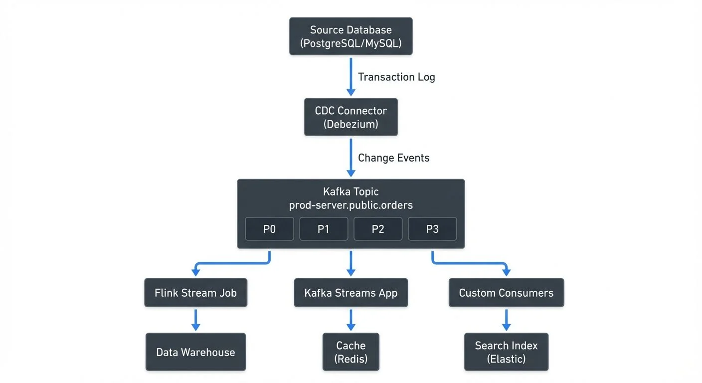

Change Data Capture (CDC) is a design pattern that identifies and captures changes made to data in a database, then delivers those changes in real-time or near real-time to downstream systems. Rather than periodically querying entire tables to detect changes, CDC monitors database transaction logs or triggers to capture inserts, updates, and deletes as they occur. For foundational concepts on real-time data delivery, see [What is Real-Time Data Streaming?](https://conduktor.io/glossary/what-is-real-time-data-streaming).

For data engineers and database administrators, CDC solves a fundamental challenge: how to keep multiple systems synchronized without impacting database performance or creating data inconsistencies.

## Why Change Data Capture Matters

Traditional data synchronization approaches rely on batch processing—running queries at scheduled intervals to compare source and target data. This approach has significant limitations:

**Performance Impact**: Full table scans consume database resources and slow down operational systems, especially as data volumes grow.

**Data Freshness**: Batch intervals create latency between when changes occur and when downstream systems reflect those changes. For analytics, this means stale dashboards. For operational systems, this means outdated information driving business decisions.

**Deleted Records**: Standard queries cannot detect deleted records unless the database implements soft deletes with timestamp columns.

CDC addresses these issues by capturing changes at the source with minimal overhead, enabling real-time data pipelines and maintaining an accurate change history.

## Core CDC Patterns

There are several approaches to implementing CDC, each with different trade-offs:

### Log-Based CDC

Log-based CDC reads database transaction logs (also called write-ahead logs or WAL) to identify changes. This is the most efficient and comprehensive approach.

**How it works**: Databases write all changes to transaction logs before applying them to tables. CDC tools read these logs, parse the change events, and emit them to downstream consumers.

**Advantages**:
- Minimal performance impact on source database
- Captures all changes including deletes
- No schema modifications required
- Preserves exact order of operations

**Limitations**:
- Requires appropriate database permissions
- Log format varies by database system
- Log retention policies must accommodate CDC processing

### Trigger-Based CDC

Trigger-based CDC uses database triggers to capture changes. When a row is inserted, updated, or deleted, a trigger fires and writes change information to a separate table.

**How it works**: Triggers are created on source tables to execute custom logic whenever data changes occur. This logic typically inserts change records into a "shadow" or audit table that CDC consumers read.

**Advantages**:
- Works with any database supporting triggers
- Can include custom business logic
- Change data explicitly stored and queryable

**Limitations**:
- Performance overhead on every write operation
- Requires schema modifications
- Trigger maintenance complexity
- Can be disabled by users with appropriate permissions

### Query-Based CDC

Query-based CDC periodically queries tables for changes, typically using timestamp columns (e.g., `updated_at`, `created_at`).

**How it works**: A scheduled process queries tables using filters like `WHERE updated_at > last_processed_time` to identify modified records.

**Advantages**:
- Simple to implement
- No special database permissions
- Works with any database

**Limitations**:
- Cannot reliably detect deletes
- Requires timestamp columns
- Performance impact from repeated queries
- Potential race conditions with concurrent updates
- Not truly real-time

## CDC in the Data Streaming Ecosystem

CDC has become a cornerstone of modern data architectures, particularly in streaming ecosystems built around Apache Kafka.

### Debezium and Kafka Connect

Debezium is the most widely-used open-source CDC platform. It provides Kafka Connect source connectors that monitor databases and stream changes to Kafka topics.

Here's an example Debezium connector configuration for PostgreSQL (as of Debezium 2.5+ in 2025):

```json
{
  "name": "postgresql-cdc-connector",
  "config": {
    "connector.class": "io.debezium.connector.postgresql.PostgresConnector",
    "database.hostname": "postgres-db.example.com",
    "database.port": "5432",
    "database.user": "cdc_user",
    "database.password": "${file:/secrets/db-password.txt:password}",
    "database.dbname": "production",
    "database.server.name": "prod-server",
    "table.include.list": "public.orders,public.customers",
    "plugin.name": "pgoutput",
    "publication.autocreate.mode": "filtered",
    "slot.name": "debezium_slot",
    "topic.prefix": "prod-server",
    "key.converter": "io.confluent.connect.avro.AvroConverter",
    "key.converter.schema.registry.url": "http://schema-registry:8081",
    "value.converter": "io.confluent.connect.avro.AvroConverter",
    "value.converter.schema.registry.url": "http://schema-registry:8081",
    "transforms": "route",
    "transforms.route.type": "org.apache.kafka.connect.transforms.RegexRouter",
    "transforms.route.regex": "([^.]+)\\.([^.]+)\\.([^.]+)",
    "transforms.route.replacement": "$3"
  }
}
```

This configuration creates a connector that reads PostgreSQL's write-ahead log using the native `pgoutput` plugin (available in PostgreSQL 10+) and publishes change events to Kafka topics named `orders` and `customers`. The connector uses Avro serialization with Schema Registry for type safety and schema evolution support.

### Event Structure

CDC events typically follow a standardized structure containing:

- **Before state**: The row's values before the change (null for inserts)
- **After state**: The row's values after the change (null for deletes)
- **Operation type**: INSERT, UPDATE, or DELETE
- **Metadata**: Timestamp, transaction ID, source position

Here's an example CDC event for an UPDATE operation on an `orders` table:

```json
{
  "before": {
    "id": 1001,
    "customer_id": 5,
    "status": "pending",
    "total": 99.50,
    "updated_at": "2025-01-15T10:30:00Z"
  },
  "after": {
    "id": 1001,
    "customer_id": 5,
    "status": "shipped",
    "total": 99.50,
    "updated_at": "2025-01-15T14:22:00Z"
  },
  "source": {
    "version": "2.5.0.Final",
    "connector": "postgresql",
    "name": "prod-server",
    "ts_ms": 1705330920000,
    "snapshot": "false",
    "db": "production",
    "schema": "public",
    "table": "orders",
    "txId": 582,
    "lsn": 24023128,
    "xmin": null
  },
  "op": "u",
  "ts_ms": 1705330920123
}
```

This event shows an order status changing from "pending" to "shipped". The `before` field contains the previous state, `after` contains the new state, and `op: "u"` indicates an update operation. For inserts, `before` would be null; for deletes, `after` would be null.

### Schema Management with Schema Registry

Production CDC deployments typically integrate with Schema Registry to manage event schemas, providing type safety and enabling schema evolution. For detailed coverage of schema serialization formats and trade-offs, see [Avro vs Protobuf vs JSON Schema](https://conduktor.io/glossary/avro-vs-protobuf-vs-json-schema).

**Why Schema Registry matters for CDC:**

- **Type Safety**: Debezium serializes change events using Avro, Protobuf, or JSON Schema formats registered in Schema Registry
- **Schema Evolution**: Schema Registry enforces compatibility rules (backward, forward, full) to prevent breaking changes
- **Automatic Deserialization**: Consumers retrieve schemas automatically, eliminating manual schema management
- **Documentation**: Schemas serve as self-documenting contracts for CDC event structures
- **Storage Efficiency**: Avro's binary format reduces message size compared to JSON

When a database schema changes (new column, type change, etc.), Debezium registers the updated schema with Schema Registry. Consumers can then adapt to schema changes without manual intervention, provided compatibility rules are followed.

### Modern CDC Ecosystem (2025)

As of 2025, the CDC landscape has matured with several production-ready options:

**Debezium 2.5+**: The dominant open-source CDC platform with connectors for PostgreSQL, MySQL, MongoDB, SQL Server, Oracle, Db2, and more. Debezium 2.x introduced significant improvements including better exactly-once semantics support, incremental snapshots without table locks, and native support for Kafka 4.0's KRaft mode. For implementation details, see [Implementing CDC with Debezium](https://conduktor.io/glossary/implementing-cdc-with-debezium).

**Apache Flink CDC Connectors**: Native CDC sources for Apache Flink (as of Flink 1.18+), enabling direct streaming from databases into Flink jobs without Kafka as an intermediary. This reduces latency and infrastructure complexity for Flink-based pipelines. See [What is Apache Flink?](https://conduktor.io/glossary/what-is-apache-flink-stateful-stream-processing) for more on Flink's streaming capabilities.

**Airbyte**: Open-source data integration platform with CDC support and a growing connector ecosystem. Airbyte provides a more user-friendly UI compared to raw Kafka Connect and supports both CDC and batch ingestion.

**Database-Native CDC**: Modern cloud databases now offer built-in CDC capabilities:
- PostgreSQL 15+ improved logical replication performance and monitoring
- MongoDB 5.0+ enhanced change streams with expanded filter capabilities
- AWS DMS (Database Migration Service) for cross-database CDC
- Google Cloud Datastream for serverless CDC

### CDC Architecture Pattern

A typical CDC streaming architecture looks like this:

In this architecture:

1. **CDC Connector** reads the database transaction log and converts changes into events
2. **Kafka Topic** stores events across multiple partitions (P0-P3). Partitions enable parallel processing and horizontal scaling—events with the same key (e.g., customer_id) always go to the same partition, ensuring order is preserved per key
3. **Multiple Consumers** independently read from the topic at their own pace. One consumer's lag doesn't affect others
4. **Downstream Systems** process events differently: data warehouses for analytics, caches for fast lookups, search indexes for full-text queries

This architecture enables multiple downstream systems to consume the same change stream independently, each processing events at their own pace. The decoupling between producers and consumers is a key advantage of the CDC + Kafka pattern.

## Governance and Monitoring CDC Pipelines

As CDC pipelines become critical infrastructure, proper governance and observability become essential. Without visibility into data flows, organizations struggle to debug issues, ensure data quality, and maintain compliance.

Governance platforms like Conduktor provide unified visibility across CDC pipelines built on Kafka, enabling teams to:

- **Monitor CDC Health**: Track connector health, lag metrics, throughput, and error rates in real-time dashboards. Learn more at [Kafka Connect Management](https://docs.conduktor.io/guide/manage-kafka/kafka-resources/kafka-connect).
- **Data Lineage**: Trace data flows from source databases through Kafka topics to downstream consumers, understanding the complete CDC pipeline
- **Governance Policies**: Enforce data governance rules on change event streams, including schema validation and data classification
- **Quality Troubleshooting**: Inspect change events in real-time to debug data quality issues, compare before/after states, and validate transformations. See [Data Quality Monitoring](https://docs.conduktor.io/guide/use-cases/observe-data-quality) for implementation details.
- **Access Control**: Implement topic-level permissions and field-level encryption to protect sensitive change data
- **Chaos Testing**: Use Conduktor Gateway to test CDC pipeline resilience by simulating network failures, latency spikes, and broker outages

For additional context on data lineage tracking across streaming systems, see [Data Lineage Tracking](https://conduktor.io/glossary/data-lineage-tracking-data-from-source-to-consumption). For audit trail requirements, see [Audit Logging for Streaming Platforms](https://conduktor.io/glossary/audit-logging-for-streaming-platforms).

This visibility is particularly valuable when managing multiple CDC sources feeding a data platform, where understanding data provenance and ensuring consistency across replicated systems requires centralized monitoring.

## Common CDC Use Cases

### Database Replication

Replicate production databases to analytics environments without impacting operational performance. CDC enables near real-time replication while avoiding expensive database read replicas. For detailed coverage of CDC-based data warehouse patterns, see [CDC for Real-Time Data Warehousing](https://conduktor.io/glossary/cdc-for-real-time-data-warehousing).

### Cache Invalidation

Keep caches synchronized with source-of-truth databases. When data changes, CDC events trigger cache updates or invalidations, preventing stale cache data.

### Search Index Synchronization

Maintain search indexes (Elasticsearch, Solr) in sync with relational databases. CDC events update indexes immediately when source data changes.

### Data Warehouse Loading

Replace batch ETL processes with continuous data ingestion. CDC streams feed data warehouses with incremental updates, reducing latency and improving data freshness. This pattern integrates well with lakehouse architectures—see [Introduction to Lakehouse Architecture](https://conduktor.io/glossary/introduction-to-lakehouse-architecture) for modern data platform designs.

### Event-Driven Architectures

CDC converts database changes into events that trigger business processes. For example, a new order insertion triggers inventory checks, payment processing, and shipping workflows. For comprehensive coverage of CDC in microservices contexts, see [CDC for Microservices Event-Driven Architectures](https://conduktor.io/glossary/cdc-for-microservices-event-driven-architectures). For broader event-driven patterns, see [Event-Driven Architecture](https://conduktor.io/glossary/event-driven-architecture).

### Audit and Compliance

Maintain complete change history for compliance and auditing. CDC captures who changed what and when, creating an immutable audit trail. For audit logging best practices in streaming platforms, see [Audit Logging for Streaming Platforms](https://conduktor.io/glossary/audit-logging-for-streaming-platforms).

## Implementation Considerations

When implementing CDC, consider these factors:

**Database Compatibility**: Not all databases expose transaction logs equally. PostgreSQL and MySQL have mature CDC support through their write-ahead log (WAL) and binary log (binlog) respectively. The WAL is a sequential record of all changes that PostgreSQL writes before applying them to the main database files, ensuring crash recovery and replication capabilities. Some proprietary databases require vendor-specific tools or may not support log-based CDC at all.

**Network and Latency**: CDC introduces network hops between source databases and consumers. Plan for appropriate network capacity and monitor latency. Typical CDC latency ranges from sub-second to a few seconds depending on network topology, log parsing complexity, and serialization overhead. For latency-sensitive applications, use consumer lag monitoring—see [Consumer Lag Monitoring](https://conduktor.io/glossary/consumer-lag-monitoring) for best practices.

**Schema Evolution**: Database schema changes (adding columns, changing types, renaming fields) must be handled gracefully. When a schema change occurs:

1. Debezium detects the change by monitoring DDL operations in the transaction log
2. A new schema version is registered in Schema Registry with appropriate compatibility settings
3. Downstream consumers receive events with the new schema
4. Consumers using schema-aware deserializers automatically adapt to the change (if compatible)

For breaking changes (e.g., removing a required field), consumers must be updated before or simultaneously with the schema change. Schema Registry's compatibility modes (backward, forward, full) enforce these constraints. Most CDC tools support schema evolution, but downstream consumers must be designed to handle schema changes gracefully.

**Exactly-Once Semantics**: Exactly-once semantics guarantee that each database change is delivered to consumers exactly one time, even in the presence of failures. However, depending on failure scenarios, CDC might deliver duplicate events (at-least-once delivery). Common causes include:

- Network retries after connector crashes
- Kafka producer retries
- Consumer group rebalances

Downstream systems should implement **idempotent processing**—operations that produce the same result when applied multiple times. For example, "set status to shipped" is idempotent, while "increment count by 1" is not. Alternatively, implement deduplication using message keys or transaction IDs. For comprehensive coverage of delivery guarantees, see [Exactly-Once Semantics in Kafka](https://conduktor.io/glossary/exactly-once-semantics-in-kafka).

**Initial Snapshot Strategy**: When starting CDC for the first time, you need to capture the current state of existing data before streaming changes. Debezium supports several snapshot modes:

- **Initial**: Takes a full snapshot before streaming changes (default)
- **Incremental**: Snapshots data in chunks without locking tables (Debezium 2.0+)
- **Never**: Skips snapshot, only streams changes from current log position
- **Schema-only**: Captures schema but not data

Choose the appropriate mode based on table size, acceptable downtime, and whether historical data is needed.

**Error Handling and Dead Letter Queues**: CDC connectors can fail for various reasons—schema incompatibilities, serialization errors, network issues, or invalid data. Implement error handling strategies:

- Configure dead letter queues to capture problematic events for later analysis
- Set appropriate retry policies and backoff strategies
- Monitor connector error metrics and set up alerting
- Have a plan for connector recovery and reprocessing

For error handling patterns in streaming systems, see [Dead Letter Queues for Error Handling](https://conduktor.io/glossary/dead-letter-queues-for-error-handling).

**Resource Planning**: While CDC is efficient compared to batch ETL, reading transaction logs and publishing events consumes resources. Size connector infrastructure appropriately based on:

- Number of tables and expected change volume
- Average event size and serialization overhead
- Peak traffic patterns
- Required processing latency
- Number of concurrent connectors

Monitor CPU, memory, and network utilization on Kafka Connect workers. For Kafka-specific infrastructure considerations, see [Apache Kafka](https://conduktor.io/glossary/apache-kafka) for cluster sizing guidance.

## Summary

Change Data Capture is a foundational pattern for modern data architectures, enabling real-time data synchronization without the performance penalties and limitations of traditional batch approaches. Log-based CDC, implemented through tools like Debezium 2.5+, provides the most robust solution by capturing all database changes with minimal source impact.

By integrating CDC with streaming platforms like Apache Kafka (see [Apache Kafka](https://conduktor.io/glossary/apache-kafka) for foundational concepts), organizations build event-driven architectures that keep multiple systems synchronized in real-time. As of 2025, CDC implementations benefit from Kafka 4.0's KRaft mode, improved exactly-once semantics, and mature Schema Registry integration. This capability powers use cases from real-time data warehouse loading to microservices communication.

Success with CDC requires attention to monitoring, governance, and operational concerns. Key implementation considerations include:

- Choosing appropriate snapshot strategies for initial data capture
- Implementing idempotent processing to handle potential duplicate events
- Managing schema evolution with Schema Registry compatibility rules
- Monitoring connector health, lag, and error rates
- Planning resource capacity for peak change volumes

As CDC pipelines become critical infrastructure, comprehensive observability and governance tooling—like Conduktor for Kafka-based CDC monitoring—becomes essential for maintaining reliable data platforms. With proper implementation, CDC transforms databases from isolated data silos into real-time event sources that power modern data-driven applications.

## Related Concepts

- [Implementing CDC with Debezium](https://conduktor.io/glossary/implementing-cdc-with-debezium) - Practical guide to implementing log-based CDC using Debezium connectors with Apache Kafka for real-time database replication.
- [Streaming Data Pipeline](https://conduktor.io/glossary/streaming-data-pipeline) - Understand how CDC serves as the foundation for real-time streaming data pipelines that move data from operational systems to analytics platforms.
- [Exactly-Once Semantics in Kafka](https://conduktor.io/glossary/exactly-once-semantics-in-kafka) - Learn how CDC systems leverage exactly-once processing to guarantee reliable change event delivery without duplicates or data loss.

## Sources and References

- [Debezium Documentation](https://debezium.io/documentation/)
- [PostgreSQL Write-Ahead Logging](https://www.postgresql.org/docs/current/wal-intro.html)
- [MySQL Binary Log](https://dev.mysql.com/doc/refman/8.0/en/binary-log.html)
- [Kafka Connect Documentation](https://kafka.apache.org/documentation/#connect)
- [Martin Kleppmann - "Designing Data-Intensive Applications"](https://dataintensive.net/) - Chapter on Stream Processing and CDC
