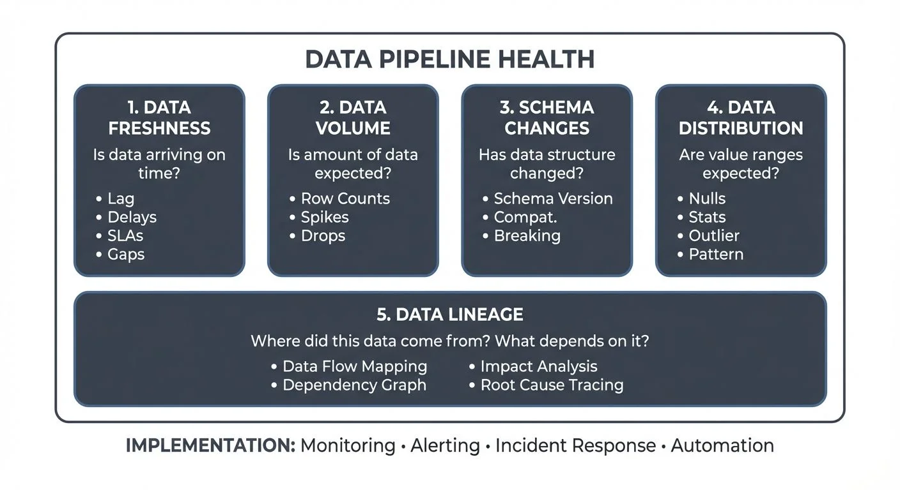

As data systems grow in complexity, organizations face an increasing challenge: how do you ensure your data pipelines are healthy, reliable, and delivering trustworthy data? This is where **data observability** comes in, a critical practice for modern data engineering that helps teams understand the health of their data systems in real-time.

<!-- ORIGINAL_DIAGRAM
```
THE FIVE PILLARS OF DATA OBSERVABILITY

                    DATA PIPELINE HEALTH
┌────────────────────────────────────────────────────────────┐
│                                                            │
│  ┌──────────┐  ┌──────────┐  ┌──────────┐  ┌──────────┐  │
│  │ 1. DATA  │  │ 2. DATA  │  │ 3.SCHEMA │  │ 4. DATA  │  │
│  │ FRESHNESS│  │ VOLUME   │  │ CHANGES  │  │DISTRIBUT'│  │
│  ├──────────┤  ├──────────┤  ├──────────┤  ├──────────┤  │
│  │ Is data  │  │ Is amount│  │ Has data │  │ Are value│  │
│  │ arriving │  │ of data  │  │ structure│  │ ranges   │  │
│  │ on time? │  │ expected?│  │ changed? │  │ expected?│  │
│  │          │  │          │  │          │  │          │  │
│  │ • Lag    │  │ • Row    │  │ • Schema │  │ • Nulls  │  │
│  │ • Delays │  │   Counts │  │   Version│  │ • Stats  │  │
│  │ • SLAs   │  │ • Spikes │  │ • Compat.│  │ • Outlier│  │
│  │ • Gaps   │  │ • Drops  │  │ • Breaking│  │ • Pattern│  │
│  └──────────┘  └──────────┘  └──────────┘  └──────────┘  │
│                                                            │
│                  ┌──────────────────────┐                  │
│                  │   5. DATA LINEAGE    │                  │
│                  ├──────────────────────┤                  │
│                  │ Where did this data  │                  │
│                  │ come from? What      │                  │
│                  │ depends on it?       │                  │
│                  │                      │                  │
│                  │ • Data Flow Mapping  │                  │
│                  │ • Dependency Graph   │                  │
│                  │ • Impact Analysis    │                  │
│                  │ • Root Cause Tracing │                  │
│                  └──────────────────────┘                  │
│                                                            │
└────────────────────────────────────────────────────────────┘

IMPLEMENTATION: Monitoring • Alerting • Incident Response • Automation
```
-->

## Understanding Data Observability

Data observability is the ability to understand the health and state of data in your system by monitoring, tracking, and troubleshooting anomalies across your data pipelines. Think of it as DevOps observability applied to data, just as DevOps teams monitor application performance, memory usage, and error rates, data teams need visibility into their data flows.

For Data Engineers, Platform Engineers, and Data Architects, observability isn't just about detecting when something breaks. It's about understanding *why* it broke, *where* the issue originated, and *how* to prevent it from happening again. In modern architectures that combine batch processing with real-time streaming platforms like Apache Kafka, this becomes even more critical.

## The Five Pillars of Data Observability

Data observability rests on five fundamental pillars that together provide comprehensive visibility into your data ecosystem. These five dimensions emerged from production experience monitoring thousands of data pipelines, they represent the most common failure modes and the metrics that provide the earliest warning signals when problems arise.

Unlike traditional monitoring that focuses solely on infrastructure (CPU, memory, disk), data observability monitors the data itself. The five pillars answer the essential questions every data team needs to confidently trust their pipelines: Is the data arriving on time? Is there the right amount? Has the structure changed? Are the values sensible? And where did it come from?

Let's explore each pillar in detail.

### 1. Data Freshness

**Data freshness** answers the question: "Is my data arriving on time?"

In streaming architectures, freshness is paramount. If your Apache Kafka topics aren't receiving data at the expected rate, or if your consumers are lagging behind, downstream applications and analytics will work with stale data, leading to poor decision-making.

Monitoring freshness involves:
- Tracking the time gap between when data is produced and when it's available for consumption
- Measuring consumer lag in streaming platforms
- Setting SLAs for data arrival times
- Alerting when data stops flowing or experiences unexpected delays

For example, if your e-commerce platform expects user clickstream events every few seconds, a 10-minute gap in data arrival is a clear indicator that something upstream has failed.

For comprehensive guidance on implementing freshness monitoring with modern tools and SLA management practices, see [Data Freshness Monitoring: SLA Management](https://conduktor.io/glossary/data-freshness-monitoring-sla-management). To understand consumer lag mechanics in depth, refer to [Consumer Lag: Monitoring and Managing Streaming Health](https://conduktor.io/glossary/consumer-lag-monitoring).

### 2. Data Volume

**Data volume** addresses: "Is the amount of data within expected ranges?"

Unexpected changes in data volume often signal problems. A sudden spike might indicate duplicate records or runaway processes, while a drop could mean missing data or failed integrations.

Volume monitoring includes:
- Tracking row counts and message throughput
- Comparing current volumes against historical baselines
- Detecting anomalies in partition-level data distribution
- Monitoring topic size and retention metrics in streaming platforms

In a Kafka-based architecture, dedicated monitoring platforms enable teams to visualize message throughput across topics, identify imbalanced partitions, and spot volume anomalies before they cascade into larger issues.

### 3. Schema Changes

**Schema evolution** monitors: "Has the structure of my data changed unexpectedly?"

Schema changes are inevitable in evolving systems, but unmanaged changes can break downstream consumers and pipelines. A new field, removed column, or changed data type can cause processing failures across your entire data platform.

Effective schema monitoring involves:
- Tracking schema versions across producers and consumers
- Validating compatibility between schema versions
- Detecting breaking changes before they reach production
- Enforcing schema governance policies

Modern streaming platforms leverage schema registries (like Apicurio Registry or Confluent's open-source Schema Registry) to version and validate schemas. Governance platforms like Conduktor integrate with these registries, allowing teams to visualize schema evolution, test compatibility, and prevent breaking changes from being deployed.

For detailed guidance on implementing schema management infrastructure, see [Schema Registry and Schema Management](https://conduktor.io/glossary/schema-registry-and-schema-management). To understand compatibility rules and versioning strategies, refer to [Schema Evolution Best Practices](https://conduktor.io/glossary/schema-evolution-best-practices).

### 4. Data Distribution

**Data distribution** examines: "Are my data values within expected ranges and patterns?"

This pillar goes beyond volume to examine the *content* of your data. Are null rates increasing? Are categorical values appearing that shouldn't exist? Is a numeric field suddenly showing extreme outliers?

Distribution monitoring covers:
- Statistical analysis of field values (min, max, mean, percentiles)
- Null rate tracking and cardinality checks
- Pattern validation for formatted data (emails, phone numbers, IDs)
- Anomaly detection in value distributions

For instance, if your user age field suddenly shows values above 150, or your country code field contains values not in ISO standards, you have a data quality issue that needs investigation.

To understand the full spectrum of data quality dimensions and how distribution relates to accuracy and completeness, see [Data Quality Dimensions: Accuracy, Completeness, and Consistency](https://conduktor.io/glossary/data-quality-dimensions-accuracy-completeness-and-consistency). For distinguishing between observability and quality testing, refer to [Data Quality vs Data Observability: Key Differences](https://conduktor.io/glossary/data-quality-vs-data-observability-key-differences).

### 5. Data Lineage

**Data lineage** answers: "Where did this data come from, and what depends on it?"

Understanding the full journey of data, from source to destination, is crucial for root cause analysis and impact assessment. When issues occur, lineage helps you trace problems back to their origin and understand which downstream systems are affected.

Lineage capabilities include:
- Mapping data flows across producers, topics, processors, and consumers
- Tracking field-level transformations
- Understanding dependencies between datasets
- Assessing blast radius when issues occur

In complex streaming architectures with multiple Kafka clusters, connectors, and stream processing applications, maintaining clear lineage becomes challenging. This is where comprehensive data platforms become essential for visualizing the entire data topology.

For detailed implementation guidance including OpenLineage integration, automated extraction strategies, and platform selection, see [Data Lineage Tracking: Data From Source to Consumption](https://conduktor.io/glossary/data-lineage-tracking-data-from-source-to-consumption).

## Implementing Data Observability in Streaming Systems

For teams working with streaming data platforms like Apache Kafka, implementing these five pillars requires purpose-built tooling. While Kafka 4.0+ (with KRaft mode) provides enhanced metrics and monitoring capabilities through JMX, achieving true observability demands higher-level abstractions and specialized tools.

### Modern Observability Tooling (2025)

The data observability ecosystem has matured significantly, offering both open-source and commercial solutions:

**Open-Source Monitoring Tools:**
- **Kafka Lag Exporter**: Prometheus-based exporter providing granular consumer lag metrics with minimal overhead. Supports Kafka 4.0+ KRaft clusters and integrates seamlessly with Grafana dashboards for freshness monitoring.
- **OpenTelemetry**: Industry-standard observability framework for distributed tracing and metrics collection. Kafka clients can emit OpenTelemetry traces to track end-to-end data flows through streaming pipelines.
- **Burrow**: LinkedIn's consumer lag evaluation tool with HTTP API and configurable health checks for multi-cluster environments.

**Data Quality Frameworks:**
- **Soda Core 3.0+**: Open-source framework for declarative data quality checks using YAML. Integrates with streaming platforms to validate data quality in real-time.
- **Great Expectations (GX) 1.0+**: Comprehensive validation framework with extensive built-in expectations. Can validate streaming data quality at ingestion points. See [Great Expectations: Data Testing Framework](https://conduktor.io/glossary/great-expectations-data-testing-framework) for implementation patterns.
- **dbt Tests**: Native data quality testing in transformation workflows with freshness checks and contract enforcement (dbt 1.5+).

**Lineage and Metadata:**
- **OpenLineage**: Open standard for capturing data lineage events at runtime. Supported by Apache Airflow, Spark, Flink, and major orchestration platforms. Enables vendor-neutral lineage tracking across heterogeneous systems.
- **DataHub** and **Apache Amundsen**: Graph-based metadata platforms with rich lineage visualization for both batch and streaming pipelines.

**Streaming Platform Management:**

For organizations running Apache Kafka, **Conduktor** provides enterprise-grade observability specifically designed for streaming architectures. Conduktor automatically discovers and visualizes the complete Kafka topology, topics, connectors, stream processors, consumer groups, while providing:
- Real-time monitoring of topic health, consumer lag, and throughput via the [monitoring dashboard](https://docs.conduktor.io/guide/monitor-brokers-apps/index)
- Schema registry integration (Apicurio, Confluent SR) with compatibility testing
- Visual lineage mapping across clusters and applications
- Anomaly detection for volume and freshness issues through [risk analysis](https://docs.conduktor.io/guide/insights/risk-analysis)
- Centralized governance and [alerting](https://docs.conduktor.io/guide/monitor-brokers-apps/alerts) with role-based access control
- Testing capabilities through Conduktor Gateway for chaos engineering and validation

By consolidating these observability pillars into a unified platform, data teams can shift from reactive firefighting to proactive data quality management.

### Practical Implementation: Monitoring Freshness with Code

Here's a concrete example of implementing freshness monitoring for a Kafka topic using Python with Prometheus metrics:

```python
from kafka import KafkaConsumer
from prometheus_client import Gauge, start_http_server
import time
from datetime import datetime
import json

# Define Prometheus metrics
data_freshness_lag_seconds = Gauge(
    'kafka_data_freshness_lag_seconds',
    'Time difference between event timestamp and processing time',
    ['topic', 'partition']
)

consumer_lag_messages = Gauge(
    'kafka_consumer_lag_messages',
    'Number of messages behind the latest offset',
    ['topic', 'partition', 'consumer_group']
)

def monitor_freshness(bootstrap_servers, topic, group_id):
    """
    Monitor data freshness by tracking event timestamps and consumer lag.
    Exposes metrics via Prometheus for alerting and dashboards.
    """
    consumer = KafkaConsumer(
        topic,
        bootstrap_servers=bootstrap_servers,
        group_id=group_id,
        auto_offset_reset='latest',
        enable_auto_commit=True,
        value_deserializer=lambda m: json.loads(m.decode('utf-8'))
    )

    # Start Prometheus metrics server on port 8000
    start_http_server(8000)
    print(f"Monitoring freshness for topic '{topic}'. Metrics at http://localhost:8000")

    for message in consumer:
        try:
            event_data = message.value
            event_timestamp = event_data.get('timestamp')  # ISO format or epoch ms

            if event_timestamp:
                # Parse timestamp (assuming epoch milliseconds)
                event_time = datetime.fromtimestamp(event_timestamp / 1000)
                processing_time = datetime.now()

                # Calculate freshness lag in seconds
                freshness_lag = (processing_time - event_time).total_seconds()

                # Update Prometheus metric
                data_freshness_lag_seconds.labels(
                    topic=topic,
                    partition=message.partition
                ).set(freshness_lag)

                # Alert if freshness exceeds threshold (e.g., 60 seconds)
                if freshness_lag > 60:
                    print(f"⚠️  FRESHNESS ALERT: {topic} partition {message.partition} "
                          f"is {freshness_lag:.1f}s behind (threshold: 60s)")

            # Monitor consumer lag using Kafka's admin client
            # (In production, use Kafka Lag Exporter or Burrow for comprehensive lag tracking)

        except Exception as e:
            print(f"Error processing message: {e}")
            continue

# Example usage
if __name__ == "__main__":
    monitor_freshness(
        bootstrap_servers=['localhost:9092'],
        topic='customer-events',
        group_id='observability-monitor'
    )
```

This monitoring script demonstrates the **freshness** pillar by tracking event-time lag. In production, combine this with:
- **Volume monitoring**: Track message throughput using `kafka.consumer:type=consumer-fetch-manager-metrics`
- **Schema validation**: Integrate with schema registry to detect unexpected schema changes
- **Data quality checks**: Use Soda Core or GX to validate distribution metrics (nulls, outliers)
- **Lineage tracking**: Emit OpenLineage events to capture data flow topology

For comprehensive guidance on building data quality validation into your pipelines, see [Building a Data Quality Framework](https://conduktor.io/glossary/building-a-data-quality-framework).

### Advanced Pattern: ML-Based Anomaly Detection

Beyond threshold-based monitoring, modern observability platforms increasingly leverage machine learning to detect anomalies in data patterns. Rather than manually defining thresholds for every metric, ML models learn normal behavior from historical data and alert when deviations occur.

**Benefits of ML-based detection:**
- **Adaptive thresholds**: Automatically adjusts to seasonal patterns, growth trends, and business cycles
- **Multivariate analysis**: Detects anomalies across multiple correlated metrics simultaneously
- **Reduced alert noise**: Distinguishes between expected variations and genuine issues
- **Early detection**: Identifies subtle degradation before it becomes critical

For example, an ML model might learn that your e-commerce transaction volume typically spikes on weekends and during holiday seasons. A 50% increase on Black Friday wouldn't trigger an alert, but a 50% decrease would, even though both deviate from the weekly average.

Platforms like Monte Carlo, Datadog Data Streams Monitoring, and Conduktor's anomaly detection capabilities provide these ML-powered insights, reducing the operational burden of maintaining static thresholds across hundreds of data assets.

## Building an Observability Practice

Implementing data observability isn't just about deploying tools, it requires cultural and process changes:

1. **Establish baselines**: Understand normal patterns in freshness, volume, and distribution before you can detect anomalies. Use historical data to set realistic thresholds rather than arbitrary targets.

2. **Define SLAs**: Set clear expectations for data freshness and quality that align with business requirements. Document these agreements in data contracts that formalize the relationship between producers and consumers. For guidance on implementing contracts, see [Data Contracts for Reliable Pipelines](https://conduktor.io/glossary/data-contracts-for-reliable-pipelines).

3. **Automate alerting**: Configure alerts for critical metrics, but avoid alert fatigue by focusing on actionable signals. Use tiered severity levels (info, warning, critical) and route alerts to appropriate teams based on impact.

4. **Create runbooks**: Document common issues and resolution steps to speed up incident response. When data quality incidents occur, follow systematic root cause analysis processes as outlined in [Data Incident Management and Root Cause Analysis](https://conduktor.io/glossary/data-incident-management-and-root-cause-analysis).

5. **Foster collaboration**: Break down silos between data producers, platform teams, and consumers. Observability metrics should be visible to all stakeholders, not just the engineering team.

## Conclusion

Data observability has evolved from a nice-to-have to a necessity for modern data teams. The five pillars, freshness, volume, schema, distribution, and lineage, provide a comprehensive framework for understanding data health across your ecosystem.

As organizations increasingly adopt streaming architectures to power real-time analytics, applications, and AI/ML workloads, the complexity of maintaining data quality grows exponentially. By implementing robust observability practices, Data Engineers, Platform Engineers, and Data Architects can ensure their data remains trustworthy, timely, and valuable to the business.

The question isn't whether you need data observability, it's how quickly you can implement it before the next data incident impacts your organization.

## Related Concepts

- [Data Quality vs Data Observability: Key Differences](https://conduktor.io/glossary/data-quality-vs-data-observability-key-differences) - Understanding complementary approaches
- [Consumer Lag Monitoring](https://conduktor.io/glossary/consumer-lag-monitoring) - Deep dive into streaming freshness tracking
- [Data Lineage: Tracking Data from Source to Consumption](https://conduktor.io/glossary/data-lineage-tracking-data-from-source-to-consumption) - Understanding the lineage pillar

## Sources and References

- [The Five Pillars of Data Observability (Monte Carlo)](https://www.montecarlodata.com/blog-what-is-data-observability/) - Original framework defining data observability principles
- [OpenTelemetry for Data Pipelines](https://opentelemetry.io/docs/) - Open standards for observability in distributed systems (2025)
- [OpenLineage: Open Standard for Data Lineage](https://openlineage.io/) - Vendor-neutral specification for capturing lineage metadata at runtime (2025)
- [Great Expectations (GX) 1.0+ Documentation](https://docs.greatexpectations.io/) - Modern data quality validation and testing framework
- [Soda Core 3.0+ Documentation](https://docs.soda.io/soda-core/) - Open-source data quality framework with declarative YAML checks (2025)
- [Kafka Lag Exporter](https://github.com/seglo/kafka-lag-exporter) - Prometheus-based consumer lag monitoring for Kafka 4.0+ KRaft clusters
- [Burrow - LinkedIn's Lag Monitor](https://github.com/linkedin/Burrow) - HTTP API-based consumer lag evaluation for multi-cluster Kafka deployments
- [DataHub: Metadata Platform](https://datahubproject.io/) - Graph-based lineage and metadata management for streaming and batch pipelines (2025)
- [Apache Kafka 4.0 Monitoring](https://kafka.apache.org/documentation/#monitoring) - Enhanced metrics and observability in KRaft mode
- [Conduktor Platform](https://www.conduktor.io/) - Enterprise Kafka observability with topology discovery, lineage visualization, and governance
- [dbt Core Documentation](https://docs.getdbt.com/) - Data transformation framework with built-in freshness checks and contracts (dbt 1.5+)
- [Apache Atlas Data Governance](https://atlas.apache.org/) - Metadata management and data lineage tracking
