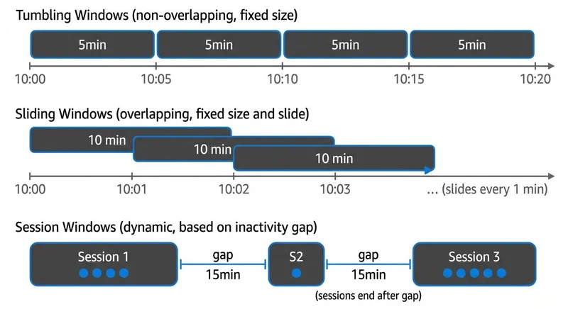
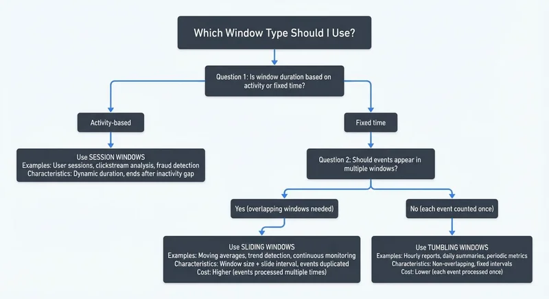
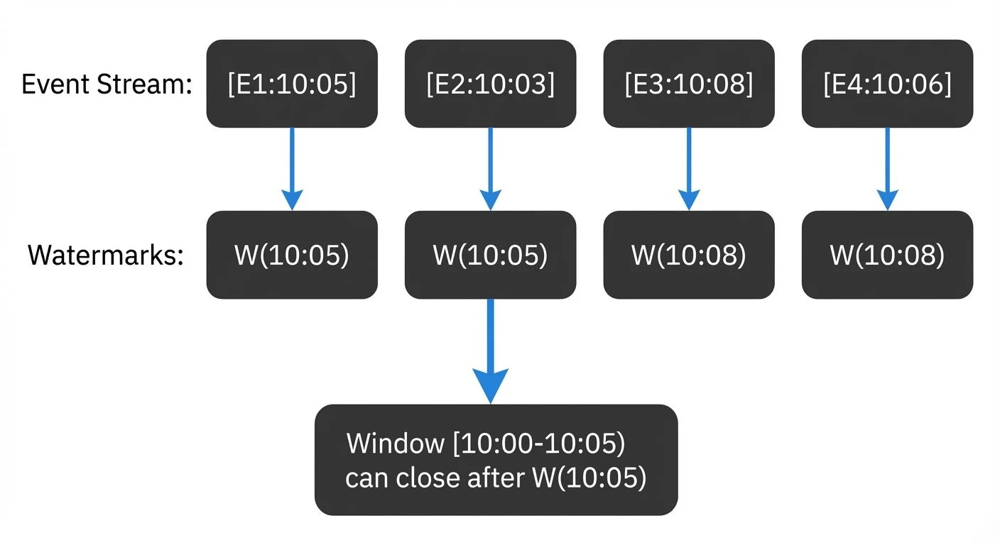

Stream processing requires mechanisms to divide infinite data streams into finite chunks for meaningful aggregations and analytics. Apache Flink provides powerful windowing abstractions that enable you to group events by time or other criteria, making it possible to compute metrics like counts, sums, and averages over specific intervals.

This article explores Flink's three primary window types, tumbling, sliding, and session windows, and demonstrates how to implement them effectively in your stream processing pipelines using Apache Flink 1.19+ (2025). Examples use the DataStream API with Java, though Flink also supports windowing through the Table API and SQL for declarative stream processing.

## Prerequisites

Before diving into windowing, ensure you have:
- Apache Flink 1.19+ installed and configured
- Basic Java programming knowledge
- Understanding of stream processing concepts (unbounded data, event time vs processing time)
- Familiarity with Apache Kafka (for integration examples)
- Maven or Gradle for dependency management

For Kafka integration, add these dependencies to your project:
```xml
<dependency>
    <groupId>org.apache.flink</groupId>
    <artifactId>flink-streaming-java</artifactId>
    <version>1.19.0</version>
</dependency>
<dependency>
    <groupId>org.apache.flink</groupId>
    <artifactId>flink-connector-kafka</artifactId>
    <version>3.1.0-1.19</version>
</dependency>
```

## Understanding Windows in Stream Processing

Windows are fundamental constructs in stream processing that segment continuous data streams into bounded collections. Unlike batch processing, where data has natural boundaries, streaming data is unbounded and requires explicit windowing logic to perform aggregations.

<!-- ORIGINAL_DIAGRAM
```
┌──────────────────────────────────────────────────────────────────┐
│                   Window Types Overview                          │
├──────────────────────────────────────────────────────────────────┤
│                                                                  │
│  Tumbling Windows (non-overlapping, fixed size)                 │
│  ┌──────┐┌──────┐┌──────┐┌──────┐                               │
│  │ 5min ││ 5min ││ 5min ││ 5min │                               │
│  └──────┘└──────┘└──────┘└──────┘                               │
│  10:00   10:05   10:10   10:15   10:20                          │
│                                                                  │
│  Sliding Windows (overlapping, fixed size and slide)            │
│  ┌──────────┐                                                    │
│  │ 10 min   │                                                    │
│  └──────────┘                                                    │
│    ┌──────────┐                                                  │
│    │ 10 min   │                                                  │
│    └──────────┘                                                  │
│      ┌──────────┐                                                │
│      │ 10 min   │                                                │
│      └──────────┘                                                │
│  10:00 10:01 10:02 10:03 ...  (slides every 1 min)              │
│                                                                  │
│  Session Windows (dynamic, based on inactivity gap)             │
│  ┌────────┐      ┌──┐  ┌─────────────┐                          │
│  │Session1│ gap  │S2│  │  Session 3  │                          │
│  └────────┘      └──┘  └─────────────┘                          │
│  ●●●●      15min ●     ●●●●●  15min  (sessions end after gap)   │
│                                                                  │
└──────────────────────────────────────────────────────────────────┘
```
-->

Flink supports two main categories of windows:

- **Time-based windows**: Group events based on timestamps (processing time or event time)
- **Count-based windows**: Group events based on the number of elements

Time-based windows are most common in production scenarios because they align with business requirements like "calculate sales per hour" or "detect anomalies within 5-minute intervals."

### Event Time vs Processing Time

Before diving into window types, it's crucial to understand Flink's time semantics:

- **Event Time**: The timestamp when the event actually occurred, embedded in the event itself
- **Processing Time**: The system clock time when Flink processes the event

Event time provides deterministic results and handles out-of-order events correctly, making it the preferred choice for most production applications. Processing time is simpler but can produce non-deterministic results when events arrive late or out of order.

### Understanding Watermarks

**Watermarks** are Flink's mechanism for tracking event time progress in the stream. A watermark with timestamp T is an assertion that "all events with timestamps less than T have arrived."

<!-- ORIGINAL_DIAGRAM
```
Event Stream:  [E1:10:05] [E2:10:03] [E3:10:08] [E4:10:06]
                    ↓          ↓          ↓          ↓
Watermarks:    W(10:05)   W(10:05)   W(10:08)   W(10:08)
                    ↓
              Window [10:00-10:05) can close after W(10:05)
```
-->

Watermarks serve three critical functions:
1. **Trigger window computation**: Windows close and produce results when the watermark passes their end time
2. **Handle out-of-order events**: Events can arrive late (before the watermark) and still be included in windows
3. **Track progress**: Enable Flink to make forward progress even with unordered or delayed data

Common watermark strategies:
- `forBoundedOutOfOrderness(Duration)`: Allows events to be late by a specified amount (e.g., 10 seconds)
- `forMonotonousTimestamps()`: Assumes timestamps are always increasing (no late events)
- Custom watermark generators: For complex timing requirements

Without watermarks, event time windows would never know when to close and produce results.

## Tumbling Windows

Tumbling windows divide the stream into non-overlapping, fixed-size intervals. Each event belongs to exactly one window, making tumbling windows ideal for periodic aggregations like hourly reports or daily summaries.

### Characteristics

- Fixed duration (e.g., 1 minute, 1 hour)
- No overlap between consecutive windows
- Every event belongs to exactly one window
- Windows align to epoch boundaries by default

### Use Cases

- Hourly traffic reports
- Daily revenue calculations
- Per-minute error counts

Sensor readings are grouped into 5-minute tumbling windows. Each sensor's average temperature is calculated independently every 5 minutes. Windows start at 00:00, 00:05, 00:10, and so on.

### Implementation Example

```java
import org.apache.flink.streaming.api.datastream.DataStream;
import org.apache.flink.streaming.api.windowing.assigners.TumblingEventTimeWindows;
import org.apache.flink.streaming.api.windowing.time.Time;
import org.apache.flink.api.common.eventtime.WatermarkStrategy;
import java.time.Duration;

// Define the data model
public class SensorReading {
    private String sensorId;
    private long timestamp;
    private double temperature;

    // Constructor, getters, setters...
}

// Tumbling Window Example - 5 minute windows
DataStream<SensorReading> sensorStream = env
    .addSource(new FlinkKafkaConsumer<>("sensor-readings", new SensorSchema(), properties));

DataStream<Tuple2<String, Double>> avgTemperature = sensorStream
    .assignTimestampsAndWatermarks(
        WatermarkStrategy.<SensorReading>forBoundedOutOfOrderness(Duration.ofSeconds(10))
            .withTimestampAssigner((event, timestamp) -> event.getTimestamp())
    )
    .keyBy(reading -> reading.getSensorId())
    .window(TumblingEventTimeWindows.of(Time.minutes(5)))
    .aggregate(new AverageAggregateFunction());

// Result: Every 5 minutes, emit average temperature per sensor
// Window 1: [00:00 - 00:05), Window 2: [00:05 - 00:10), etc.
```

In this example:
- Events are grouped by sensor ID using `keyBy`
- `TumblingEventTimeWindows.of(Time.minutes(5))` creates non-overlapping 5-minute windows
- Watermarks with 10-second bounded out-of-orderness handle late arrivals
- An aggregate function computes the average temperature incrementally

## Sliding Windows

Sliding windows create overlapping intervals by defining both a window size and a slide interval. This allows you to compute aggregations over a moving time frame, providing more granular insights than tumbling windows.

### Characteristics

- Defined by window size and slide interval
- Windows overlap when slide < size
- Events can belong to multiple windows
- Useful for moving averages and trend analysis

### Use Cases

- 10-minute moving average with 1-minute updates
- Continuous anomaly detection over recent data
- Real-time trend analysis

A 10-minute sliding window with 1-minute slide creates overlapping windows. At any given time, 10 overlapping windows are active, each containing the last 10 minutes of data. This provides smooth, continuously updated aggregations rather than discrete jumps.

### Implementation Example

```java
import org.apache.flink.streaming.api.windowing.assigners.SlidingEventTimeWindows;

// Define the transaction data model
public class TransactionEvent {
    private String userId;
    private long timestamp;
    private double amount;

    // Constructor, getters, setters...
}

// Sliding Window Example - 10 minute window, 1 minute slide
DataStream<TransactionEvent> transactions = env
    .addSource(new FlinkKafkaConsumer<>("transactions", new TransactionSchema(), properties));

DataStream<Tuple3<String, Long, Double>> movingAverage = transactions
    .assignTimestampsAndWatermarks(
        WatermarkStrategy.<TransactionEvent>forBoundedOutOfOrderness(Duration.ofSeconds(30))
            .withTimestampAssigner((event, timestamp) -> event.getTimestamp())
    )
    .keyBy(txn -> txn.getUserId())
    .window(SlidingEventTimeWindows.of(Time.minutes(10), Time.minutes(1)))
    .aggregate(new TransactionAverageAggregator());

// Result: Every 1 minute, emit moving average for the last 10 minutes per user
// Window 1: [10:00 - 10:10), Window 2: [10:01 - 10:11), Window 3: [10:02 - 10:12), etc.
```

Key differences from tumbling windows:
- `SlidingEventTimeWindows.of(size, slide)` takes two parameters: window size and slide interval
- Each event appears in multiple overlapping windows (10 windows in this example)
- Produces more frequent updates (every slide interval) with overlapping data
- Higher computational cost due to event duplication across windows

## Session Windows

Session windows group events based on activity patterns rather than fixed time intervals. A session window closes after a specified period of inactivity (the session gap), making them ideal for user behavior analysis.

### Characteristics

- Dynamic window duration based on data
- Defined by an inactivity gap
- Each key (user, device) has independent sessions
- Windows can vary significantly in size

### Use Cases

- User session analytics on websites
- Click-stream analysis
- Fraud detection based on activity patterns

User events are grouped into sessions with a 15-minute inactivity gap. If a user doesn't generate any events for 15 minutes, their current session closes and a new session begins with the next event.

### Implementation Example

```java
import org.apache.flink.streaming.api.windowing.assigners.EventTimeSessionWindows;
import org.apache.flink.streaming.api.functions.windowing.ProcessWindowFunction;
import org.apache.flink.streaming.api.windowing.windows.TimeWindow;
import org.apache.flink.util.Collector;

// Define the user event data model
public class UserEvent {
    private String userId;
    private long timestamp;
    private String action;  // click, view, purchase, etc.

    // Constructor, getters, setters...
}

// Define session summary output
public class UserSession {
    private String userId;
    private long sessionStart;
    private long sessionEnd;
    private int eventCount;

    // Constructor, getters, setters...
}

// Session Window Example - 15 minute inactivity gap
DataStream<UserEvent> userEvents = env
    .addSource(new FlinkKafkaConsumer<>("user-events", new UserEventSchema(), properties));

DataStream<UserSession> sessions = userEvents
    .assignTimestampsAndWatermarks(
        WatermarkStrategy.<UserEvent>forBoundedOutOfOrderness(Duration.ofSeconds(10))
            .withTimestampAssigner((event, timestamp) -> event.getTimestamp())
    )
    .keyBy(event -> event.getUserId())
    .window(EventTimeSessionWindows.withGap(Time.minutes(15)))
    .process(new SessionProcessFunction());

// ProcessWindowFunction to compute session statistics
public class SessionProcessFunction extends
    ProcessWindowFunction<UserEvent, UserSession, String, TimeWindow> {

    @Override
    public void process(String userId, Context context,
                       Iterable<UserEvent> events,
                       Collector<UserSession> out) {
        int count = 0;
        for (UserEvent event : events) {
            count++;
        }

        long sessionStart = context.window().getStart();
        long sessionEnd = context.window().getEnd();

        out.collect(new UserSession(userId, sessionStart, sessionEnd, count));
    }
}

// Result: Dynamic-length sessions per user, ending after 15 minutes of inactivity
// Session 1: [10:00 - 10:15) if user is active until 10:00 and idle after
// Session 2: [10:30 - 11:05) if user resumes activity at 10:30 and continues until 10:50
```

Session window characteristics:
- Window duration varies dynamically based on user activity
- Each key (user) has independent session boundaries
- Sessions can be very short (single event) or very long (hours of continuous activity)
- Perfect for analyzing user journeys, session conversion rates, and engagement patterns

## Window Functions and Aggregations

Flink provides multiple approaches for processing windowed data, each with different trade-offs between performance and flexibility.

### ReduceFunction: Incremental Aggregation

ReduceFunction combines elements incrementally, maintaining a running aggregate without storing all window elements. Best for simple operations where input and output types are the same.

```java
import org.apache.flink.api.common.functions.ReduceFunction;

// ReduceFunction - incremental summation
public class SumReducer implements ReduceFunction<SensorReading> {
    @Override
    public SensorReading reduce(SensorReading r1, SensorReading r2) {
        return new SensorReading(
            r1.getSensorId(),
            r1.getTimestamp(),
            r1.getValue() + r2.getValue()
        );
    }
}

// Usage
DataStream<SensorReading> windowedSum = sensorStream
    .keyBy(reading -> reading.getSensorId())
    .window(TumblingEventTimeWindows.of(Time.minutes(5)))
    .reduce(new SumReducer());
```

**Advantages**: Memory efficient, low latency, incremental computation
**Limitations**: Input and output types must be identical

### AggregateFunction: Flexible Incremental Aggregation

AggregateFunction provides more flexibility than reduce, allowing different input and output types. Ideal for computing averages, complex metrics, or when the accumulator type differs from the input.

```java
import org.apache.flink.api.common.functions.AggregateFunction;
import org.apache.flink.api.java.tuple.Tuple2;

// AggregateFunction - compute average with different input/output types
public class AverageAggregate implements
    AggregateFunction<SensorReading, Tuple2<Double, Long>, Double> {

    @Override
    public Tuple2<Double, Long> createAccumulator() {
        return new Tuple2<>(0.0, 0L);  // (sum, count)
    }

    @Override
    public Tuple2<Double, Long> add(SensorReading value, Tuple2<Double, Long> accumulator) {
        return new Tuple2<>(
            accumulator.f0 + value.getValue(),
            accumulator.f1 + 1L
        );
    }

    @Override
    public Double getResult(Tuple2<Double, Long> accumulator) {
        return accumulator.f0 / accumulator.f1;  // average
    }

    @Override
    public Tuple2<Double, Long> merge(Tuple2<Double, Long> a, Tuple2<Double, Long> b) {
        return new Tuple2<>(a.f0 + b.f0, a.f1 + b.f1);
    }
}

// Usage
DataStream<Double> avgTemperature = sensorStream
    .keyBy(reading -> reading.getSensorId())
    .window(TumblingEventTimeWindows.of(Time.minutes(5)))
    .aggregate(new AverageAggregate());
```

**Advantages**: Memory efficient, flexible type handling, incremental computation
**Use cases**: Averages, percentiles, custom metrics

### ProcessWindowFunction: Full Window Access

ProcessWindowFunction provides access to all window elements and window metadata (start time, end time). Use when you need the complete window context or must access all elements together.

```java
import org.apache.flink.streaming.api.functions.windowing.ProcessWindowFunction;
import org.apache.flink.streaming.api.windowing.windows.TimeWindow;
import org.apache.flink.util.Collector;
import org.apache.flink.api.java.tuple.Tuple4;

// ProcessWindowFunction - access all elements and window metadata
public class WindowMetadataFunction extends ProcessWindowFunction<
    SensorReading, Tuple4<String, Long, Long, Integer>, String, TimeWindow> {

    @Override
    public void process(String sensorId,
                       Context context,
                       Iterable<SensorReading> elements,
                       Collector<Tuple4<String, Long, Long, Integer>> out) {

        int count = 0;
        double max = Double.MIN_VALUE;

        for (SensorReading reading : elements) {
            count++;
            max = Math.max(max, reading.getValue());
        }

        long windowStart = context.window().getStart();
        long windowEnd = context.window().getEnd();

        // Emit: sensorId, window start, window end, event count
        out.collect(new Tuple4<>(sensorId, windowStart, windowEnd, count));
    }
}

// Usage
DataStream<Tuple4<String, Long, Long, Integer>> windowStats = sensorStream
    .keyBy(reading -> reading.getSensorId())
    .window(TumblingEventTimeWindows.of(Time.minutes(5)))
    .process(new WindowMetadataFunction());
```

**Advantages**: Full window access, rich context, flexible output
**Limitations**: Stores all window elements in state (higher memory usage)

### Combining Incremental and Full Window Processing

For performance-critical applications, combine an incremental aggregation with a ProcessWindowFunction. This provides both efficiency (incremental computation) and flexibility (window metadata access).

```java
// Combine AggregateFunction with ProcessWindowFunction
public class AverageWithWindowInfo extends ProcessWindowFunction<
    Double, Tuple3<String, Double, Long>, String, TimeWindow> {

    @Override
    public void process(String key, Context context,
                       Iterable<Double> averages,
                       Collector<Tuple3<String, Double, Long>> out) {
        Double average = averages.iterator().next();
        long windowEnd = context.window().getEnd();
        out.collect(new Tuple3<>(key, average, windowEnd));
    }
}

// Usage: aggregate incrementally, then enrich with window metadata
DataStream<Tuple3<String, Double, Long>> result = sensorStream
    .keyBy(reading -> reading.getSensorId())
    .window(TumblingEventTimeWindows.of(Time.minutes(5)))
    .aggregate(new AverageAggregate(), new AverageWithWindowInfo());
```

**Best practice**: Use this pattern when you need both computational efficiency and window context.

## Integration with Apache Kafka

Apache Kafka serves as the de facto standard for event streaming, making Flink-Kafka integration crucial for production deployments. Flink's windowing capabilities work seamlessly with Kafka sources. For comprehensive coverage of Kafka fundamentals, see [Apache Kafka](https://conduktor.io/glossary/apache-kafka).

### Watermarks and Late Data

When consuming from Kafka, configure watermarks to handle out-of-order events. The `forBoundedOutOfOrderness` method allows events to arrive up to a specified duration late before the watermark advances. The idleness timeout prevents idle partitions from blocking watermark progress.

### Governance and Visibility

Managing Kafka topics and ensuring data quality in streaming pipelines requires robust governance tools. Streaming management platforms like Conduktor provide comprehensive visibility into Kafka clusters, helping teams monitor topic health, schema evolution, and consumer lag, critical factors for successful Flink deployments.

When operating windowed Flink applications at scale, governance platforms enable:
- **Topic monitoring**: [Track Kafka topics](https://docs.conduktor.io/guide/manage-kafka/kafka-resources/topics) for message rates and partition distribution across input/output topics
- **Schema governance**: Ensure event schemas remain compatible across pipeline stages with [Schema Registry integration](https://docs.conduktor.io/guide/manage-kafka/kafka-resources/schema-registry) (see [Avro vs Protobuf vs JSON Schema](https://conduktor.io/glossary/avro-vs-protobuf-vs-json-schema))
- **Consumer lag tracking**: Monitor Flink consumer groups and detect processing delays that could affect window accuracy (see [Consumer Lag Monitoring](https://conduktor.io/glossary/consumer-lag-monitoring))
- **Data quality rules**: Validate event timestamps and structure before they enter windowing logic (see [Building a Data Quality Framework](https://conduktor.io/glossary/building-a-data-quality-framework))

This governance layer becomes essential when managing multiple Flink jobs consuming from shared Kafka topics, ensuring consistent event time semantics across the organization. For error handling in windowed applications, see [Dead Letter Queues for Error Handling](https://conduktor.io/glossary/dead-letter-queues-for-error-handling).

## Best Practices and Performance Considerations

### Choose the Right Window Type

Selecting the appropriate window type is critical for both correctness and performance. Use this decision tree:

<!-- ORIGINAL_DIAGRAM
```
┌─────────────────────────────────────────────────────────────────────┐
│              Which Window Type Should I Use?                        │
└─────────────────────────────────────────────────────────────────────┘

Question 1: Is window duration based on activity or fixed time?
  ├─ Activity-based → Use SESSION WINDOWS
  │   Examples: User sessions, clickstream analysis, fraud detection
  │   Characteristics: Dynamic duration, ends after inactivity gap
  │
  └─ Fixed time → Continue to Question 2

Question 2: Should events appear in multiple windows?
  ├─ Yes (overlapping windows needed) → Use SLIDING WINDOWS
  │   Examples: Moving averages, trend detection, continuous monitoring
  │   Characteristics: Window size + slide interval, events duplicated
  │   Cost: Higher (events processed multiple times)
  │
  └─ No (each event counted once) → Use TUMBLING WINDOWS
      Examples: Hourly reports, daily summaries, periodic metrics
      Characteristics: Non-overlapping, fixed intervals
      Cost: Lower (each event processed once)
```
-->

**Quick Reference:**
- **Tumbling windows** → Discrete time-based reports (hourly, daily metrics)
- **Sliding windows** → Continuous monitoring and trend detection (moving averages)
- **Session windows** → User behavior and activity-based analysis (web sessions)

### Optimize Window State

Windows maintain state until they close. For large windows or high-throughput streams:

- Use incremental aggregations (ReduceFunction, AggregateFunction) instead of ProcessWindowFunction when possible
- Configure appropriate state backends (RocksDB for large state)
- Set reasonable allowed lateness to balance completeness and resource usage

### Handle Late Events

Configure allowed lateness and side outputs for late data. This allows windows to accept late events within a grace period and routes extremely late events to a separate stream for handling.

```java
import org.apache.flink.util.OutputTag;

// Define a side output for late data
OutputTag<SensorReading> lateDataTag = new OutputTag<SensorReading>("late-data"){};

// Configure window with allowed lateness and late data handling
SingleOutputStreamOperator<Tuple2<String, Double>> windowedStream = sensorStream
    .assignTimestampsAndWatermarks(
        WatermarkStrategy.<SensorReading>forBoundedOutOfOrderness(Duration.ofSeconds(10))
            .withTimestampAssigner((event, timestamp) -> event.getTimestamp())
            .withIdleness(Duration.ofMinutes(1))  // Handle idle partitions
    )
    .keyBy(reading -> reading.getSensorId())
    .window(TumblingEventTimeWindows.of(Time.minutes(5)))
    .allowedLateness(Time.minutes(1))  // Accept events up to 1 minute late
    .sideOutputLateData(lateDataTag)   // Route extremely late data to side output
    .aggregate(new AverageAggregate());

// Process late data separately (e.g., log, store, reprocess)
DataStream<SensorReading> lateData = windowedStream.getSideOutput(lateDataTag);
lateData.addSink(new LateDataSink());  // Custom handling for late arrivals
```

This configuration:
- Sets a 10-second watermark delay for out-of-order events
- Allows windows to accept events up to 1 minute after the watermark passes
- Routes events that arrive more than 1 minute late to a side output
- Handles idle Kafka partitions that could block watermark progress

### Monitor Watermark Progress

Slow watermark advancement indicates problems with event timestamps or idle sources. Monitor watermark metrics to ensure timely window triggering.

## Complete End-to-End Example

Here's a complete, runnable example that demonstrates tumbling windows with Kafka integration, proper watermarking, and late data handling:

```java
import org.apache.flink.api.common.eventtime.WatermarkStrategy;
import org.apache.flink.api.common.functions.AggregateFunction;
import org.apache.flink.api.common.serialization.SimpleStringSchema;
import org.apache.flink.api.java.tuple.Tuple2;
import org.apache.flink.api.java.tuple.Tuple3;
import org.apache.flink.connector.kafka.source.KafkaSource;
import org.apache.flink.connector.kafka.source.enumerator.initializer.OffsetsInitializer;
import org.apache.flink.streaming.api.datastream.DataStream;
import org.apache.flink.streaming.api.datastream.SingleOutputStreamOperator;
import org.apache.flink.streaming.api.environment.StreamExecutionEnvironment;
import org.apache.flink.streaming.api.windowing.assigners.TumblingEventTimeWindows;
import org.apache.flink.streaming.api.windowing.time.Time;
import org.apache.flink.util.OutputTag;
import com.fasterxml.jackson.databind.JsonNode;
import com.fasterxml.jackson.databind.ObjectMapper;
import java.time.Duration;

/**
 * Complete example: Real-time sensor temperature monitoring with tumbling windows
 *
 * Scenario: Process IoT sensor readings from Kafka, compute 5-minute average
 * temperatures per sensor, handle late arrivals, and detect anomalies.
 */
public class SensorTemperatureMonitor {

    public static void main(String[] args) throws Exception {
        // 1. Setup execution environment
        StreamExecutionEnvironment env = StreamExecutionEnvironment.getExecutionEnvironment();
        env.setParallelism(4);

        // 2. Configure Kafka source
        KafkaSource<String> kafkaSource = KafkaSource.<String>builder()
            .setBootstrapServers("localhost:9092")
            .setTopics("sensor-readings")
            .setGroupId("flink-sensor-monitor")
            .setStartingOffsets(OffsetsInitializer.earliest())
            .setValueOnlyDeserializer(new SimpleStringSchema())
            .build();

        // 3. Create DataStream from Kafka
        DataStream<String> rawStream = env.fromSource(
            kafkaSource,
            WatermarkStrategy.noWatermarks(),
            "Kafka Source"
        );

        // 4. Parse JSON and extract SensorReading objects
        DataStream<SensorReading> sensorStream = rawStream
            .map(json -> {
                ObjectMapper mapper = new ObjectMapper();
                JsonNode node = mapper.readTree(json);
                return new SensorReading(
                    node.get("sensorId").asText(),
                    node.get("timestamp").asLong(),
                    node.get("temperature").asDouble()
                );
            });

        // 5. Define side output for late data
        OutputTag<SensorReading> lateDataTag =
            new OutputTag<SensorReading>("late-data"){};

        // 6. Apply windowing with watermarks and aggregation
        SingleOutputStreamOperator<Tuple3<String, Long, Double>> windowedAverages =
            sensorStream
                .assignTimestampsAndWatermarks(
                    WatermarkStrategy.<SensorReading>forBoundedOutOfOrderness(
                        Duration.ofSeconds(10)
                    )
                    .withTimestampAssigner((event, timestamp) -> event.getTimestamp())
                    .withIdleness(Duration.ofMinutes(1))
                )
                .keyBy(reading -> reading.getSensorId())
                .window(TumblingEventTimeWindows.of(Time.minutes(5)))
                .allowedLateness(Time.minutes(1))
                .sideOutputLateData(lateDataTag)
                .aggregate(new TemperatureAverageAggregator());

        // 7. Process main output - detect temperature anomalies
        windowedAverages
            .filter(result -> result.f2 > 80.0)  // Threshold: 80°C
            .map(result -> String.format(
                "ALERT: Sensor %s exceeded temperature threshold at window %d: %.2f°C",
                result.f0, result.f1, result.f2
            ))
            .print("Anomalies");

        // 8. Process late data separately
        windowedAverages
            .getSideOutput(lateDataTag)
            .map(reading -> String.format(
                "Late arrival: Sensor %s at %d (%.2f°C)",
                reading.getSensorId(), reading.getTimestamp(), reading.getTemperature()
            ))
            .print("Late Data");

        // 9. Execute the pipeline
        env.execute("Sensor Temperature Monitor");
    }

    // Data model
    public static class SensorReading {
        private String sensorId;
        private long timestamp;
        private double temperature;

        public SensorReading() {}

        public SensorReading(String sensorId, long timestamp, double temperature) {
            this.sensorId = sensorId;
            this.timestamp = timestamp;
            this.temperature = temperature;
        }

        public String getSensorId() { return sensorId; }
        public long getTimestamp() { return timestamp; }
        public double getTemperature() { return temperature; }
    }

    // Aggregate function: Compute average temperature
    public static class TemperatureAverageAggregator implements
        AggregateFunction<SensorReading, Tuple2<Double, Long>, Tuple3<String, Long, Double>> {

        @Override
        public Tuple2<Double, Long> createAccumulator() {
            return new Tuple2<>(0.0, 0L);  // (sum, count)
        }

        @Override
        public Tuple2<Double, Long> add(SensorReading value, Tuple2<Double, Long> acc) {
            return new Tuple2<>(acc.f0 + value.getTemperature(), acc.f1 + 1L);
        }

        @Override
        public Tuple3<String, Long, Double> getResult(Tuple2<Double, Long> acc) {
            double average = acc.f0 / acc.f1;
            return new Tuple3<>("sensor", System.currentTimeMillis(), average);
        }

        @Override
        public Tuple2<Double, Long> merge(Tuple2<Double, Long> a, Tuple2<Double, Long> b) {
            return new Tuple2<>(a.f0 + b.f0, a.f1 + b.f1);
        }
    }
}
```

### Running the Example

1. **Start Kafka** (if not already running):
   ```bash
   bin/kafka-server-start.sh config/server.properties
   ```

2. **Create the topic**:
   ```bash
   bin/kafka-topics.sh --create --topic sensor-readings \
     --bootstrap-server localhost:9092 --partitions 4 --replication-factor 1
   ```

3. **Produce sample data**:
   ```bash
   # Sample JSON sensor readings
   echo '{"sensorId":"sensor-1","timestamp":1609459200000,"temperature":75.5}' | \
     bin/kafka-console-producer.sh --broker-list localhost:9092 --topic sensor-readings
   ```

4. **Run the Flink job**:
   ```bash
   mvn clean package
   bin/flink run -c SensorTemperatureMonitor target/sensor-monitor-1.0.jar
   ```

This example demonstrates:
- Reading from Kafka with proper deserialization
- Configuring watermarks for event time processing
- Applying tumbling windows with 5-minute intervals
- Handling late data with allowed lateness and side outputs
- Performing incremental aggregation for efficiency
- Filtering results to detect anomalies
- Processing late arrivals separately

## Summary

Apache Flink's windowing mechanisms provide powerful abstractions for processing unbounded streams. Tumbling windows offer non-overlapping intervals for periodic aggregations, sliding windows enable moving averages and continuous analysis, and session windows capture activity-based patterns.

Choosing the appropriate window type depends on your use case: tumbling for discrete reports, sliding for trends, and session for behavior analysis. When integrated with Kafka, Flink's event time processing and watermarking ensure accurate, deterministic results even with out-of-order events.

Understanding window functions, from incremental aggregations to full window processing, enables you to balance performance and functionality. Combined with proper governance tools for monitoring Kafka infrastructure, these techniques form the foundation of robust, production-ready stream processing pipelines.

## Related Concepts

- [Session Windows in Stream Processing](https://conduktor.io/glossary/session-windows-in-stream-processing) - Dynamic windowing based on activity patterns, complementing fixed-interval windows
- [Watermarks and Triggers in Stream Processing](https://conduktor.io/glossary/watermarks-and-triggers-in-stream-processing) - Essential mechanisms for determining when windows should fire
- [Handling Late-Arriving Data in Streaming](https://conduktor.io/glossary/handling-late-arriving-data-in-streaming) - Strategies for managing late events beyond allowed lateness configuration

## Sources and References

- [Apache Flink Documentation - Windows](https://nightlies.apache.org/flink/flink-docs-stable/docs/dev/datastream/operators/windows/)
- [Apache Flink Documentation - Event Time and Watermarks](https://nightlies.apache.org/flink/flink-docs-stable/docs/concepts/time/)
- [Apache Flink Documentation - Kafka Connector](https://nightlies.apache.org/flink/flink-docs-stable/docs/connectors/datastream/kafka/)
- [Apache Kafka Streams Documentation](https://kafka.apache.org/documentation/streams/)
- Kleppmann, Martin. "Designing Data-Intensive Applications." O'Reilly Media, 2017.
- Friedman, Erin and Kostas Tzoumas. "Introduction to Apache Flink." O'Reilly Media, 2016.
