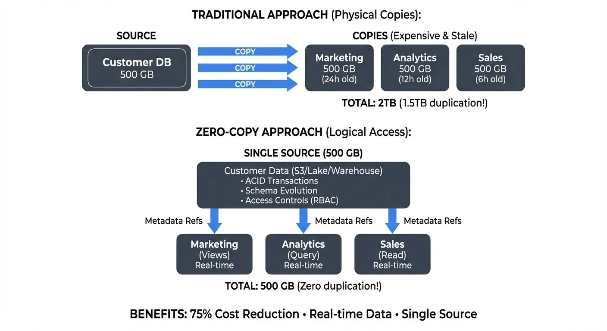

## Introduction

Traditional data sharing has long relied on physical duplication: creating copies, exporting datasets, and maintaining multiple versions of the same information across teams and systems. This approach creates storage overhead, synchronization challenges, and data governance nightmares. Zero-copy sharing fundamentally changes this paradigm by enabling logical access to data without physical duplication, creating a single source of truth that multiple consumers can access simultaneously.

<!-- ORIGINAL_DIAGRAM
```
ZERO-COPY SHARING: ELIMINATING DUPLICATION

TRADITIONAL APPROACH (Physical Copies):
┌────────────────────────────────────────────────────────────┐
│ SOURCE                 COPIES (Expensive & Stale)          │
│ ┌────────┐            ┌─────────┬─────────┬─────────┐     │
│ │Customer│  COPY  →   │Marketing│Analytics│  Sales  │     │
│ │  DB    │  COPY  →   │ 500 GB  │ 500 GB  │ 500 GB  │     │
│ │500 GB  │  COPY  →   │(24h old)│(12h old)│(6h old) │     │
│ └────────┘            └─────────┴─────────┴─────────┘     │
│                        TOTAL: 2TB (1.5TB duplication!)     │
└────────────────────────────────────────────────────────────┘

ZERO-COPY APPROACH (Logical Access):
┌────────────────────────────────────────────────────────────┐
│               SINGLE SOURCE (500 GB)                       │
│     ┌──────────────────────────────────────┐               │
│     │   Customer Data (S3/Lake/Warehouse)  │               │
│     │   • ACID Transactions                │               │
│     │   • Schema Evolution                 │               │
│     │   • Access Controls (RBAC)           │               │
│     └────────┬───────────┬─────────┬───────┘               │
│              │           │         │                        │
│        Metadata Refs   Metadata Refs   Metadata Refs       │
│              │           │         │                        │
│              ▼           ▼         ▼                        │
│        ┌─────────┬─────────┬─────────┐                     │
│        │Marketing│Analytics│  Sales  │                     │
│        │ (Views) │ (Query) │ (Read)  │                     │
│        │Real-time│Real-time│Real-time│                     │
│        └─────────┴─────────┴─────────┘                     │
│        TOTAL: 500 GB (Zero duplication!)                   │
└────────────────────────────────────────────────────────────┘

BENEFITS: 75% Cost Reduction • Real-time Data • Single Source
```
-->

**The Traditional Duplication Problem**: Consider a company with a 500GB customer database. Under traditional approaches, the Marketing team copies the entire database for campaign analysis (500GB), the Analytics team copies it for reporting (500GB), and the Sales team copies it for CRM integration (500GB). The company now stores 2TB total—1.5TB of pure duplication. When the source updates, all copies become stale until the next sync job runs. If Marketing's copy is updated daily at midnight, they work with data that's potentially 24 hours old.

**The Zero-Copy Solution**: With zero-copy sharing, all three teams query the same 500GB database through logical views with appropriate access controls. Marketing sees customers with consent for marketing communications, Analytics sees anonymized demographic data, and Sales sees full records for their territories. Storage costs drop by 75%, all teams work with real-time data, and governance policies apply consistently at the source. When a customer updates their preferences, all teams see the change immediately.

In modern data architectures spanning streaming platforms and lakehouse systems, zero-copy sharing has become essential for building scalable, cost-effective, and governable data infrastructure. This article explores how zero-copy sharing works, its benefits and challenges, and its critical role in governed data streaming environments.

## What is Zero-Copy Data Sharing?

Zero-copy sharing is a data access pattern where consumers read data directly from its original storage location without creating physical copies. Instead of duplicating data, the system grants logical access through references, pointers, or metadata sharing. The data remains in one location while multiple consumers can query, transform, and analyze it.

At its core, zero-copy sharing operates through several mechanisms:

**Metadata-based access**: Systems share metadata about data location, schema, and structure rather than the data itself. Consumers use this metadata to read directly from source storage.

**Reference-based sharing**: Logical pointers or references direct consumers to data locations without copying the underlying bytes. The storage layer handles access control and data retrieval.

**Shared storage architectures**: Cloud object storage (S3, Azure Blob, GCS) enables multiple compute engines to access the same data files simultaneously, forming the foundation for lakehouse architectures.

**Virtual views and projections**: Query engines create virtual representations of data that appear as separate tables or streams but reference the same underlying storage.

This approach contrasts sharply with traditional ETL pipelines that extract, transform, and load copies of data into separate systems, creating multiple versions that drift out of sync over time.

## Benefits of Zero-Copy Sharing

The advantages of eliminating physical data duplication extend across technical, operational, and business dimensions:

**Reduced storage costs**: Storing a single copy instead of multiple duplicates dramatically reduces cloud storage expenses. For large datasets measured in petabytes, this can translate to millions in annual savings.

**Single source of truth**: All consumers access the same data, eliminating inconsistencies from version drift, delayed synchronization, or failed replication jobs. Analytics and operations work from identical information.

**Real-time access**: Consumers see updates as soon as they're written to the source system, without waiting for batch ETL processes. This enables near-real-time analytics and operational decision-making.

**Simplified data pipelines**: Removing copy-and-sync operations reduces pipeline complexity, failure modes, and operational overhead. Fewer moving parts mean higher reliability.

**Faster time to value**: New consumers can access existing data immediately by requesting access rather than waiting for data copies to be created and loaded.

**Improved data freshness**: Without replication lag, downstream systems always reflect the current state of source data, critical for operational analytics and real-time applications.

## Zero-Copy in Cloud Data Warehouses

Cloud data warehouses pioneered accessible zero-copy sharing at scale. Snowflake's secure data sharing exemplifies this approach:

**Snowflake Secure Shares**: Data providers grant access to database objects without creating copies. Consumers query shared data through their own compute resources while reading from the provider's storage. No data moves, but consumers pay for their own compute usage.

**Data Exchange and Marketplace**: Snowflake's marketplace extends zero-copy sharing to enable data product distribution. Providers publish datasets that subscribers can access instantly without data transfer.

**Cross-region and cross-cloud sharing**: Advanced capabilities enable sharing across cloud providers and geographic regions through metadata replication while keeping data in place, minimizing egress costs.

**Example: Snowflake secure data sharing**

```sql
-- Provider account: Share sales data with partner company
CREATE SHARE sales_data_share;

-- Grant access to specific database and tables
GRANT USAGE ON DATABASE sales_db TO SHARE sales_data_share;
GRANT USAGE ON SCHEMA sales_db.public TO SHARE sales_data_share;
GRANT SELECT ON TABLE sales_db.public.transactions TO SHARE sales_data_share;

-- Add consumer account (partner company)
ALTER SHARE sales_data_share ADD ACCOUNTS = partner_org_account;

-- Consumer account: Access shared data without copying
-- Creates a database from the share - no data transfer occurs
CREATE DATABASE partner_sales_data FROM SHARE provider_account.sales_data_share;

-- Query shared data - reads directly from provider's storage
SELECT product_id, SUM(amount) as revenue
FROM partner_sales_data.public.transactions
WHERE date >= CURRENT_DATE - 30
GROUP BY product_id;

-- Provider pays storage costs, consumer pays their query compute costs
-- Data remains in provider's storage, zero bytes transferred for sharing
```

This model has transformed how organizations share data internally across business units and externally with partners, creating data products and enabling data monetization strategies.

## Zero-Copy in Streaming Platforms

Streaming platforms implement zero-copy sharing through architectural patterns that separate storage from consumption. For foundational knowledge of Kafka architecture, see [Apache Kafka](https://conduktor.io/glossary/apache-kafka).

**Consumer groups in Apache Kafka**: Multiple consumer groups read from the same topic partitions without duplicating messages. Each consumer maintains its own offset, enabling independent consumption rates and replay capabilities while sharing the underlying log. In Kafka 4.0+ with KRaft mode, consumer group coordination is more efficient through the new group coordinator protocol, reducing latency for zero-copy consumption patterns and eliminating the ZooKeeper dependency that previously added coordination overhead.

**Topic sharing across teams**: Different teams can subscribe to the same Kafka topics, processing events for different purposes (analytics, alerting, archiving) without creating separate event streams.

**Streaming views and materialized tables**: Stream processing frameworks like Apache Flink 1.19+, ksqlDB, and Apache Paimon create virtual views over streams, enabling derived streams and tables without copying source data. These engines can simultaneously read from the same Kafka topics for different transformations.

**Schema Registry integration**: Sharing schema definitions separately from data enables consumers to interpret binary formats (Avro, Protobuf) without embedded schema overhead in each message. Binary formats are compact data representations that require schema information to decode—the Schema Registry stores these schemas centrally so they don't need to be included with every message, reducing storage and network costs by 30-70% compared to self-describing formats like JSON. For detailed comparison, see [Avro vs Protobuf vs JSON Schema](https://conduktor.io/glossary/avro-vs-protobuf-vs-json-schema).

**Offset management**: Kafka's offset mechanism tracks each consumer's position in the topic log. This enables "time-travel" queries where consumers can rewind to any previous offset and re-read historical data, useful for error recovery, reprocessing with updated logic, or backfilling new analytics pipelines. All of this happens without maintaining separate historical copies—the same log serves both real-time and historical access patterns.

**Example: Multiple consumer groups sharing a Kafka topic**

```java
// Analytics team consumer - processes all events for reporting
Properties analyticsConfig = new Properties();
analyticsConfig.put("bootstrap.servers", "kafka:9092");
analyticsConfig.put("group.id", "analytics-team");
analyticsConfig.put("enable.auto.commit", "true");
KafkaConsumer<String, CustomerEvent> analyticsConsumer =
    new KafkaConsumer<>(analyticsConfig);
analyticsConsumer.subscribe(Collections.singletonList("customer-events"));

// Fraud detection team consumer - same topic, independent processing
Properties fraudConfig = new Properties();
fraudConfig.put("bootstrap.servers", "kafka:9092");
fraudConfig.put("group.id", "fraud-detection");
fraudConfig.put("enable.auto.commit", "false"); // Manual commit for exactly-once
KafkaConsumer<String, CustomerEvent> fraudConsumer =
    new KafkaConsumer<>(fraudConfig);
fraudConsumer.subscribe(Collections.singletonList("customer-events"));

// Both consumers read the same events from customer-events topic
// Zero data duplication, independent consumption rates, separate offsets
// The topic stores data once; governance controls what each team can see
```

In governed streaming environments, zero-copy sharing extends to policy enforcement and access control. Teams can share streams while maintaining granular control over who can consume which topics, with governance policies applied at the consumption layer rather than requiring separate filtered copies for each consumer. For comprehensive coverage of streaming access patterns, see [Access Control for Streaming](https://conduktor.io/glossary/access-control-for-streaming).

## Zero-Copy in Lakehouse Architectures

Lakehouse platforms leverage zero-copy sharing as a foundational principle, combining cloud object storage with table formats that enable concurrent access. For comprehensive coverage of lakehouse architecture, see [Introduction to Lakehouse Architecture](https://conduktor.io/glossary/introduction-to-lakehouse-architecture).

**Apache Iceberg, Delta Lake, Apache Hudi, and Apache Paimon**: These open table formats provide transactional consistency, schema evolution, and time travel while multiple engines (Spark, Trino, Flink) read the same data files on S3 or similar object storage. These features ensure that even though multiple systems read the same files simultaneously, they get consistent results without seeing partial writes or conflicting updates. Iceberg 1.5+ and Delta Lake 3.0+ have particularly strong multi-catalog support enabling sharing across organizational boundaries. For deep technical details on Iceberg's architecture, see [Apache Iceberg](https://conduktor.io/glossary/apache-iceberg).

**Catalog-based sharing**: Centralized catalogs (AWS Glue, Hive Metastore, Unity Catalog, Polaris Catalog) share table metadata while data remains in object storage. New consumers register with the catalog to gain access without data movement. Catalogs act like library card systems—they tell you where the data files are located, but you read the actual data directly from object storage. For catalog patterns and discovery, see [What is a Data Catalog](https://conduktor.io/glossary/what-is-a-data-catalog-modern-data-discovery).

**Cross-engine interoperability**: The same parquet or ORC files can be queried by different compute engines—Spark for batch processing, Presto for interactive analytics, Flink for stream processing—without duplication. This is the core zero-copy benefit: write once to object storage, read from any compatible engine.

**Snapshot isolation**: Table formats maintain multiple snapshots through metadata, enabling different consumers to query different versions of the same table without physical copies. A data science team can train a model against yesterday's snapshot while analysts query today's data, both reading from the same underlying files with zero duplication.

**Partition pruning and predicate pushdown**: Query engines use metadata to read only relevant files, enabling efficient access to massive datasets without full scans. When querying a 100TB table for last week's data, the engine reads only the relevant partitions, making zero-copy access performant even at petabyte scale.

The integration of streaming and lakehouse through technologies like Apache Iceberg creates powerful zero-copy paths from real-time streams to analytical storage, where streaming platforms write directly to lakehouse tables that analytical tools query without intermediate copies.

**Example: Sharing an Iceberg table across compute engines**

```python
# Team 1: Data engineering writes to Iceberg table using Spark
from pyspark.sql import SparkSession

spark = SparkSession.builder \
    .config("spark.sql.catalog.prod", "org.apache.iceberg.spark.SparkCatalog") \
    .config("spark.sql.catalog.prod.type", "glue") \
    .config("spark.sql.catalog.prod.warehouse", "s3://company-lakehouse/") \
    .getOrCreate()

# Write customer data to Iceberg table
customer_df.writeTo("prod.analytics.customers") \
    .tableProperty("write.format.default", "parquet") \
    .createOrReplace()

# Team 2: Analytics queries with Trino - same data, different engine
# No data copy, just catalog metadata sharing
# trino> SELECT * FROM prod.analytics.customers WHERE region = 'US-WEST';

# Team 3: Real-time ML features via Flink - same data, streaming context
# Flink job reads Iceberg table for feature enrichment
# All three teams read from s3://company-lakehouse/analytics/customers/data/
# Zero duplication, catalog coordinates access, S3 serves the files
```

This example demonstrates true zero-copy: Spark writes parquet files to S3, Trino reads them for SQL analytics, and Flink accesses them for streaming enrichment—all through the Glue catalog sharing metadata, with data files remaining in place.

## Governance Requirements for Zero-Copy Sharing

While zero-copy sharing eliminates physical duplication, it intensifies governance requirements since multiple consumers access sensitive source data directly:

**Access control and authorization**: Fine-grained permissions determine who can access which data. This includes table-level, column-level, and row-level security to ensure consumers see only authorized subsets. For example, a sales database might use row-level security to ensure sales representatives only see their own region's data, while column-level security hides sensitive commission rates from most users—all while everyone queries the same underlying table. For comprehensive patterns, see [Data Access Control: RBAC and ABAC](https://conduktor.io/glossary/data-access-control-rbac-and-abac).

**Auditing and lineage tracking**: Comprehensive audit logs track all access to shared data, recording who queried what data, when, and for what purpose. Data lineage tools trace how shared data flows through downstream transformations, essential for impact analysis when source data changes. For streaming audit patterns, see [Audit Logging for Streaming Platforms](https://conduktor.io/glossary/audit-logging-for-streaming-platforms).

**Data masking and anonymization**: Sensitive fields may be masked or tokenized based on consumer identity, enabling sharing while protecting privacy. Different consumers might see different views of the same record—analysts might see customer emails as "***@domain.com" while the fraud team sees full values. For comprehensive masking strategies, see [Data Masking and Anonymization for Streaming](https://conduktor.io/glossary/data-masking-and-anonymization-for-streaming).

**Schema evolution policies**: Governance frameworks enforce rules about backward-compatible schema changes to prevent breaking downstream consumers when source schemas evolve. Schema registries validate that new versions remain compatible with existing consumers.

**Data quality guarantees**: Service-level agreements define data quality metrics, freshness guarantees, and availability commitments for shared data products. For comprehensive quality frameworks, see [Building a Data Quality Framework](https://conduktor.io/glossary/building-a-data-quality-framework).

**Quota and rate limiting**: To prevent resource exhaustion, governance systems enforce consumption limits, query complexity restrictions, and rate limits on shared resources.

Governance platforms like Conduktor extend these capabilities to streaming environments, providing centralized policy enforcement, schema validation, and access control across Kafka clusters while maintaining zero-copy efficiency. Conduktor Gateway adds real-time policy enforcement at the protocol level, enabling capabilities like field-level encryption, dynamic data masking, and quota management without requiring separate filtered copies of topics. Teams can define governance rules that apply transparently as data flows from producers through governed topics to authorized consumers, ensuring compliance without sacrificing the performance benefits of zero-copy access.

## Use Cases and Applications

Zero-copy sharing enables architectural patterns that would be impractical with physical duplication:

**Cross-team collaboration**: Multiple teams access shared datasets for different purposes—product analytics, marketing attribution, fraud detection—without maintaining separate copies or coordinating updates.

**Data products and data mesh**: Domain teams publish data products as shared tables or streams that consumers discover through catalogs and access on-demand, embodying data mesh principles of domain ownership with federated access. Zero-copy sharing is foundational to data mesh architectures, enabling decentralized ownership while maintaining centralized discoverability. For comprehensive coverage of these patterns, see [Data Mesh Principles and Implementation](https://conduktor.io/glossary/data-mesh-principles-and-implementation) and [Building and Managing Data Products](https://conduktor.io/glossary/building-and-managing-data-products).

**Data marketplaces**: Organizations monetize data by providing zero-copy access to external subscribers, generating revenue without data transfer overhead. For cross-organizational patterns, see [Cross-Organization Data Sharing Patterns](https://conduktor.io/glossary/cross-organization-data-sharing-patterns).

**Multi-tenant analytics**: SaaS platforms provide customers with direct query access to their data in shared infrastructure, using row-level security to isolate tenants without physical separation.

**Real-time feature stores**: Machine learning systems access shared feature datasets for model training and inference without copying features into separate stores. Modern feature stores like Feast and Tecton leverage zero-copy patterns to serve features from lakehouse tables or streaming platforms directly. For detailed feature store architectures, see [Feature Stores for Machine Learning](https://conduktor.io/glossary/feature-stores-for-machine-learning).

**Regulatory reporting**: Compliance teams query operational data for reporting without creating separate reporting databases that might drift from source systems.

## Challenges and Considerations

Zero-copy sharing introduces new challenges that require careful architectural planning:

**Network costs and performance**: While storage duplication is eliminated, network costs for data transfer between storage and compute can be significant, especially for cross-region access. Query performance depends on network bandwidth and latency.

**Access pattern conflicts**: Different consumers may have conflicting access patterns—some need full scans while others need point lookups. A single storage layout may not optimize for all use cases.

**Schema evolution complexity**: Updating schemas becomes more complex when multiple consumers depend on the same data. Breaking changes require coordination across all consumers or sophisticated schema compatibility management.

**Dependency management**: Shared data creates tight coupling between providers and consumers. Provider system outages or performance issues affect all consumers simultaneously.

**Cost attribution**: When multiple teams share data, fairly attributing compute costs to consumers while storage costs remain with providers requires sophisticated chargeback mechanisms. For example, if the Sales domain stores 5TB of customer data and the Marketing, Analytics, and Finance teams all query it, the Sales team pays for the 5TB of S3 storage (~$115/month) while each consuming team pays for their compute (queries, scans, data transfer). This requires careful resource tagging and cost allocation frameworks to ensure accurate chargeback across domains.

**Data deletion and retention**: Removing data becomes complicated when multiple consumers with different retention requirements share the same storage. Implementing time-based deletion while supporting various replay needs requires careful planning.

## Security and Privacy Considerations

Sharing data without duplication requires robust security controls:

**Row-level security**: Filtering records based on consumer identity ensures users see only authorized data. Implementing efficient row-level security without performance degradation requires careful indexing and partition strategies.

**Column-level access control**: Sensitive columns can be hidden or masked for specific consumers, providing different views into the same table.

**Encryption and key management**: Data at rest remains encrypted in shared storage, with key management systems controlling which consumers can decrypt specific datasets.

**Network security**: Secure network paths between compute and storage prevent unauthorized interception, especially important for cross-region or cross-cloud sharing.

**Audit compliance**: Detailed logging of all data access enables compliance with regulations like GDPR, HIPAA, and SOC 2, providing evidence of proper data handling.

## Connection to Data Mesh and Data Products

Zero-copy sharing is foundational to data mesh architecture, enabling domain-oriented decentralized data ownership while maintaining central governance. Data mesh is an architectural approach where domain teams own their data as products rather than centralizing all data in one data warehouse, with zero-copy patterns making this decentralization practical and efficient.

**Domain ownership with federated access**: Domain teams own and manage their data products in place, granting access to consumers without losing control or creating copies. The Sales domain maintains customer data in their lakehouse tables, while Marketing and Analytics teams access it through shared catalogs with appropriate governance policies.

**Self-service data infrastructure**: Consumers discover and access data products through catalogs without requiring manual provisioning or data transfer by central IT. A new analytics team can search the catalog, find the "customer-360" data product, request access, and begin querying within hours rather than waiting weeks for data pipeline creation.

**Federated computational governance**: Governance policies apply automatically to shared data, enforced at query time rather than requiring specialized copies for each compliance requirement. A single data product can serve both GDPR-compliant anonymized views for analytics and full-detail views for authorized compliance officers, all from the same underlying storage.

**Product thinking for data**: Teams treat shared datasets as products with consumers, SLAs, and versioning, made practical by zero-copy access that enables rapid iteration without duplication overhead.

For comprehensive coverage of data mesh patterns and implementation strategies, see [Data Mesh Principles and Implementation](https://conduktor.io/glossary/data-mesh-principles-and-implementation).

## Conclusion

Zero-copy data sharing represents a fundamental shift from duplication-based data distribution to logical access patterns that reduce costs, improve consistency, and enable real-time collaboration. By combining cloud object storage, advanced table formats, streaming platforms, and governance frameworks, modern data architectures can share data efficiently across organizational boundaries while maintaining security and control.

The convergence of streaming platforms and lakehouse architectures amplifies the benefits of zero-copy sharing, creating unified data platforms where events flow from real-time streams to analytical storage without duplication at any stage. With proper governance tools providing policy enforcement and access control, organizations can confidently share data across teams and applications while maintaining compliance and security.

As data volumes continue to grow and real-time requirements intensify, zero-copy sharing will become increasingly essential for building scalable, cost-effective, and governable data platforms. Organizations that master these patterns will gain significant advantages in operational efficiency, analytical agility, and collaborative innovation.

## Related Concepts

- [Apache Kafka](https://conduktor.io/glossary/apache-kafka) - Streaming platform enabling zero-copy sharing through consumer groups
- [What is Apache Flink: Stateful Stream Processing](https://conduktor.io/glossary/what-is-apache-flink-stateful-stream-processing) - Stream processor supporting zero-copy lakehouse integration
- [Streaming Total Cost of Ownership](https://conduktor.io/glossary/streaming-total-cost-of-ownership) - Cost benefits of zero-copy architectures

## Sources and References

- [Snowflake Data Sharing](https://docs.snowflake.com/en/user-guide/data-sharing-intro) - Zero-copy data sharing across cloud data warehouses
- [Delta Sharing Protocol](https://delta.io/sharing/) - Open protocol for secure data sharing without duplication
- [Apache Iceberg Table Format](https://iceberg.apache.org/) - Table format enabling zero-copy access across engines
- [Data Mesh Principles](https://martinfowler.com/articles/data-mesh-principles.html) - Architectural approach to decentralized data sharing
- [AWS Lake Formation Permissions](https://docs.aws.amazon.com/lake-formation/latest/dg/how-it-works.html) - Fine-grained access control for shared lakehouse data
