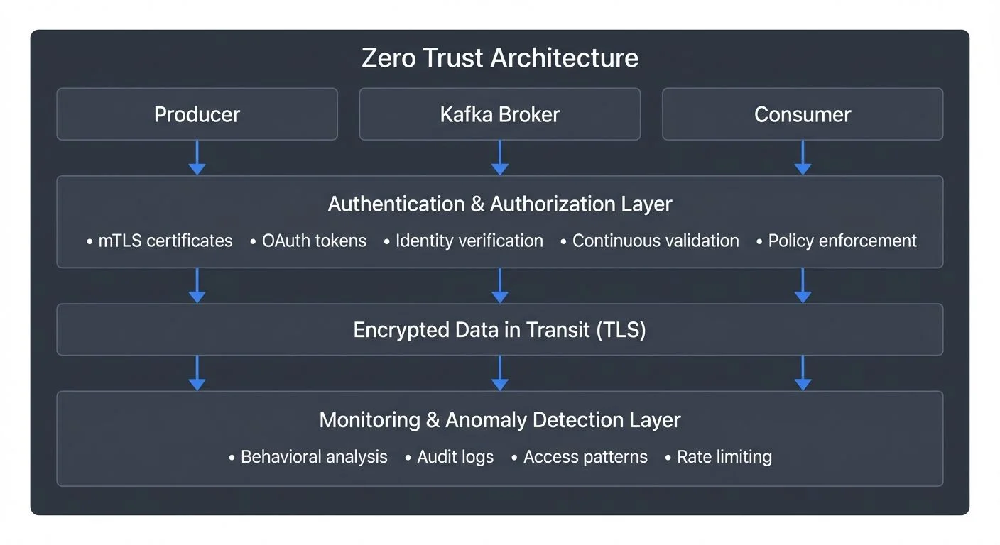

# Zero Trust for Streaming: Security Without Implicit Trust

## Beyond Perimeter Security

For decades, enterprise security operated on the castle-and-moat principle: build a strong perimeter, and trust everything inside. Firewalls protected the network boundary, and once a service or user was inside, they were largely trusted by default.

Streaming architectures expose the fundamental flaw in this model. Data flows continuously across services, cloud boundaries, and organizational units. A single compromised producer could poison data for hundreds of downstream consumers. A breached consumer could exfiltrate sensitive events in real-time. The attack surface is not a perimeter—it's a mesh of interconnected data flows.

For detailed coverage of traditional access control approaches in streaming, see [Access Control for Streaming](https://conduktor.io/glossary/access-control-for-streaming).

Zero trust security addresses this reality with a simple principle: **never trust, always verify**. Every request, every connection, and every data access must be authenticated and authorized, regardless of where it originates. There is no "inside" the network. There is no implicit trust.

## The Three Core Tenets

Zero trust for streaming rests on three foundational principles:



<!-- ORIGINAL_DIAGRAM
```
┌─────────────────────────────────────────────────────────────────┐
│                    Zero Trust Architecture                      │
├─────────────────────────────────────────────────────────────────┤
│                                                                 │
│  ┌──────────────┐      ┌──────────────┐      ┌──────────────┐ │
│  │   Producer   │      │    Kafka     │      │   Consumer   │ │
│  │              │      │    Broker    │      │              │ │
│  └──────┬───────┘      └──────┬───────┘      └──────┬───────┘ │
│         │                     │                     │         │
│         ▼                     ▼                     ▼         │
│  ┌─────────────────────────────────────────────────────────┐  │
│  │           Authentication & Authorization Layer          │  │
│  │  • mTLS certificates     • OAuth tokens                 │  │
│  │  • Identity verification • ACL checks                   │  │
│  │  • Continuous validation • Policy enforcement           │  │
│  └─────────────────────────────────────────────────────────┘  │
│         │                     │                     │         │
│         ▼                     ▼                     ▼         │
│  ┌─────────────────────────────────────────────────────────┐  │
│  │              Encrypted Data in Transit (TLS)            │  │
│  └─────────────────────────────────────────────────────────┘  │
│         │                     │                     │         │
│         ▼                     ▼                     ▼         │
│  ┌─────────────────────────────────────────────────────────┐  │
│  │         Monitoring & Anomaly Detection Layer            │  │
│  │  • Behavioral analysis  • Audit logs                    │  │
│  │  • Access patterns      • Rate limiting                 │  │
│  └─────────────────────────────────────────────────────────┘  │
│                                                                 │
└─────────────────────────────────────────────────────────────────┘
```
-->

**Verify explicitly.** Authentication and authorization must use all available data points: identity, location, device health, service metadata, and data classification. A producer connecting from an unexpected region at an unusual time should trigger additional verification, even if credentials are valid.

**Least privilege access.** Grant the minimum permissions necessary for a service to function. A consumer reading from a single topic shouldn't have cluster-wide read access. A producer writing order events shouldn't be able to write to user profile topics. Fine-grained permissions prevent lateral movement after a breach.

**Assume breach.** Design as if attackers are already inside your network. Limit blast radius through segmentation. Encrypt data in-transit and at-rest. Monitor for anomalous behavior. A zero trust architecture doesn't prevent all breaches—it contains them.

## Authentication Everywhere

In a streaming system, authentication happens at multiple layers. Client authentication to brokers is the first gate, but it's not the only one.

**Mutual TLS (mTLS)** provides service-to-service authentication where both parties present certificates. Kafka clients authenticate to brokers, and brokers authenticate to each other. Certificate-based authentication is stronger than passwords and integrates naturally with service identity platforms. With Kafka 4.0's KRaft mode, certificate management becomes more streamlined as the removal of ZooKeeper eliminates an additional security surface to manage.

**OAuth 2.0 and OIDC (OpenID Connect)** enable centralized identity management. Services obtain short-lived access tokens from an identity provider. Kafka can validate these tokens on every request, allowing real-time revocation when a service is compromised. Modern Kafka versions (3.x and 4.x) support OAuth 2.0 bearer tokens through the OAUTHBEARER SASL mechanism, with improved support for delegated tokens that can be scoped to specific operations and time windows. Token expiration forces periodic re-authentication, reducing the window for stolen credentials to be exploited. For implementation details, see [Kafka Authentication: SASL, SSL, OAuth](https://conduktor.io/glossary/kafka-authentication-sasl-ssl-oauth).

**Service mesh integration** layers authentication onto the network itself. Tools like Istio or Linkerd automatically handle mTLS between services, verify identities, and enforce policies. The streaming platform doesn't need to implement all authentication logic—it delegates to the mesh.

**Workload identity** ties authentication to the workload, not the host. A Kubernetes pod gets a unique identity regardless of which node it runs on. Credentials rotate automatically. Identity follows the workload through the infrastructure lifecycle.

## Authorization at Every Hop

Authentication proves identity. Authorization determines what that identity can do.

Streaming systems require authorization at multiple levels:

**Topic-level permissions** control which services can read from or write to specific topics. A payment service writes to `payments.*` topics but can't access `user.clickstream`.

**Partition-level controls** further restrict access. In multi-tenant systems, each tenant's data might reside in specific partitions. Authorization ensures tenants can only access their own data, even when sharing a topic.

**Operation-specific access** differentiates read, write, and admin operations. Consumer groups need read access but not write. Producers need write access but not configuration privileges. Separate roles for separate functions. For comprehensive patterns and examples, see [Kafka ACLs and Authorization Patterns](https://conduktor.io/glossary/kafka-acls-and-authorization-patterns).

**Dynamic policy enforcement** evaluates policies at request time, using current context. A policy might allow reads only during business hours, or restrict writes when data volume exceeds thresholds. Static ACLs can't capture these temporal and conditional requirements.

## Network Segmentation and Encryption

Zero trust architectures assume the network is hostile. Segmentation and encryption protect data as it flows.

**Micro-segmentation** divides the network into small zones with explicit access controls between them. Rather than one flat network where any service can reach any other, each segment requires authenticated and authorized traversal. A compromised service in the analytics segment can't pivot to the payment processing segment.

**TLS encryption in-transit** prevents eavesdropping on the wire. Every connection between clients and brokers, and between brokers themselves, should use TLS 1.3 (or TLS 1.2 minimum for legacy compatibility). TLS 1.3 provides improved security and performance with a faster handshake and removal of vulnerable cipher suites. Encryption overhead is negligible compared to the risk of plaintext streaming data. For detailed encryption configuration, see [Encryption at Rest and in Transit for Kafka](https://conduktor.io/glossary/encryption-at-rest-and-in-transit-for-kafka).

**At-rest encryption** protects data on disk. Even if an attacker gains access to storage volumes, encrypted data remains unreadable without keys. Kafka supports transparent encryption through encrypted volumes or filesystem-level encryption.

**End-to-end encryption** goes further: producers encrypt messages before sending, and only authorized consumers can decrypt them. The streaming platform itself never sees plaintext. This pattern is essential for highly sensitive data, though it prevents server-side operations like filtering or schema validation. For use cases requiring field-level protection, see [Data Masking and Anonymization for Streaming](https://conduktor.io/glossary/data-masking-and-anonymization-for-streaming).

## Continuous Verification and Monitoring

Zero trust doesn't end after initial authentication. Continuous verification ensures trust decisions remain valid throughout a session.

**Session validation** periodically re-checks credentials. Long-lived producer connections might authenticate once, then stream for hours. Periodic re-authentication catches revoked credentials faster than waiting for the next connection.

**Token rotation** limits the lifetime of credentials. Short-lived tokens expire quickly, forcing regular renewal. If a token leaks, it's only valid for minutes, not months.

**Anomaly detection** identifies unusual patterns. A consumer that typically reads 1,000 messages per second suddenly pulling millions raises flags. A producer connecting from a new geographic region warrants investigation. Machine learning models establish baselines and alert on deviations.

**Behavioral analysis** builds profiles of normal service behavior. Login times, data access patterns, throughput rates—all contribute to a behavioral signature. Deviations suggest compromise or misconfiguration. For comprehensive tracking of access patterns, see [Audit Logging for Streaming Platforms](https://conduktor.io/glossary/audit-logging-for-streaming-platforms).

## Implementation Challenges and Best Practices

Zero trust in streaming systems introduces complexity, especially at scale.

**Performance impact** is real. Authentication and authorization add latency to every request. Encryption consumes CPU. In high-throughput systems processing millions of messages per second, these costs matter. Optimize by caching authorization decisions, using hardware-accelerated encryption, and batching authentication checks where possible.

**Operational complexity** increases. Managing certificates, rotating credentials, and maintaining authorization policies across hundreds of services requires automation. Manual processes don't scale and introduce errors.

For **Kafka specifically**, zero trust implementation leverages:
- SASL for flexible authentication (SCRAM, OAUTHBEARER, GSSAPI)
- ACLs for fine-grained authorization
- TLS for encrypted transport
- Cluster and broker-level access controls
- Integration with external authorization services
- KRaft mode (Kafka 4.0+) for simplified security architecture

Governance platforms like **Conduktor** simplify zero trust by centralizing policy management, providing visibility into access patterns, and enforcing consistent security controls across Kafka clusters. Rather than managing ACLs manually across environments, teams define policies once and apply them uniformly. [Conduktor Gateway](https://docs.conduktor.io/guide/conduktor-concepts/gw-authen-author) adds an additional security layer by acting as a proxy that can enforce custom policies, intercept and validate requests, and provide fine-grained access control beyond native Kafka ACLs.

**Migration strategies** matter. You can't flip a switch from perimeter security to zero trust overnight. Start with high-value data: authenticate and authorize access to topics containing PII or financial data. Expand incrementally. Use monitoring to understand existing access patterns before enforcing restrictions. Run in shadow mode initially to catch unintended blocks.

**Testing security resilience** is critical. Use chaos engineering techniques to verify that security controls hold under failure conditions. For testing approaches, see [Chaos Engineering for Streaming Systems](https://conduktor.io/glossary/chaos-engineering-for-streaming-systems).

## Practical Example: Zero Trust Kafka Configuration

Here's a minimal example of zero trust configuration for a Kafka producer using mTLS and ACLs:

```yaml
# Producer configuration with mTLS authentication
bootstrap.servers: kafka.example.com:9093
security.protocol: SSL
ssl.truststore.location: /etc/kafka/secrets/truststore.jks
ssl.truststore.password: ${TRUSTSTORE_PASSWORD}
ssl.keystore.location: /etc/kafka/secrets/producer.keystore.jks
ssl.keystore.password: ${KEYSTORE_PASSWORD}
ssl.key.password: ${KEY_PASSWORD}

# Additional security hardening
ssl.endpoint.identification.algorithm: https
ssl.protocol: TLSv1.3
ssl.enabled.protocols: TLSv1.3
```

Corresponding broker-side ACL enforcement:

```bash
# Grant specific producer write-only access to payment topics
kafka-acls --bootstrap-server localhost:9093 \
  --add --allow-principal User:CN=payment-service \
  --operation Write --topic payments.transactions

# Deny all other operations
kafka-acls --bootstrap-server localhost:9093 \
  --add --deny-principal User:CN=payment-service \
  --operation All --cluster
```

This configuration ensures:
- **Authentication**: Producer must present valid certificate (mTLS)
- **Encryption**: All data encrypted in-transit with TLS 1.3
- **Authorization**: Producer can only write to specific topics, nothing else
- **Least privilege**: No cluster-wide permissions granted

For OAuth 2.0 authentication with modern Kafka:

```yaml
security.protocol: SASL_SSL
sasl.mechanism: OAUTHBEARER
sasl.jaas.config: org.apache.kafka.common.security.oauthbearer.OAuthBearerLoginModule required \
  clientId="${CLIENT_ID}" \
  clientSecret="${CLIENT_SECRET}" \
  scope="kafka.producer";
sasl.login.callback.handler.class: org.apache.kafka.common.security.oauthbearer.secured.OAuthBearerLoginCallbackHandler
```

This demonstrates zero trust in practice: explicit authentication, minimal permissions, and continuous verification through token expiration.

## Conclusion

Zero trust for streaming acknowledges a simple reality: distributed data flows can't rely on perimeter defenses. Every producer, every consumer, every broker interaction is a potential attack vector.

By verifying explicitly, enforcing least privilege, and assuming breach, zero trust architectures contain the blast radius of compromises. Authentication proves identity at every hop. Authorization limits what each identity can do. Encryption protects data in motion and at rest. Continuous monitoring detects anomalies before they escalate.

The transition requires effort—technical implementation, operational changes, and cultural shifts. But in an era where data breaches are measured in millions of records and streaming systems are critical infrastructure, implicit trust is a luxury we can't afford.

Trust must be earned, continuously, at every request.

## Related Topics

- [Access Control for Streaming](https://conduktor.io/glossary/access-control-for-streaming) - Traditional and modern access control approaches
- [Kafka Authentication: SASL, SSL, OAuth](https://conduktor.io/glossary/kafka-authentication-sasl-ssl-oauth) - Authentication implementation details
- [Kafka ACLs and Authorization Patterns](https://conduktor.io/glossary/kafka-acls-and-authorization-patterns) - Authorization strategies and examples
- [Encryption at Rest and in Transit for Kafka](https://conduktor.io/glossary/encryption-at-rest-and-in-transit-for-kafka) - Encryption configuration guide
- [Audit Logging for Streaming Platforms](https://conduktor.io/glossary/audit-logging-for-streaming-platforms) - Comprehensive access tracking
- [Data Masking and Anonymization for Streaming](https://conduktor.io/glossary/data-masking-and-anonymization-for-streaming) - Field-level data protection
- [Chaos Engineering for Streaming Systems](https://conduktor.io/glossary/chaos-engineering-for-streaming-systems) - Testing security resilience
- [Data Classification and Tagging Strategies](https://conduktor.io/glossary/data-classification-and-tagging-strategies) - Classifying data for security policies

## Sources and References

- [NIST Zero Trust Architecture (SP 800-207)](https://csrc.nist.gov/publications/detail/sp/800-207/final) - Federal framework for zero trust security
- [Apache Kafka Security Documentation](https://kafka.apache.org/documentation/#security) - Authentication, authorization, and encryption for Kafka
- [OAuth 2.0 Authorization Framework (RFC 6749)](https://datatracker.ietf.org/doc/html/rfc6749) - Token-based authentication standard
- [Istio Service Mesh Security](https://istio.io/latest/docs/concepts/security/) - mTLS and policy enforcement in service mesh architectures
- [CISA Zero Trust Maturity Model](https://www.cisa.gov/zero-trust-maturity-model) - Government guidance on zero trust implementation
