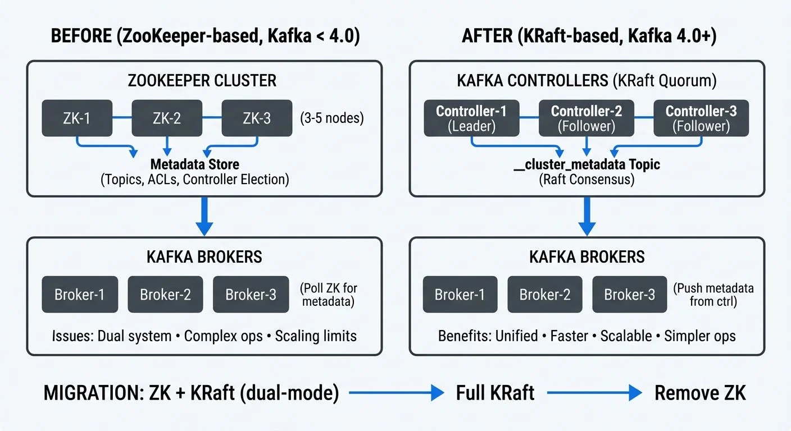

Apache Kafka's shift from ZooKeeper to KRaft (Kafka Raft) represents one of the most significant architectural changes in the platform's history. This migration simplifies Kafka's operational model, reduces infrastructure complexity, and improves cluster performance. Understanding how to migrate from ZooKeeper to KRaft is essential for teams managing production Kafka environments.

<!-- ORIGINAL_DIAGRAM
```
KAFKA METADATA MANAGEMENT: ZOOKEEPER → KRAFT

BEFORE (ZooKeeper-based, Kafka < 4.0):
┌───────────────────────────────────────────────────────────┐
│                    ZOOKEEPER CLUSTER                      │
│  ┌──────────┬──────────┬──────────┐                      │
│  │  ZK-1    │  ZK-2    │  ZK-3    │  (3-5 nodes)         │
│  └────┬─────┴────┬─────┴────┬─────┘                      │
│       │          │          │                             │
│   Metadata Store (Topics, ACLs, Controller Election)     │
└───────┼──────────┼──────────┼─────────────────────────────┘
        ▼          ▼          ▼
┌────────────────────────────────────────────────────────────┐
│                  KAFKA BROKERS                             │
│  ┌────────┬────────┬────────┐                             │
│  │Broker-1│Broker-2│Broker-3│  (Poll ZK for metadata)     │
│  └────────┴────────┴────────┘                             │
│  Issues: Dual system • Complex ops • Scaling limits       │
└────────────────────────────────────────────────────────────┘

AFTER (KRaft-based, Kafka 4.0+):
┌────────────────────────────────────────────────────────────┐
│            KAFKA CONTROLLERS (KRaft Quorum)                │
│  ┌─────────────┬──────────────┬─────────────┐             │
│  │Controller-1 │Controller-2  │Controller-3 │             │
│  │  (Leader)   │  (Follower)  │  (Follower) │             │
│  └──────┬──────┴──────┬───────┴──────┬──────┘             │
│         │             │              │                     │
│    __cluster_metadata Topic (Raft Consensus)              │
│         │             │              │                     │
└─────────┼─────────────┼──────────────┼─────────────────────┘
          ▼             ▼              ▼
┌────────────────────────────────────────────────────────────┐
│                  KAFKA BROKERS                             │
│  ┌────────┬────────┬────────┐                             │
│  │Broker-1│Broker-2│Broker-3│  (Push metadata from ctrl)  │
│  └────────┴────────┴────────┘                             │
│  Benefits: Unified • Faster • Scalable • Simpler ops      │
└────────────────────────────────────────────────────────────┘

MIGRATION: ZK + KRaft (dual-mode) → Full KRaft → Remove ZK
```
-->

For foundational knowledge of Apache Kafka's architecture, see [Apache Kafka](https://conduktor.io/glossary/apache-kafka).

## Understanding Apache Kafka's Metadata Management

Historically, Apache Kafka relied on Apache ZooKeeper as an external system for storing critical cluster metadata. ZooKeeper handled controller election, topic configurations, access control lists (ACLs), partition leadership information, and broker registration.

This dependency meant that every Kafka cluster required a separate ZooKeeper ensemble, typically consisting of 3-5 nodes for high availability. Operators needed expertise in both systems, and any ZooKeeper issues could directly impact Kafka availability.

The metadata stored in ZooKeeper included:
- Broker registrations and configurations
- Topic and partition metadata
- Replica assignments and ISR (In-Sync Replicas) lists, the set of replicas that are fully caught up with the partition leader
- ACLs and quota configurations
- Controller epoch (version number tracking leadership changes) and leadership information

While ZooKeeper served Kafka well for over a decade, this dual-system architecture created operational overhead and introduced latency in metadata propagation across large clusters.

## What is KRaft (Kafka Raft)?

KRaft is Kafka's native consensus protocol based on the Raft algorithm (a consensus algorithm that ensures multiple servers agree on data). Introduced through KIP-500 (Kafka Improvement Proposal 500) and declared production-ready in Kafka 3.3.1, KRaft eliminates the need for ZooKeeper by managing metadata directly within Kafka itself. As of Kafka 4.0 (October 2024), ZooKeeper support has been completely removed, making KRaft the only supported metadata management mode.

In KRaft mode, dedicated controller nodes form a Raft quorum that stores metadata in an internal Kafka topic called `__cluster_metadata` (the double underscore prefix indicates system-internal topics). This topic is replicated across controller nodes using the Raft consensus algorithm, ensuring consistency and fault tolerance.

Key architectural changes include:

**Unified Architecture**: Metadata management happens within Kafka brokers or dedicated controller nodes, removing the external dependency.

**Metadata as Events**: Cluster metadata is stored as a log of events in the `__cluster_metadata` topic, making it queryable and recoverable like any other Kafka topic.

**Faster Propagation**: Controllers push metadata changes to brokers, rather than brokers polling ZooKeeper, significantly reducing metadata propagation time in large clusters.

**Simplified Operations**: One system to deploy, monitor, and maintain instead of two separate distributed systems.

## Why Migrate from ZooKeeper to KRaft?

The migration to KRaft offers substantial benefits that impact both operations and performance.

**Operational Simplification**: Eliminating ZooKeeper reduces the infrastructure footprint by 30-40%. Teams no longer need to maintain separate ZooKeeper clusters, monitor two different systems, or manage cross-system version compatibility.

**Improved Scalability**: ZooKeeper's watch mechanism created scalability bottlenecks in clusters with hundreds of thousands of partitions. KRaft scales more efficiently, with production deployments successfully running millions of partitions.

**Faster Metadata Operations**: Metadata changes propagate in milliseconds rather than seconds. Controller failover typically completes in under a second with KRaft, compared to several seconds with ZooKeeper.

**Enhanced Recovery**: Since metadata is stored in a Kafka topic, standard Kafka replication and recovery mechanisms apply. Metadata snapshots and log compaction make recovery faster and more predictable. For broader disaster recovery planning, see [Disaster Recovery Strategies for Kafka Clusters](https://conduktor.io/glossary/disaster-recovery-strategies-for-kafka-clusters).

**Future-Proofing**: ZooKeeper support was deprecated in Kafka 3.5 and completely removed in Kafka 4.0 (released October 2024). Migrating to KRaft is now mandatory for accessing new features and security updates in Kafka 4.0 and beyond.

A real-world example: A financial services company managing a 50-node Kafka cluster reduced their infrastructure by 15 nodes after migrating to KRaft, as they no longer needed the separate ZooKeeper ensemble. They also observed controller failover times drop from 5-7 seconds to under 1 second.

## Migration Approaches and Strategies

**Important Note for Kafka 4.0+**: If you're deploying a new Kafka 4.0+ cluster, you must use KRaft from the start as ZooKeeper support has been removed. The migration approaches below apply to existing clusters running Kafka 3.x that need to transition from ZooKeeper to KRaft.

There are two primary approaches to migrating from ZooKeeper to KRaft:

**1. Direct Migration (Online Migration)**

This approach involves migrating an existing ZooKeeper-based cluster to KRaft mode with minimal downtime. It requires Kafka 3.4 or later and involves a phased process where ZooKeeper and KRaft controllers coexist temporarily.

Advantages:
- Preserves existing cluster data and configurations
- No need to recreate topics or migrate consumer offsets
- Suitable for clusters where rebuilding is impractical

Considerations:
- Requires careful planning and coordination
- More complex than clean installation
- Still maturing (consider testing thoroughly in non-production first)

**2. New Cluster Setup (Offline Migration)**

This involves creating a new KRaft-based cluster and migrating data from the old ZooKeeper-based cluster. Tools like MirrorMaker 2 facilitate data replication between clusters.

Advantages:
- Clean slate with KRaft from the start
- Lower risk as the original cluster remains unchanged during migration
- Easier rollback if issues occur

Considerations:
- Requires sufficient infrastructure to run both clusters temporarily
- Producers and consumers must be redirected to the new cluster
- Consumer offset migration needed

For most production environments, the new cluster approach offers lower risk and clearer rollback options, especially for mission-critical deployments.

## Step-by-Step Migration Process

Here's a technical walkthrough of the direct migration process:

**Phase 1: Preparation**
1. Upgrade to Kafka 3.6+ minimum (Kafka 4.0+ recommended for 2025 deployments, as it's KRaft-only)
2. Verify all brokers are on the same version
3. Backup ZooKeeper data using `zkCli.sh`
4. Document current configurations and ACLs
5. Test the migration process in a non-production environment

**Phase 2: Enable KRaft Controllers**
1. Deploy dedicated controller nodes or configure combined broker/controller nodes
2. Generate a cluster UUID: `kafka-storage.sh random-uuid`
3. Configure controllers with the new `process.roles=controller` setting
4. Format controller log directories: `kafka-storage.sh format -t <uuid> -c controller.properties`
5. Start controllers and verify Raft quorum formation

**Phase 3: Migration Execution**
1. Configure brokers for migration mode: `zookeeper.metadata.migration.enable=true`
2. Point brokers to both ZooKeeper and KRaft controllers
3. Restart brokers one at a time, verifying metadata synchronization
4. Monitor the migration progress through controller logs and metrics

**Phase 4: Finalization**
1. Verify all metadata has migrated successfully
2. Switch active controller from ZooKeeper to KRaft
3. Remove ZooKeeper configuration from broker properties
4. Rolling restart of all brokers in KRaft-only mode
5. Decommission ZooKeeper ensemble

Critical configuration examples for migration:

**During Migration (Kafka 3.4-3.8):**

```properties
# Controller configuration
process.roles=controller
node.id=1
controller.quorum.voters=1@controller1:9093,2@controller2:9093,3@controller3:9093
metadata.log.dir=/var/lib/kafka/metadata

# Broker configuration during migration
process.roles=broker
zookeeper.metadata.migration.enable=true
zookeeper.connect=zk1:2181,zk2:2181,zk3:2181
controller.quorum.voters=1@controller1:9093,2@controller2:9093,3@controller3:9093
```

**After Migration Complete (KRaft-Only Mode):**

```properties
# Controller configuration (final state)
process.roles=controller
node.id=1
controller.quorum.voters=1@controller1:9093,2@controller2:9093,3@controller3:9093
metadata.log.dir=/var/lib/kafka/metadata
controller.listener.names=CONTROLLER
listeners=CONTROLLER://controller1:9093

# Broker configuration (final state - no ZooKeeper references)
process.roles=broker
node.id=101
controller.quorum.voters=1@controller1:9093,2@controller2:9093,3@controller3:9093
listeners=PLAINTEXT://broker1:9092
advertised.listeners=PLAINTEXT://broker1:9092
log.dirs=/var/lib/kafka/data
```

## KRaft in Data Streaming Ecosystems

The migration to KRaft has significant implications for data streaming platforms and real-time processing architectures.

**Faster Stream Processing Startup**: Stream processing applications using Kafka Streams or Flink depend on topic metadata to assign partitions and start processing. KRaft's faster metadata propagation reduces application startup time, especially in auto-scaling scenarios where new instances spin up frequently.

**Improved Multi-Cluster Management**: Organizations running multiple Kafka clusters for different environments or regions benefit from simplified operations. Fewer components mean easier automation, faster provisioning, and lower maintenance overhead.

**Enhanced Observability**: With metadata stored as a Kafka topic, monitoring tools can subscribe to metadata changes just like any other stream. This enables real-time tracking of configuration changes, topic creation, and partition reassignments.

**Platform Integration**: Data governance platforms like Conduktor can leverage KRaft's improved metadata APIs to provide better visibility into cluster topology, track migration progress, and validate metadata consistency. Conduktor's management interface is particularly valuable during migrations when verifying that all configurations, ACLs, and quotas have transferred correctly, offering visual comparison of pre- and post-migration cluster states.

**Cloud-Native Deployments**: KRaft's simpler architecture aligns better with containerized and Kubernetes-based deployments. Fewer stateful components make it easier to implement infrastructure-as-code patterns and automated cluster provisioning.

## Post-Migration Monitoring and Validation

After completing the migration, thorough validation ensures cluster health and correct operation.

**Metadata Verification**:
- Compare topic configurations, partition counts, and replication factors
- Verify ACLs and quota configurations match pre-migration state
- Check consumer group offsets are preserved
- Validate broker configurations and dynamic settings

**Performance Monitoring**:
- Observe controller failover behavior under simulated failures
- Measure metadata operation latency (topic creation, partition reassignment)
- Monitor broker and controller resource utilization
- Track client request latency for any regressions

For comprehensive coverage of Kafka monitoring strategies and metrics, see [Kafka Cluster Monitoring and Metrics](https://conduktor.io/glossary/kafka-cluster-monitoring-and-metrics).

**Key Metrics to Watch**:
- `kafka.controller:type=KafkaController,name=ActiveControllerCount` (should be 1)
- `kafka.controller:type=ControllerStats,name=LeaderElectionRateAndTimeMs`
- `kafka.server:type=KRaftMetadataCache,name=MetadataLoadLatency`
- `kafka.server:type=broker-metadata-metrics,name=metadata-apply-latency` (Kafka 3.7+)
- `kafka.server:type=raft-metrics,name=high-watermark` (tracks replication progress in controller quorum)
- `kafka.server:type=raft-metrics,name=log-end-offset` (current end of metadata log)
- Broker log for any metadata-related errors or warnings

These JMX metrics (Java Management Extensions monitoring metrics) can be accessed through standard monitoring tools like Prometheus, Grafana, or Conduktor's built-in monitoring interface.

**Operational Checklist**:
1. Perform a controlled controller failover and verify new leader election
2. Create test topics and verify metadata propagation speed
3. Execute partition reassignments to test metadata update paths
4. Update monitoring dashboards to track KRaft-specific metrics
5. Document the new operational procedures for the KRaft cluster

Platforms like Conduktor can streamline this validation process by providing visual confirmation of cluster state, metadata consistency across brokers, and historical tracking of configuration changes before and after migration. Conduktor's monitoring capabilities help teams quickly identify any discrepancies in topic configurations, ACLs, or quotas that may have occurred during the transition.

## Related Concepts

- [Understanding KRaft Mode in Kafka](https://conduktor.io/glossary/understanding-kraft-mode-in-kafka) - Foundational understanding of KRaft architecture and benefits before planning migration.
- [Kafka Cluster Monitoring and Metrics](https://conduktor.io/glossary/kafka-cluster-monitoring-and-metrics) - Essential monitoring strategies for tracking migration progress and validating KRaft cluster health.
- [Kafka Capacity Planning](https://conduktor.io/glossary/kafka-capacity-planning) - KRaft's reduced infrastructure requirements impact capacity planning for post-migration clusters.

## Summary

Migrating from ZooKeeper to KRaft represents a significant architectural evolution for Apache Kafka, delivering operational simplification, improved performance, and better scalability. While the migration requires careful planning and execution, the long-term benefits of reduced infrastructure complexity, faster metadata operations, and improved reliability make it essential for teams managing Kafka at scale.

The migration process, whether through direct migration or new cluster setup, demands thorough testing and validation. Understanding both approaches allows teams to choose the strategy that best fits their operational constraints and risk tolerance.

With ZooKeeper support completely removed in Kafka 4.0 (October 2024), migrating to KRaft is no longer optional, it's mandatory for teams wanting to upgrade to Kafka 4.0 and access new features, security updates, and community support. Organizations that plan and execute this migration thoughtfully will benefit from a more streamlined, performant, and maintainable data streaming platform.

## Sources and References

1. **Apache Kafka Improvement Proposal KIP-500**: "Replace ZooKeeper with a Self-Managed Metadata Quorum" - The original proposal outlining KRaft's architecture and implementation plan. [https://cwiki.apache.org/confluence/display/KAFKA/KIP-500](https://cwiki.apache.org/confluence/display/KAFKA/KIP-500)

2. **Apache Kafka Documentation**: "KRaft Mode" - Official documentation covering KRaft configuration, migration procedures, and operational guidelines. [https://kafka.apache.org/documentation/#kraft](https://kafka.apache.org/documentation/#kraft)

3. **Confluent Documentation**: "Migrate to KRaft" - Comprehensive migration guide with best practices and troubleshooting tips. [https://docs.confluent.io/platform/current/installation/migrate-zk-kraft.html](https://docs.confluent.io/platform/current/installation/migrate-zk-kraft.html)

4. **Apache Kafka 3.3.1 Release Notes**: Documentation of KRaft's production-ready declaration and feature completeness. [https://archive.apache.org/dist/kafka/3.3.1/RELEASE_NOTES.html](https://archive.apache.org/dist/kafka/3.3.1/RELEASE_NOTES.html)

5. **Colin McCabe (Apache Kafka Committer)**: "The Apache Kafka Control Plane" - Technical deep-dive into KRaft's architecture and performance characteristics presented at Kafka Summit conferences and available through Confluent's technical blog series.
